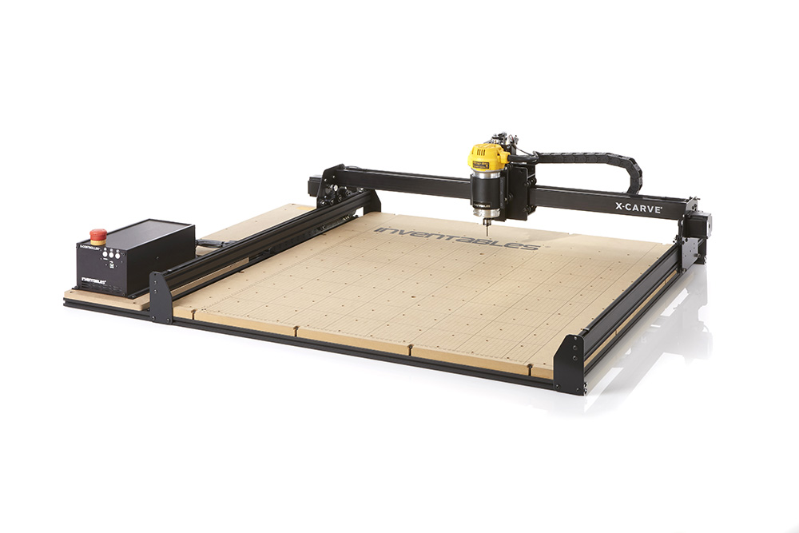

Congratulations! You've just taken one of your first steps into the world of 3D Carving! This guide will take you through the steps of building your very own X-Carve 3D Carver! We've tried to make it as easy as possible to get you from unpacking your parts to carving. We've laid out the instructions starting from the bottom of the machine to the top, and we will cover everything from machine assembly to computer setup.

This is a do-it-yourself 3D carving kit: the more time and attention you put into assembling your machine, the better it will perform. If you run into any trouble during assembly or carving you can find further help from the wonderful community on the forum, our support center which is continuously growing with articles and tutorials, and as always you can reach our customer success team through our [support center](https://inventables.desk.com/) or by phone at 312 775 7009.

The X-Carve is open source hardware. We have 3D models and drawings available in a GrabCAD repository <a href="https://workbench.grabcad.com/workbench/projects/gcl5zpCuwqCXWLvYktLQBc-2IHvossNo37ycTOkzg6gREW#/space/gcojYwyy_VqboQQ-9hKBJrjS3zGaGuue8sfnqRNxGI9WQS">here</a>.

<h2>Recommended Tools</h2>

If you purchased a tool kit with your machine, most of these should be included with the exception of power tools

- 7mm wrench or socket
- 8mm wrench or socket
- 10mm wrench or socket
- 13mm wrench
- 5.5mm or 7/32" wrench or socket
- 1.5mm hex key
- 2mm hex key
- 2.5mm hex key
- 3mm hex key
- 4mm hex key
- Drill driver with 5mm hex bit

<h2>Bill of Materials</h2>

  

    

      

        <h4 class="panel-title">
          <strong>Core Components</strong>
        </h4>
        

          <i class="fa fa-plus"></i>
          <i class="fa fa-minus"></i>
        

      

      

        

          <table>
            <tr>
              <td style="color:#fff;background: #383838" colspan="3">
                <b>Core Components Kit</b>
              </td>
            </tr>
            <tr>
              <td><b>SKU</b></td>
              <td><b>Name</b></td>
              <td><b>Quantity</b></td>
            </tr>
            <tr>
              <td>30524-01</td>
              <td>MakerSlide End Plate</td>
              <td>4</td>
            </tr>
            <tr>
              <td>30525-01</td>
              <td>Gantry Side Plate</td>
              <td>2</td>
            </tr>
            <tr>
              <td>30526-01</td>
              <td>Belt Clip</td>
              <td>6</td>
            </tr>
            <tr>
              <td>30677-01</td>
              <td>Belt Sleeve Clip</td>
              <td>6</td>
            </tr>
            <tr>
              <td>30396-02</td>
              <td>ACME Lead Screw</td>
              <td>1</td>
            </tr>
            <tr>
              <td>25195-07</td>
              <td>Eccentric Spacer 0.200" Long</td>
              <td>8</td>
            </tr>
            <tr>
              <td>25195-08</td>
              <td>Eccentric Spacer 0.375" Long</td>
              <td>2</td>
            </tr>
            <tr>
              <td>30534-01</td>
              <td>Z Axis Motor Plate</td>
              <td>1</td>
            </tr>
            <tr>
              <td>25281-12</td>
              <td>T-Slot Nut M5 Pre-Assembly</td>
              <td>18</td>
            </tr>
            <tr>
              <td>26054-04</td>
              <td>Aluminum GT2 Pulley 20T 8mm</td>
              <td>1</td>
            </tr>
            <tr>
              <td>25280-03</td>
              <td>Delrin Nut ACME 3/8-12</td>
              <td>1</td>
            </tr>
            <tr>
              <td>30547-01</td>
              <td>GT2 Belt Closed Loop, 80T</td>
              <td>1</td>
            </tr>
            <tr>
              <td>25312-23</td>
              <td>Aluminum Spacer 5.1mm ID 9.5mm OD 9.5mm LG</td>
              <td>8</td>
            </tr>
            <tr>
              <td>25287-11</td>
              <td>Flat Washer M8</td>
              <td>1</td>
            </tr>
            <tr>
              <td>30545-01</td>
              <td>X Carriage Extrusion</td>
              <td>1</td>
            </tr>
            <tr>
              <td>25142-09</td>
              <td>MakerSlide 200mm Tapped Black</td>
              <td>1</td>
            </tr>
            <tr>
              <td>25203-01</td>
              <td>V Wheel Assembly</td>
              <td>20</td>
            </tr>
            <tr>
              <td>25197-01</td>
              <td>Smooth Idler Pulley Assembly</td>
              <td>6</td>
            </tr>
            <tr>
              <td>25286-33</td>
              <td>Button Head Cap Screw M5 x 8</td>
              <td>16</td>
            </tr>
            <tr>
              <td>25286-35</td>
              <td>Button Head Cap Screw M5 x 10</td>
              <td>4</td>
            </tr>
            <tr>
              <td>25286-38</td>
              <td>Button Head Cap Screw M5 x 12</td>
              <td>16</td>
            </tr>
            <tr>
              <td>25286-46</td>
              <td>Button Head Cap Screw M5 x 14</td>
              <td>2</td>
            </tr>
            <tr>
              <td>25286-43</td>
              <td>Button Head Cap Screw M5 x 25</td>
              <td>11</td>
            </tr>
            <tr>
              <td>25286-49</td>
              <td>Button Head Cap Screw M5 x 30</td>
              <td>12</td>
            </tr>
            <tr>
              <td>25286-48</td>
              <td>Button Head Cap Screw M5 x 40</td>
              <td>4</td>
            </tr>
            <tr>
              <td>30169-01</td>
              <td>Flanged Bearing, 8mm</td>
              <td>1</td>
            </tr>
            <tr>
              <td>30552-05</td>
              <td>Flat Head Screw M5 x 35</td>
              <td>2</td>
            </tr>
            <tr>
              <td>25287-12</td>
              <td>M5 Flat Washer</td>
              <td>26</td>
            </tr>
            <tr>
              <td>30265-09</td>
              <td>Nylon Insert Lock Nut M5</td>
              <td>41</td>
            </tr>
            <tr>
              <td>30265-05</td>
              <td>Nylon Insert Lock Nut M6</td>
              <td>1</td>
            </tr>
            <tr>
              <td>25285-54</td>
              <td>Socket Head Screw M5 x 10</td>
              <td>4</td>
            </tr>
            <tr>
              <td>25285-52</td>
              <td>Socket Head Screw M5 x 16</td>
              <td>8</td>
            </tr>
            <tr>
              <td>25285-53</td>
              <td>Socket Head Screw M5 x 20</td>
              <td>4</td>
            </tr>
            <tr>
              <td>30711-01</td>
              <td>Lubricant</td>
              <td>1</td>
            </tr>
          </table>
        

      

    

  

  

    

      

        <h4 class="panel-title">
          <strong>Rail Size</strong>
        </h4>
        

          <i class="fa fa-plus"></i>
          <i class="fa fa-minus"></i>
        

      

      

        

          <table>
            <tr>
              <td style="color:#000;background: #FFFFFF" colspan="3">
                <b>1000mm Rail Kit</b>
              </td>
            </tr>
            <tr>
              <td><b>SKU</b></td>
              <td><b>Name</b></td>
              <td><b>Quantity</b></td>
            </tr>
            <tr>
              <td>25281-10</td>
              <td>T-Slot Nut M5 Pre-Assembly</td>
              <td>12</td>
            </tr>
            <tr>
              <td>26018-01</td>
              <td>Extrusion Bracket (Gusset)</td>
              <td>6</td>
            </tr>
            <tr>
              <td>30558-02</td>
              <td>X-Carve Label</td>
              <td>1</td>
            </tr>
            <tr>
              <td>26053-01</td>
              <td>GT2 Belting - Open Ended (feet)</td>
              <td>12</td>
            </tr>
            <tr>
              <td>26049-02</td>
              <td>Aluminum Extrusion 20mm × 20mm Black 1000mm Lg</td>
              <td>2</td>
            </tr>
            <tr>
              <td>26049-04</td>
              <td>Aluminum Extrusion 20mm × 20mm Black 958mm Lg</td>
              <td>3</td>
            </tr>
            <tr>
              <td>25142-11</td>
              <td>MakerSlide 1000mm Tapped Black</td>
              <td>2</td>
            </tr>
            <tr>
              <td>30678-03</td>
              <td>MakerSlide Extra Wide 1000mm Tapped Black</td>
              <td>1</td>
            </tr>
            <tr>
              <td>25286-36</td>
              <td>Button Head Cap Screw M5 x 10</td>
              <td>12</td>
            </tr>
          </table>
        

      

    

  

  

    

      

        <h4 class="panel-title">
          <strong>Motors and Wiring</strong>
        </h4>
        

          <i class="fa fa-plus"></i>
          <i class="fa fa-minus"></i>
        

      

      

        

          <table>
            <tr>
              <td style="color:#fff;background: #CC3440" colspan="3">
                <b>1000mm Motor and Wiring Kit</b>
              </td>
            </tr>
            <tr>
              <td><b>SKU</b></td>
              <td><b>Name</b></td>
              <td><b>Quantity</b></td>
            </tr>
            <tr>
              <td>25311-06</td>
              <td>Stepper Motor - NEMA 23</td>
              <td>4</td>
            </tr>
            <tr>
              <td>30679-09</td>
              <td>Cable Assembly, Stepper Motor 97 in long (X-Axis)</td>
              <td>1</td>
            </tr>
            <tr>
              <td>30679-10</td>
              <td>Cable Assembly, Stepper Motor 42 in long (Y1-Axis)</td>
              <td>1</td>
            </tr>
            <tr>
              <td>30679-11</td>
              <td>Cable Assembly, Stepper Motor 89 in long (Y2-Axis)</td>
              <td>1</td>
            </tr>
            <tr>
              <td>30679-12</td>
              <td>Cable Assembly, Stepper Motor 97 in long (Z-Axis)</td>
              <td>1</td>
            </tr>
          </table>
        

      

    

  

  

    

      

        <h4 class="panel-title">
          <strong>Drag Chain</strong>
        </h4>
        

          <i class="fa fa-plus"></i>
          <i class="fa fa-minus"></i>
        

      

      

        

          <table>
            <tr>
              <td style="color:#fff;background: #8A52A1" colspan="3">
                <b>1000mm Drag Chain Kit</b>
              </td>
            </tr>
            <tr>
              <td><b>SKU</b></td>
              <td><b>Name</b></td>
              <td><b>Quantity</b></td>
            </tr>
            <tr>
              <td>30527-05</td>
              <td>Drag Chain Bracket</td>
              <td>2</td>
            </tr>
            <tr>
              <td>30527-06</td>
              <td>Drag Chain Bracket</td>
              <td>1</td>
            </tr>
            <tr>
              <td>30680-01</td>
              <td>Zip Tie Mount</td>
              <td>5</td>
            </tr>
            <tr>
              <td>26016-03</td>
              <td>T-Nut M5 Post Assembly</td>
              <td>5</td>
            </tr>
            <tr>
              <td>30681-01</td>
              <td>Drag Chain Support Arm</td>
              <td>2</td>
            </tr>
            <tr>
              <td>30331-13</td>
              <td>Drag Chain 18x25 21 Links w/ Custom Ends</td>
              <td>2</td>
            </tr>
            <tr>
              <td>25986-03</td>
              <td>Cable Tie 4" (100 Pack)</td>
              <td>1</td>
            </tr>
            <tr>
              <td>26049-09</td>
              <td>Extrusion T-Slot 20x20 x 1000mm Tapped</td>
              <td>1</td>
            </tr>
            <tr>
              <td>25286-44</td>
              <td>Button Head Cap Screw M4 x 10</td>
              <td>4</td>
            </tr>
            <tr>
              <td>25286-31</td>
              <td>Button Head Cap Screw M5 x 6</td>
              <td>1</td>
            </tr>
            <tr>
              <td>25286-46</td>
              <td>Button Head Cap Screw M5 x 14</td>
              <td>2</td>
            </tr>
            <tr>
              <td>30554-06</td>
              <td>Flat Head Cap Screw M5 x 10</td>
              <td>4</td>
            </tr>
            <tr>
              <td>30554-07</td>
              <td>Flat Head Cap Screw M5 x 12</td>
              <td>6</td>
            </tr>
            <tr>
              <td>30265-08</td>
              <td>Nylon Insert Lock Nut M4</td>
              <td>2</td>
            </tr>
            <tr>
              <td>30265-10</td>
              <td>Nylon Insert Lock Nut M5</td>
              <td>6</td>
            </tr>
          </table>
        

      

    

  

  

    

      

        <h4 class="panel-title">
          <strong>Home Switch</strong>
        </h4>
        

          <i class="fa fa-plus"></i>
          <i class="fa fa-minus"></i>
        

      

      

        

          <table>
            <tr>
              <td style="color:#fff;background: #F47B44" colspan="3">
                <b>1000mm Homing Switch Kit</b>
              </td>
            </tr>
            <tr>
              <td><b>SKU</b></td>
              <td><b>Name</b></td>
              <td><b>Quantity</b></td>
            </tr>
            <tr>
              <td>30557-02</td>
              <td>Microswitch</td>
              <td>3</td>
            </tr>
            <tr>
              <td>26016-03</td>
              <td>Post-Assembly M5 T-Slot Nuts</td>
              <td>2</td>
            </tr>
            <tr>
              <td>30682-07</td>
              <td>Cable Assembly, 2C Lugs Ferrules 95"Lg X-Limit</td>
              <td>1</td>
            </tr>
            <tr>
              <td>30682-08</td>
              <td>Cable Assembly, 2C Lugs Ferrules 50"Lg Y-Limit</td>
              <td>1</td>
            </tr>
            <tr>
              <td>30682-09</td>
              <td>Cable Assembly, 2C Lugs Ferrules 95"Lg Z-Limit</td>
              <td>1</td>
            </tr>
            <tr>
              <td>25312-25</td>
              <td>Spacer 5.1mm ID 9.5mm 10.5mm Lg Aluminum</td>
              <td>2</td>
            </tr>
            <tr>
              <td>25284-12</td>
              <td>Hex Nut M2x0.4</td>
              <td>2</td>
            </tr>
            <tr>
              <td>30265-07</td>
              <td>Hex Nut M3 Nylon Locking</td>
              <td>1</td>
            </tr>
            <tr>
              <td>25285-56</td>
              <td>Socket Head Screw M2 x 10</td>
              <td>2</td>
            </tr>
            <tr>
              <td>25285-57</td>
              <td>Socket Head Screw M2 x 14</td>
              <td>4</td>
            </tr>
            <tr>
              <td>25285-44</td>
              <td>Socket Head Screw M3 x 20</td>
              <td>1</td>
            </tr>
            <tr>
              <td>25285-51</td>
              <td>Socket Head Screw M5 x 16</td>
              <td>2</td>
            </tr>
            <tr>
              <td>30555-03</td>
              <td>Washer, Split Lock M2 Stainless</td>
              <td>6</td>
            </tr>
          </table>
        

      

    

  

  

    

      

        <h4 class="panel-title">
          <strong>Waste Board</strong>
        </h4>
        

          <i class="fa fa-plus"></i>
          <i class="fa fa-minus"></i>
        

      

      

        

          <table>
            <tr>
              <td style="color:#fff;background: #0a91d1" colspan="3">
                <b>1000mm Waste Board Kit</b>
              </td>
            </tr>
            <tr>
              <td><b>SKU</b></td>
              <td><b>Name</b></td>
              <td><b>Quantity</b></td>
            </tr>
            <tr>
              <td>25281-11</td>
              <td>T-Slot Nut M5 Pre-Assembly</td>
              <td>14</td>
            </tr>
            <tr>
              <td>30537-01</td>
              <td>1000mm Waste Board</td>
              <td>1</td>
            </tr>
            <tr>
              <td>30517-09</td>
              <td>Threaded Insert M5 x 10</td>
              <td>144</td>
            </tr>
            <tr>
              <td>25286-42</td>
              <td>Button Head Cap Screw M5 x 20</td>
              <td>14</td>
            </tr>
          </table>
        

      

    

  

  

    

      

        <h4 class="panel-title">
          <strong>Side Board</strong>
        </h4>
        

          <i class="fa fa-plus"></i>
          <i class="fa fa-minus"></i>
        

      

      

        

          <table>
            <tr>
              <td style="color:#fff;background: #9D9FA2" colspan="3">
                <b>1000mm Side Board Kit</b>
              </td>
            </tr>
            <tr>
              <td><b>SKU</b></td>
              <td><b>Name</b></td>
              <td><b>Quantity</b></td>
            </tr>
            <tr>
              <td>30684-01</td>
              <td>Extrusion Connection Bracket</td>
              <td>2</td>
            </tr>
            <tr>
              <td>25281-13</td>
              <td>T-Slot Nut M5 Pre-Assembly</td>
              <td>21</td>
            </tr>
            <tr>
              <td>26018-01</td>
              <td>Cast Corner Bracket, Clear</td>
              <td>4</td>
            </tr>
            <tr>
              <td>30517-11</td>
              <td>Threaded Insert M5</td>
              <td>12</td>
            </tr>
            <tr>
              <td>30685-03</td>
              <td>Side Board, X-Carve 1000mm</td>
              <td>1</td>
            </tr>
            <tr>
              <td>26049-10</td>
              <td>Extrusion T-Slot 20x20 x 250mm</td>
              <td>2</td>
            </tr>
            <tr>
              <td>26049-04</td>
              <td>Extrusion T-Slot 20x20 x 958mm</td>
              <td>2</td>
            </tr>
            <tr>
              <td>25286-34</td>
              <td>Button Head Cap Screw M5 x 8</td>
              <td>8</td>
            </tr>
            <tr>
              <td>25286-37</td>
              <td>Button Head Cap Screw M5 x 10</td>
              <td>8</td>
            </tr>
            <tr>
              <td>25286-41</td>
              <td>Button Head Cap Screw M5 x 12</td>
              <td>5</td>
            </tr>
            <tr>
              <td>25286-47</td>
              <td>Button Head Cap Screw M5 x 14</td>
              <td>12</td>
            </tr>
          </table>
        

      

    

  

  

    

      

        <h4 class="panel-title">
          <strong>Spindle</strong>
        </h4>
        

          <i class="fa fa-plus"></i>
          <i class="fa fa-minus"></i>
        

      

      

        

          <table>
            <tr>
              <td style="color:#fff;background: #42a44e" colspan="3">
                <b>110V DeWalt 611 Spindle and Mount</b>
              </td>
            </tr>
            <tr>
              <td><b>SKU</b></td>
              <td><b>Name</b></td>
              <td><b>Quantity</b></td>
            </tr>
            <tr>
              <td>30621-01</td>
              <td>DeWalt 611 Router</td>
              <td>1</td>
            </tr>
            <tr>
              <td>30610-01</td>
              <td>X-Carve DeWalt 611 Spindle Mount</td>
              <td>1</td>
            </tr>
            <tr>
              <td>25285-55</td>
              <td>Socket Head Cap Screw M4 x 16mm Low Profile</td>
              <td>3</td>
            </tr>
            <tr>
              <td>25286-45</td>
              <td>Button Head Cap Screw M5 × 16mm</td>
              <td>2</td>
            </tr>
            <tr>
              <td>30558-01</td>
              <td>Inventables Label</td>
              <td>1</td>
            </tr>
            <tr>
              <td>30662-01</td>
              <td>1/4" to 1/8" Collet Adapter</td>
              <td>1</td>
            </tr>
          </table>
          <table>
            <tr>
              <td style="color:#fff;background: #42a44e" colspan="3">
                <b>240V DeWalt 611 Spindle and Mount</b>
              </td>
            </tr>
            <tr>
              <td><b>SKU</b></td>
              <td><b>Name</b></td>
              <td><b>Quantity</b></td>
            </tr>
            <tr>
              <td>30621-02</td>
              <td>240V DeWalt 26200 router</td>
              <td>1</td>
            </tr>
            <tr>
              <td>30610-01</td>
              <td>X-Carve DeWalt 611 Spindle Mount</td>
              <td>1</td>
            </tr>
            <tr>
              <td>25285-55</td>
              <td>Socket Head Cap Screw M4 x 16mm Low Profile</td>
              <td>3</td>
            </tr>
            <tr>
              <td>25286-45</td>
              <td>Button Head Cap Screw M5 × 16mm</td>
              <td>2</td>
            </tr>
            <tr>
              <td>30558-01</td>
              <td>Inventables Label</td>
              <td>1</td>
            </tr>
            <tr>
              <td>30662-01</td>
              <td>1/4" to 1/8" Collet Adapter</td>
              <td>1</td>
            </tr>
          </table>
          <table>
            <tr>
              <td style="color:#fff;background: #42a44e" colspan="3">
                <b>X-Carve DeWalt 611 Spindle Mount (Does Not Include Spindle)</b>
              </td>
            </tr>
            <tr>
              <td><b>SKU</b></td>
              <td><b>Name</b></td>
              <td><b>Quantity</b></td>
            </tr>
            <tr>
              <td>30610-01</td>
              <td>X-Carve DeWalt 611 Spindle Mount</td>
              <td>1</td>
            </tr>
            <tr>
              <td>25285-55</td>
              <td>Socket Head Cap Screw M4 x 16mm Low Profile</td>
              <td>3</td>
            </tr>
            <tr>
              <td>30558-01</td>
              <td>Inventables Label</td>
              <td>1</td>
            </tr>
            <tr>
              <td>25286-45</td>
              <td>Button Head Cap Screw M5 × 16mm</td>
              <td>2</td>
            </tr>
            <tr>
              <td>30662-01</td>
              <td>1/4" to 1/8" Collet Adapter</td>
              <td>1</td>
            </tr>
          </table>
          <table>
            <tr>
              <td style="color:#fff;background: #42a44e" colspan="3">
                <b>Bosch Colt Spindle Mount Kit</b>
              </td>
            </tr>
            <tr>
              <td><b>SKU</b></td>
              <td><b>Name</b></td>
              <td><b>Quantity</b></td>
            </tr>
            <tr>
              <td>30287-01</td>
              <td>Spindle Mounting Plate</td>
              <td>1</td>
            </tr>
            <tr>
              <td>30329-03</td>
              <td>Bosch Colt Spindle Mount</td>
              <td>1</td>
            </tr>
            <tr>
              <td>30549-01</td>
              <td>Rubber Inventables Sticker</td>
              <td>1</td>
            </tr>
            <tr>
              <td>25286-18</td>
              <td>Button Head Cap Screw M5 x 10</td>
              <td>2</td>
            </tr>
            <tr>
              <td>25287-08</td>
              <td>Flat Washer M5</td>
              <td>1</td>
            </tr>
            <tr>
              <td>25285-37</td>
              <td>Socket Head Screw M5 x 20</td>
              <td>1</td>
            </tr>
            <tr>
              <td>25285-38</td>
              <td>Socket Head Screw M5 x 25</td>
              <td>1</td>
            </tr>
            <tr>
              <td>30555-01</td>
              <td>Split Lockwashers M5</td>
              <td>1</td>
            </tr>
          </table>
        

      

    

  

  

    

      

        <h4 class="panel-title">
          <strong>Z-Probe</strong>
        </h4>
        

          <i class="fa fa-plus"></i>
          <i class="fa fa-minus"></i>
        

      

      

        

          <table>
            <tr>
              <td style="color:#fff;background: #000" colspan="3">
                <b>Z-Probe</b>
              </td>
            </tr>
            <tr>
              <td><b>SKU</b></td>
              <td><b>Name</b></td>
              <td><b>Quantity</b></td>
            </tr>
            <tr>
              <td>30611-02</td>
              <td>Z-Probe Kit</td>
              <td>1</td>
            </tr>
          </table>
        

      

    

  

