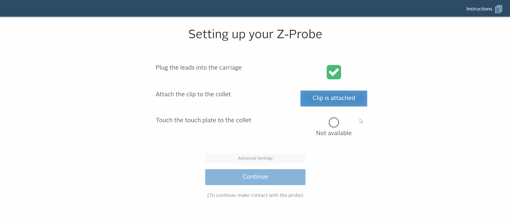

In this step, you will be setting up your machine with the Easel. You have already wired the X-Controller to your X-Carve in previous steps. 
 Power on your X-Controller. You should see the LED lights, on front and back, light up as well as the rear fan spinning. Make sure the e-stop button is disengaged. If the e-stop is engaged, the X-Controller will not power on or connect to Easel.

 Now it's time to connect the X-Controller to your computer and complete your first carve. 

<h3 id="easel_account">Log Into Easel</h3>
We'll begin by opening a new project in Easel. Go to the <a href="http://easel.inventables.com/" target="_blank">Easel login screen to get started</a>. If you already have an account with us, you can log into your account. Otherwise you can enter your email address and create a password for a new account.

 Once you are logged in, you will see the Projects, Account and Toolbox menu. Click on the "Intro to Easel" project or the "New project" button to begin.

<h3 id="local-sender">Download Easel Driver</h3>
Easel is a web application and needs a small piece of software to allow it to talk to the USB port on your computer. 
The Easel Driver behaves like a printer driver in that you never have to open it to use Easel. You may have to update the Easel Driver from time to time, but you can generally install it and forget that it's there. If it doesn't open you can access all the <a href="http://easel.inventables.com/sender_versions" target="_blank">drivers here.</a>

Click the "Carve" button to download the Easel driver. Once the download is complete, open the Downloads folder and right-click on the Easel driver file to "Install as administrator." When the driver is successfully installed, the "Carve" button will turn from blue to green. You may have to refresh the page.

<strong>NOTE:</strong> If you're having trouble connecting your X-Controller on a computer running Windows, you may need to update the FTDI driver then re-start your computer. <a href="http://www.ftdichip.com/Drivers/CDM/CDM21228_Setup.zip">Click here</a> for a direct download. The linked file is a .zip file for installation on Windows 7 and newer only. If possible, we recommend installing the driver using administrative privileges with a right click and selecting "Run as Administrator".

<h3>Run Machine Setup through Easel</h3>
 Before you run your first carve, you will have to go through the Machine Setup to make sure you have the correct firmware settings for your machine. Click the green "Carve" button and you will be prompted to setup your machine. You can also access this menu by clicking on "Machine" and "Setup your machine" from the Easel menu. 

 Choose the correct settings for your X-Carve here. You'll want to make sure that you have the ACME threaded rod selected for the lead screw unless you're using a pre-2016 machine with an M8 threaded rod. Once you've configured your machine using the dropdown menus click <strong>Confirm settings</strong>.

If the machine successfully connects, you'll be presented with a set of controls for jogging your machine. At this point the motors should be locked.

Try jogging the machine using the directional arrows. When standing in front of the X-Carve, X should jog the carriage left to right. Y should jog the gantry away from you and towards you. Z should jog the spindle up and down. If everything is wired correctly you should get proper motion on each axis. If one is reversed you can either go back and re-wire your motors or let Easel change the direction in the firmware settings by clicking <strong>No</strong> in the menu.

<strong>Note:</strong> If your Y axis is struggling to move, make sure that each motor is wired correctly. The Y motors should be wired to move in the opposite direction from one another since they are mirrored on the machine. You can refer to the diagrams in the <a href="http://x-carve-instructions.inventables.com/1000mm/step8/">X-Controller step</a> if necessary.

Click <strong>confirm settings</strong> when all axes are moving correctly. You'll now be prompted to set your spindle settings. 

You'll want to select "Manual" for your spindle control preference. Only select "Automatic" if you have customized your spindle to be controlled via a relay or other method.

After you confirm your spindle setting, you'll be prompted to enable or disable homing. Only enable homing if you have installed the homing switches.

If you enable homing, you'll be prompted to test the homing sequence. If you have your home switches installed but don't want to test them now, you can always click <strong>no, disable homing</strong>. If you want to enable homing in the future, just run your machine through this setup again.

The last step is enabling up the z-probe. You can also skip this step and enable the z-probe later. The image that shows how the z-probe should be connected to the X-Carve. You do not need to have a bit installed during this step. If you want to continue with the setup, select <strong>Yes</strong>.

In the next page, you will be prompted to test the continuity of the z-probe. Follow the steps on the screen. Make sure to click "Clip is attached" button, otherwise, the setup may not allow you to continue. 

<h3>Run The Test Carve</h3>

After setting your machine, you can run a test carve to ensure that the machine is operating properly. Clicking on the green button here will take you to the test carve project itself. Follow the steps in Easel to complete your first carve! 

You can use any material you'd like for this initial carve, though we generally recommend working with wood or a soft plastic to begin with. 
  If you have any trouble connecting your X-Carve to Easel, check out our Support center <a href="https://inventables.zendesk.com/hc/en-us/sections/360002677093-X-Carve-Troubleshooting" target="_blank">troubleshooting guides.</a>

<a href="https://inventables.zendesk.com/hc/en-us/categories/360001068153-Easel" target="_blank" class="btn btn-invent btn-animate-arrow">Easel Basics</a>
