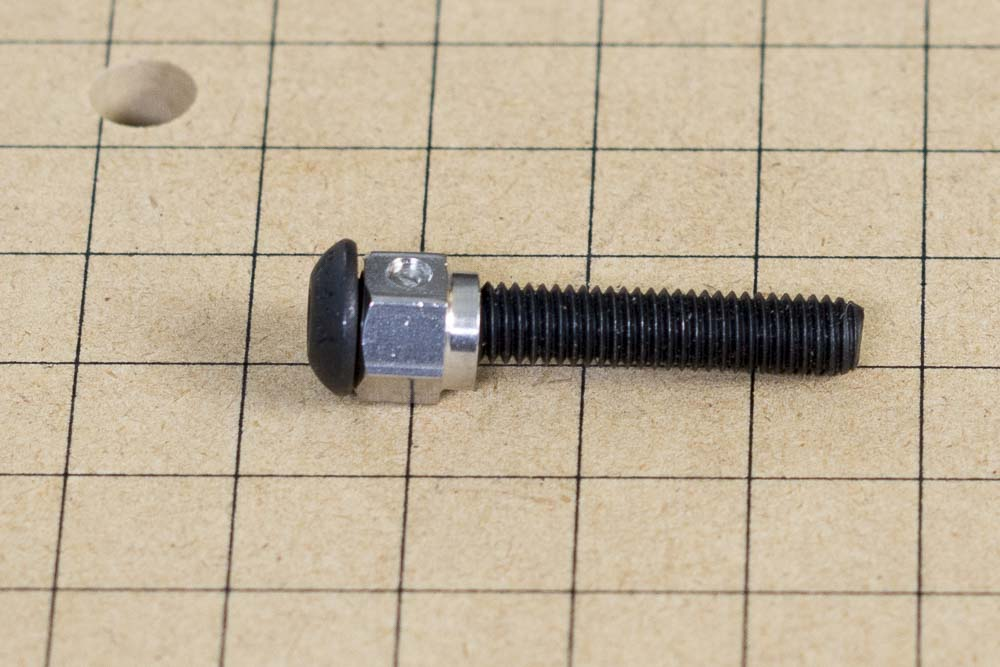
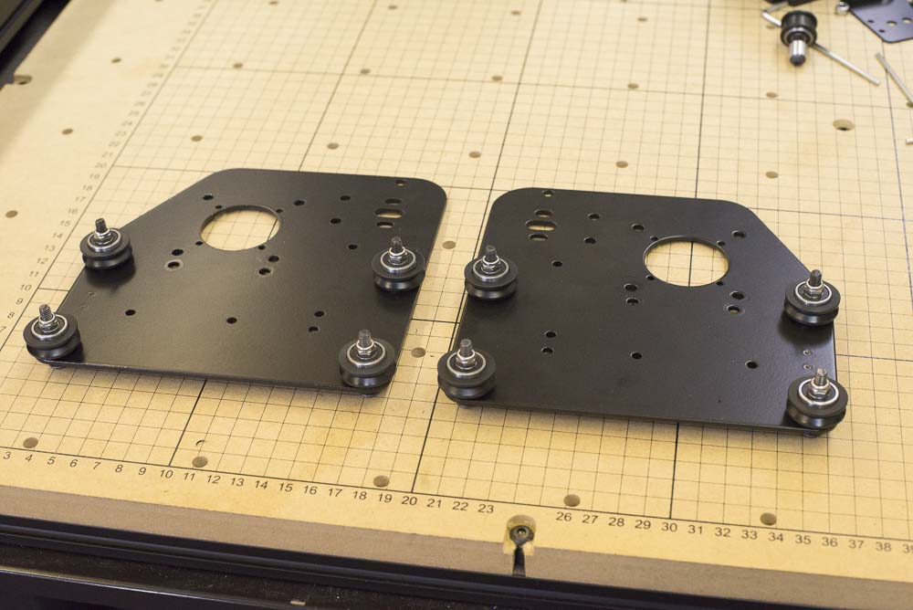

<table>
  <tr>
    <td style="color:#fff;background: #383838" colspan="3">
      <b>Core Components Kit</b>
    </td>
  </tr>
  <tr>
    <td>
      <b>SKU</b>
    </td>
    <td>
      <b>Name</b>
    </td>
    <td>
      <b>Quantity</b>
    </td>
  </tr>
  <tr>
    <td>
      25286-49
    </td>
    <td>
      Button Head Cap Screw M5 x 30
    </td>
    <td>
      4
    </td>
  </tr>
  <tr>
    <td>
      25195-07
    </td>
    <td>
      Eccentric Spacer 0.200" Long
    </td>
    <td>
      4
    </td>
  </tr>
  <tr>
    <td>
      25287-12
    </td>
    <td>
      M5 Flat Washer
    </td>
    <td>
      4
    </td>
  </tr>
  <tr>
    <td>
      25203-01
    </td>
    <td>
      V Wheel Assembly
    </td>
    <td>
      4
    </td>
  </tr>
  <tr>
    <td>
      30265-09
    </td>
    <td>
      Nylon Insert Lock Nut M5
    </td>
    <td>
      4
    </td>
  </tr>
</table>

<h3>Attach Adjustable V-Wheels</h3>
Attaching the adjustable v-wheels is a bit more complicated, though you won't have to adjust them until later in the assembly. These v-wheels are adjusted by means of an eccentric spacer that rests inside a larger hole on the plate. by turning the spacer, the distance between the v-wheels can be adjusted just enough to make sure that they are snug on the makerslide rail. For the moment you'll want to install the spacers in the 'open' position, that is, rotated so that the adjustable v-wheel is as far from the corresponding fixed v-wheel as possible.

Begin by placing an eccentric spacer on an M5x30mm bolt.

Put the bolt and spacer into one of the holes for the adjustable v-wheel. Make sure that the 'shoulder' of the spacer is facing the plate and fits into the hole on the plate. Place an M5 washer and v-wheel onto the bolt.

Secure the assembly with an M5 nylock nut. Make sure not to over-tighten the assembly.

Now you can repeat this for the other side of the plate. You should have two mirrored plates that look like this:

