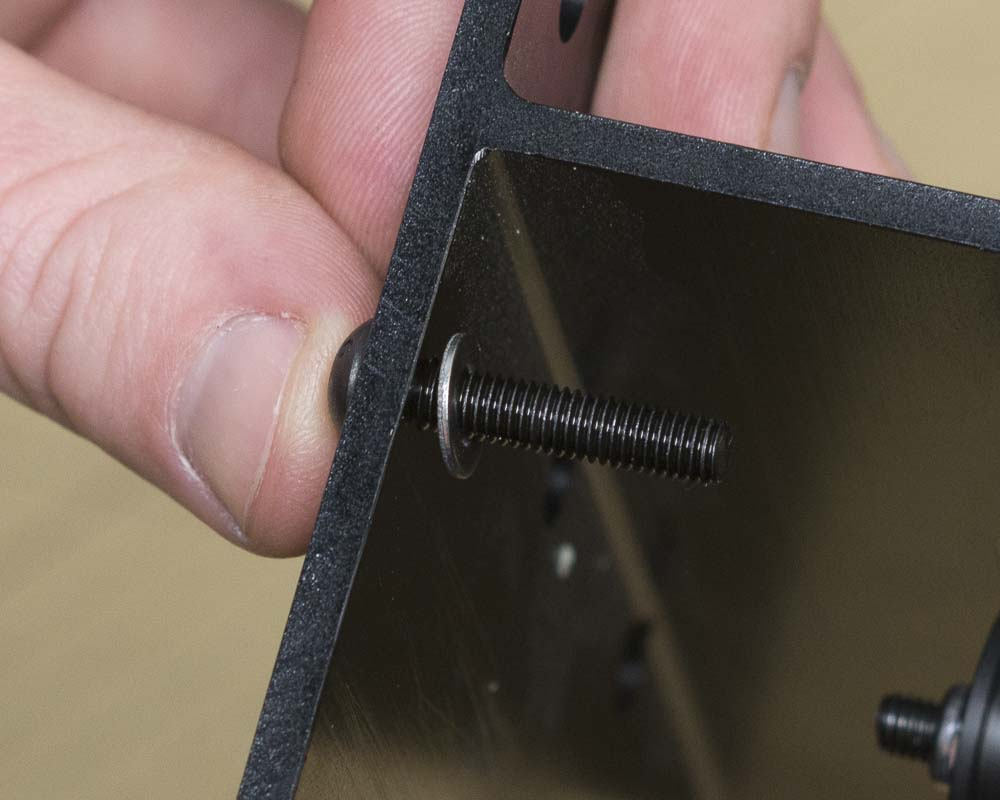
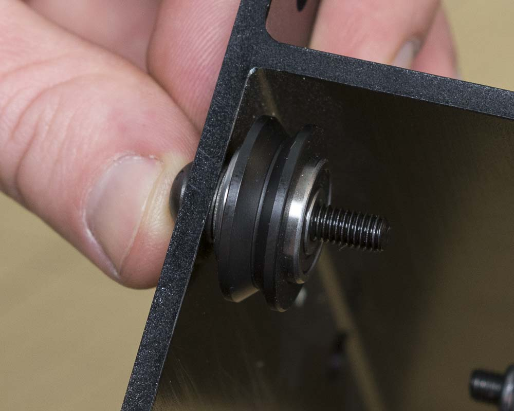

<table>
  <tr>
    <td style="color:#fff;background: #383838" colspan="3">
      <b>Core Components Kit</b>
    </td>
  </tr>
  <tr>
    <td>
      <b>SKU</b>
    </td>
    <td>
      <b>Name</b>
    </td>
    <td>
      <b>Quantity</b>
    </td>
  </tr>
  <tr>
    <td>
      25286-21
    </td>
    <td>
      Button Head Cap Screw M5 x 25
    </td>
    <td>
      4
    </td>
  </tr>
  <tr>
    <td>
      25287-08
    </td>
    <td>
      M5 Flat Washer
    </td>
    <td>
      4
    </td>
  </tr>
  <tr>
    <td>
      25203-01
    </td>
    <td>
      V Wheel Assembly
    </td>
    <td>
      4
    </td>
  </tr>
  <tr>
    <td>
      30265-04
    </td>
    <td>
      Hex Nut M5 Nylon Locking
    </td>
    <td>
      4
    </td>
  </tr>
</table>

<h3>Attach Fixed V-Wheels</h3>
This process is similar to attaching the fixed V-Wheels on the gantry side plates. Use an M5x25mm button head cap screw, an M5 washer, and an M5 nylock hex nut to attach the wheels as pictured.

