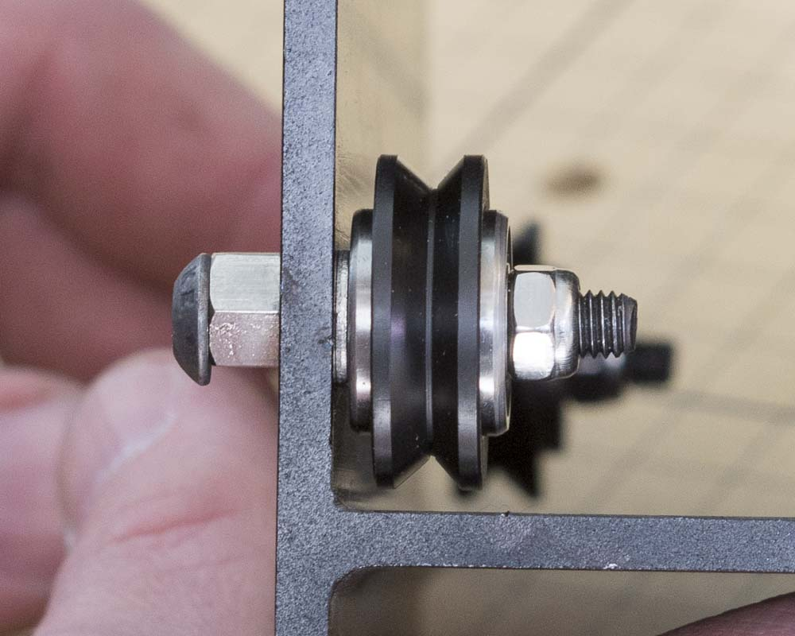
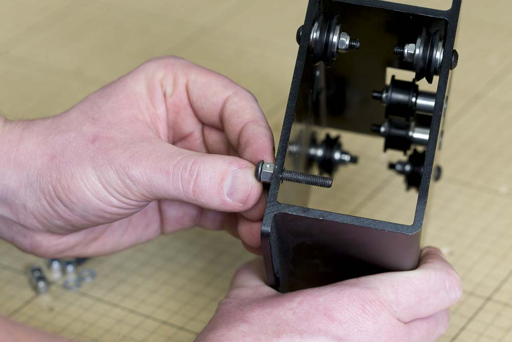

<table>
  <tr>
    <td style="color:#fff;background: #383838" colspan="3">
      <b>Core Components Kit</b>
    </td>
  </tr>
  <tr>
    <td>
      <b>SKU</b>
    </td>
    <td>
      <b>Name</b>
    </td>
    <td>
      <b>Quantity</b>
    </td>
  </tr>
  <tr>
    <td>
      25286-32
    </td>
    <td>
      Button Head Cap Screw M5 x 30
    </td>
    <td>
      4
    </td>
  </tr>
  <tr>
    <td>
      25195-07
    </td>
    <td>
      Eccentric Spacer 0.200" Long
    </td>
    <td>
      4
    </td>
  </tr>
  <tr>
    <td>
      25287-08
    </td>
    <td>
      M5 Flat Washer
    </td>
    <td>
      4
    </td>
  </tr>
  <tr>
    <td>
      25203-01
    </td>
    <td>
      V Wheel Assembly
    </td>
    <td>
      4
    </td>
  </tr>
  <tr>
    <td>
      30265-04
    </td>
    <td>
      Hex Nut M5 Nylon Locking
    </td>
    <td>
      4
    </td>
  </tr>
</table>

<h3>Attach Adjustable V-Wheels</h3>

Begin by placing an eccentric spacer on an M5x30mm bolt, then put the bolt and spacer into one of the holes for the adjustable v-wheel. Make sure that the 'shoulder' of the spacer is facing the carriage and fits into the hole on the plate. Place an M5 washer and v-wheel onto the bolt, then tighten the assembly with a nylock washer.

