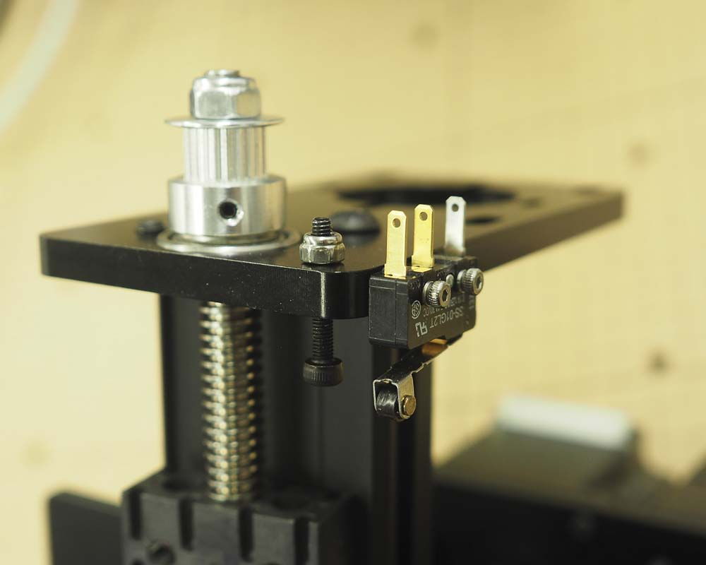
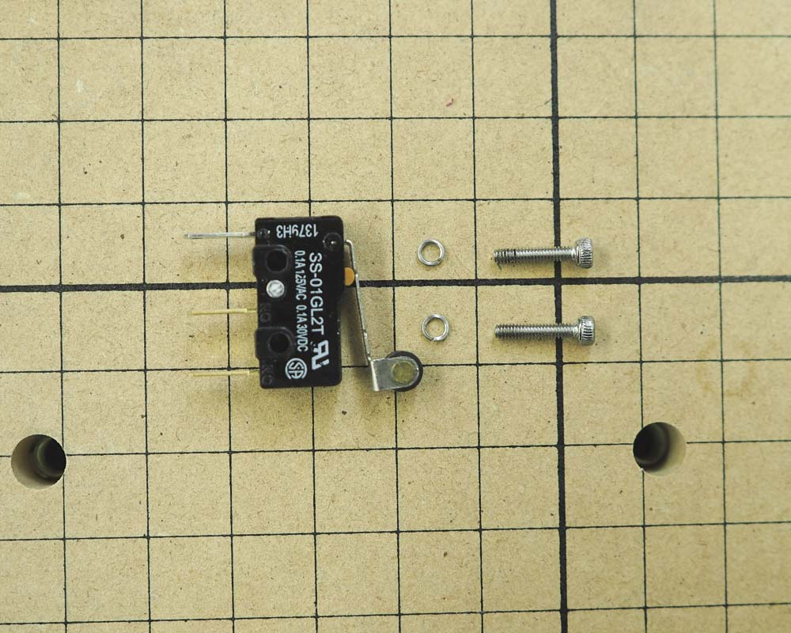
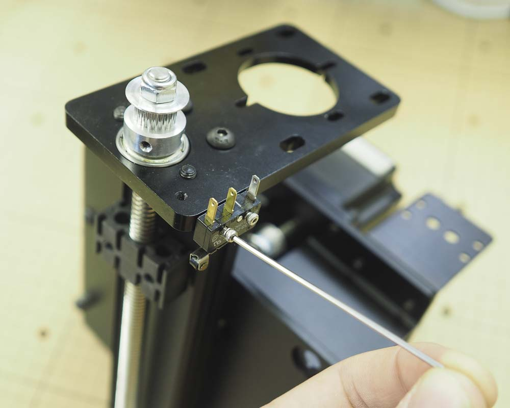
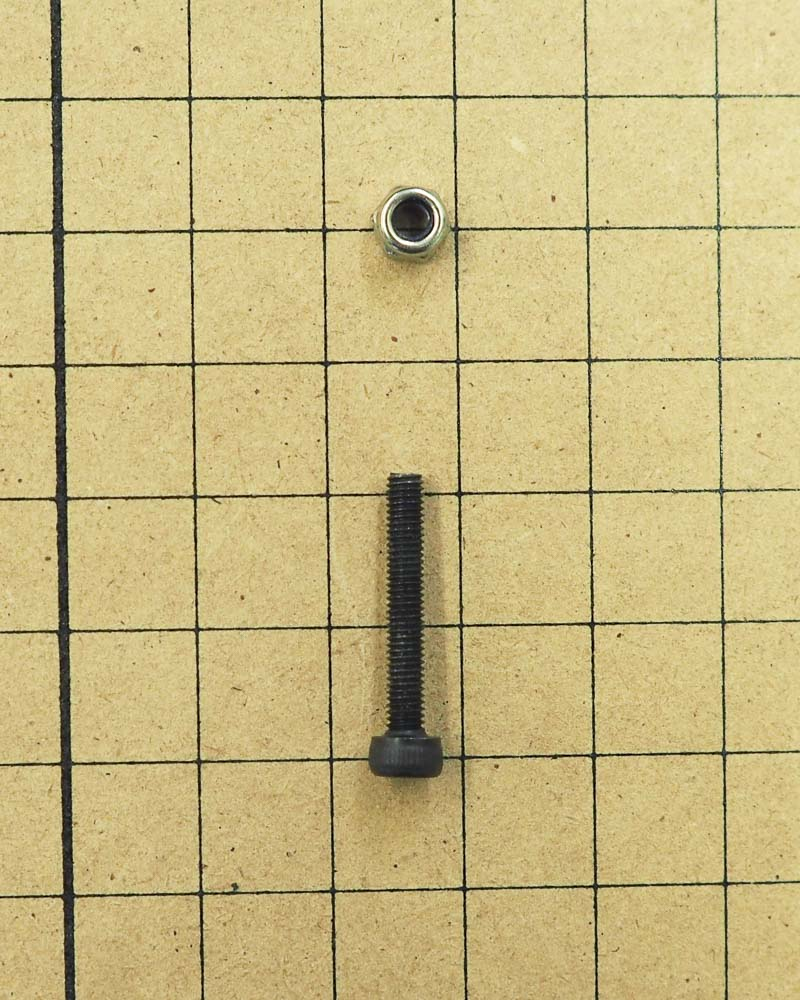
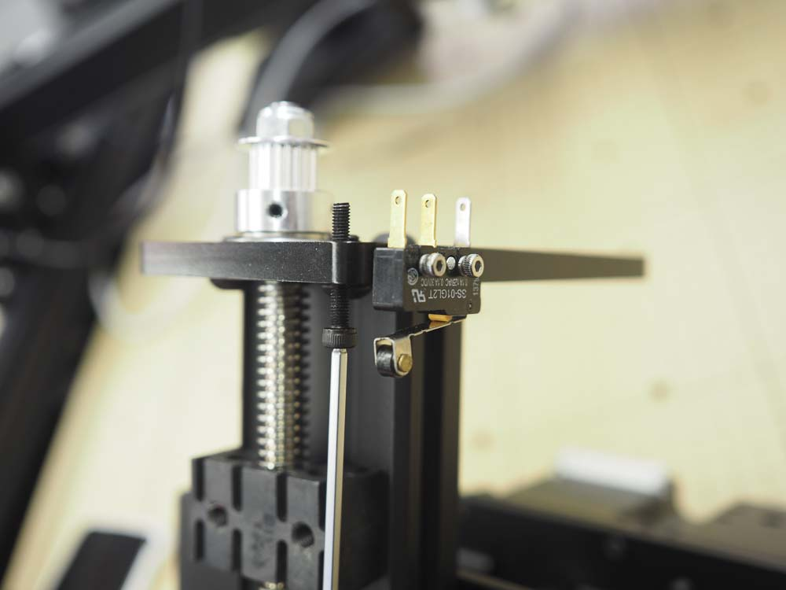
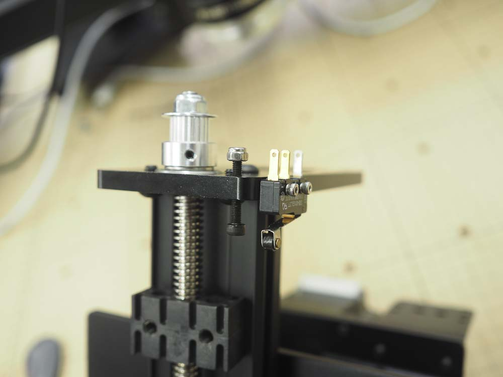
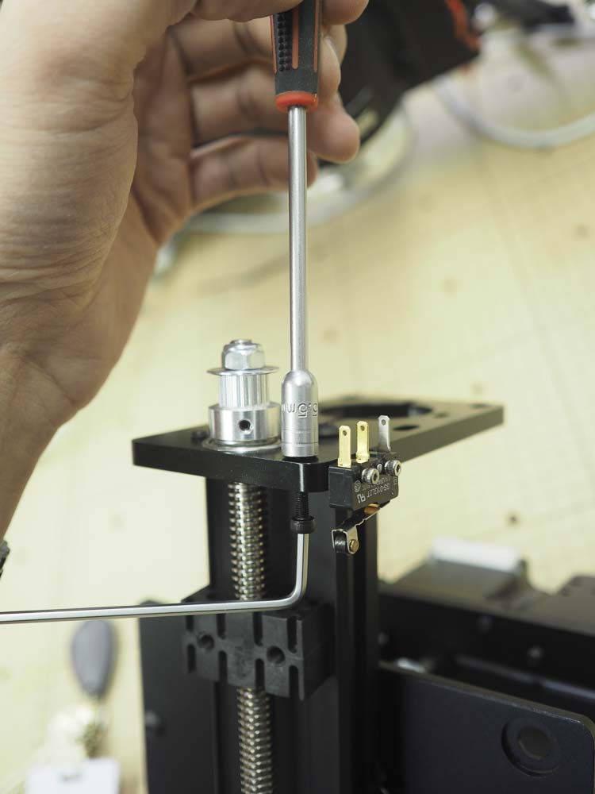

<table>
  <tr>
    <td style="color:#fff;background: #F47B44" colspan="3">
      <b>1000mm Homing Switch Kit</b>
    </td>
  </tr>
  <tr>
    <td>
      <b>SKU</b>
    </td>
    <td>
      <b>Name</b>
    </td>
    <td>
      <b>Quantity</b>
    </td>
  </tr>
  <tr>
    <td>
      30557-02
    </td>
    <td>
      Microswitch
    </td>
    <td>
      1
    </td>
  </tr>
  <tr>
    <td>
      25285-56
    </td>
    <td>
      Socket Head Screw M2 x 10
    </td>
    <td>
      2
    </td>
  </tr>
  <tr>
    <td>
      30555-03
    </td>
    <td>
      Washer, Split Lock M2 Stainless
    </td>
    <td>
      2
    </td>
  </tr>
  <tr>
    <td>
      25285-44
    </td>
    <td>
      Socket Head Screw M3 x 20
    </td>
    <td>
      1
    </td>
  </tr>
  <tr>
    <td>
      30265-07
    </td>
    <td>
      Hex Nut M3 Nylon Locking
    </td>
    <td>
      1
    </td>
  </tr>
</table>

If you ordered your kit with homing switches, we will now install the Z-axis limit switch and Z-axis stop which prevents it from being crushed.

First, locate one of the microswitches from your homing switch kit as well as two M2x10mm socket head screws and two M2 split washers.

Orient the switch so that the roller actuator is facing down and toward the front of the z axis motor plate. The mounting holes on the switch should line up with the two threaded holes on the side of the motor plate. Place a split washer on each of the M2x10mm screws and use them to secure the switch to the motor plate. You'll want to use a 1.5mm hex key to drive the screws.

<strong>NOTE:</strong> Make sure to position the protruding "split" of the split ring washer away from the plastic microswitch as that may cut into and damage the switch when tightened.

To prevent the switch from being broken by the Z axis, we'll install a mechanical stop in the form of an M3 socket head screw. Begin by locating the M3x20mm socket head screw as well as the M3 nylock nut in your kit.

Use a 2.5mm hex key or your hand to thread the screw into its corresponding hole from the bottom of the Z-axis plate. Line up the head of the screw so that it is approximately 10mm (0.4in) from the bottom of the motor plate. This will allow the switch to be pressed, but will prevent the spindle mount plate from crushing the switch. You can always go back and adjust the position of the stop later so it's not vital to get exact positioning at the moment.

On the other side of the motor plate, thread on an M3 nylock nut and tighten it against the plate with either a 5.5mm socket as pictured here, or with the appropriate wrench/pliers. This will secure the position of the stop.

