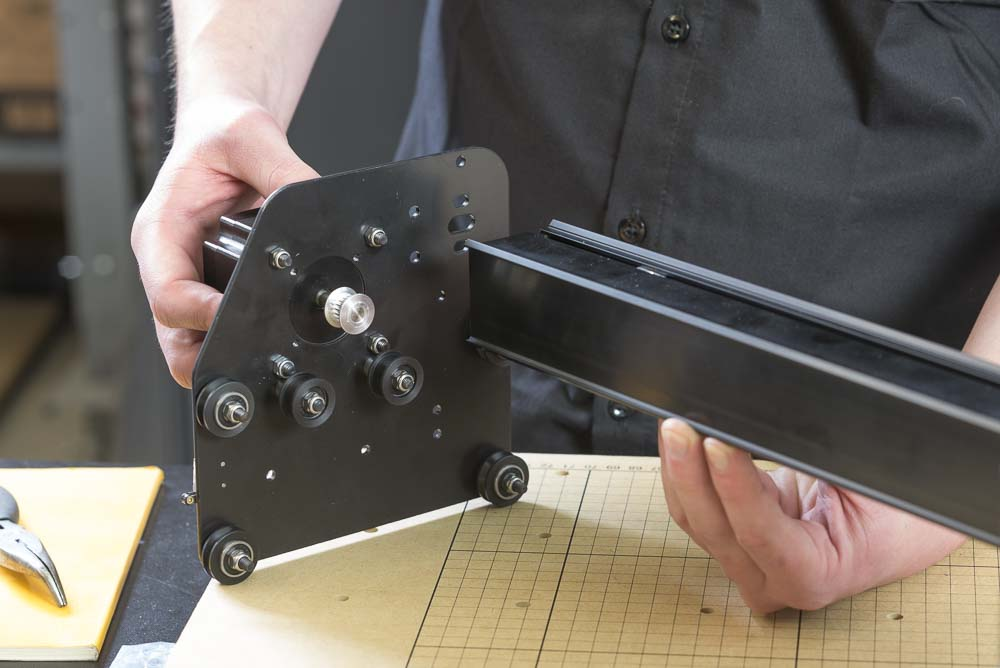
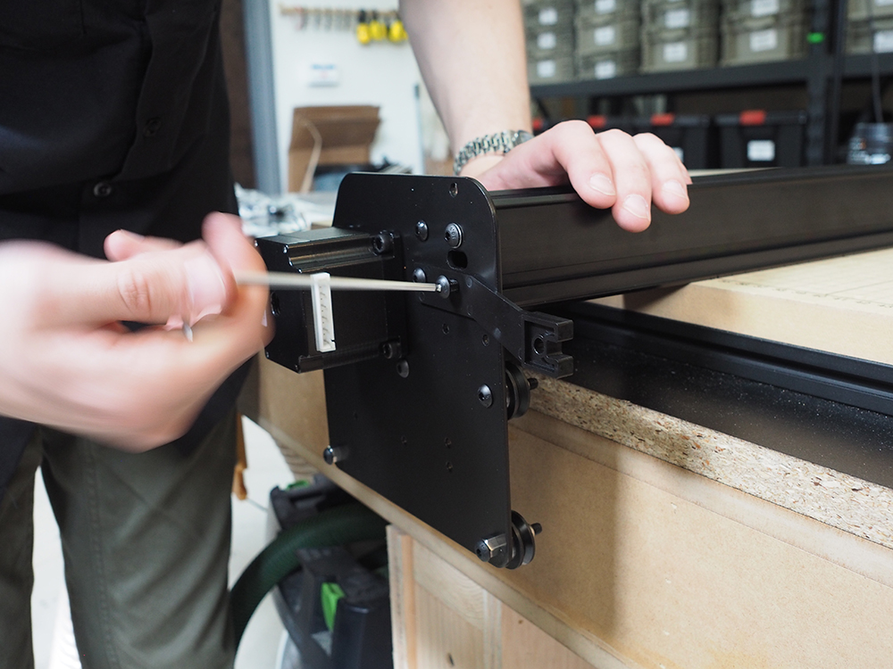

<table>
  <tr>
    <td style="color:#fff;background: #383838" colspan="3">
      <b>Core Components Kit</b>
    </td>
  </tr>
  <tr>
    <td>
      <b>SKU</b>
    </td>
    <td>
      <b>Name</b>
    </td>
    <td>
      <b>Quantity</b>
    </td>
  </tr>
  <tr>
    <td>
      25286-38
    </td>
    <td>
      Button Head Cap Screw M5 x 12
    </td>
    <td>
      4
    </td>
  </tr>
  <tr>
    <td>
      25287-12
    </td>
    <td>
      M5 Flat Washer
    </td>
    <td>
      1
    </td>
  </tr>
</table>
<table>
  <tr>
    <td style="color:#000;background: #FFFFFF" colspan="3">
      <b>1000mm Rail Kit</b>
    </td>
  </tr>
  <tr>
    <td>
      <b>SKU</b>
    </td>
    <td>
      <b>Name</b>
    </td>
    <td>
      <b>Quantity</b>
    </td>
  </tr>
  <tr>
    <td>
      30678-03
    </td>
    <td>
      MakerSlide Extra Wide 1000mm Tapped Black
    </td>
    <td>
      1
    </td>
  </tr>
</table>
<table>
  <tr>
    <td style="color:#fff;background: #8A52A1" colspan="3">
      <b>1000mm Drag Chain Kit</b>
    </td>
  </tr>
  <tr>
    <td>
      <b>SKU</b>
    </td>
    <td>
      <b>Name</b>
    </td>
    <td>
      <b>Quantity</b>
    </td>
  </tr>
  <tr>
    <td>
      30681-01
    </td>
    <td>
      Drag Chain Support Arm
    </td>
    <td>
      1
    </td>
  </tr>
</table>

In this step you will attach one of the Y Plates to The X axis makerslide rail. You'll put the left plate on first, then slide the assembled X Carriage on before inserting some pre-assembly insertion nuts for the belting and attaching the right side plate.

<i>Left side plate</i>

Make sure the beveled side of the plates and the X-Carve logo on the gantry rail are facing in the same direction.

<i>Left side plate</i>
 
 
Secure the plate and drag chain support arm to the end of the makerslide rail with four M5x12mm button head cap screws. Position the drag chain support arm with the extrusion mount facing down. You will have to install one washer between the plate and the screw on the top slotted hole in the plate. The bottom slotted hole is covered by the plastic bracket and doesn't need a washer.

<i>Right side plate</i>
