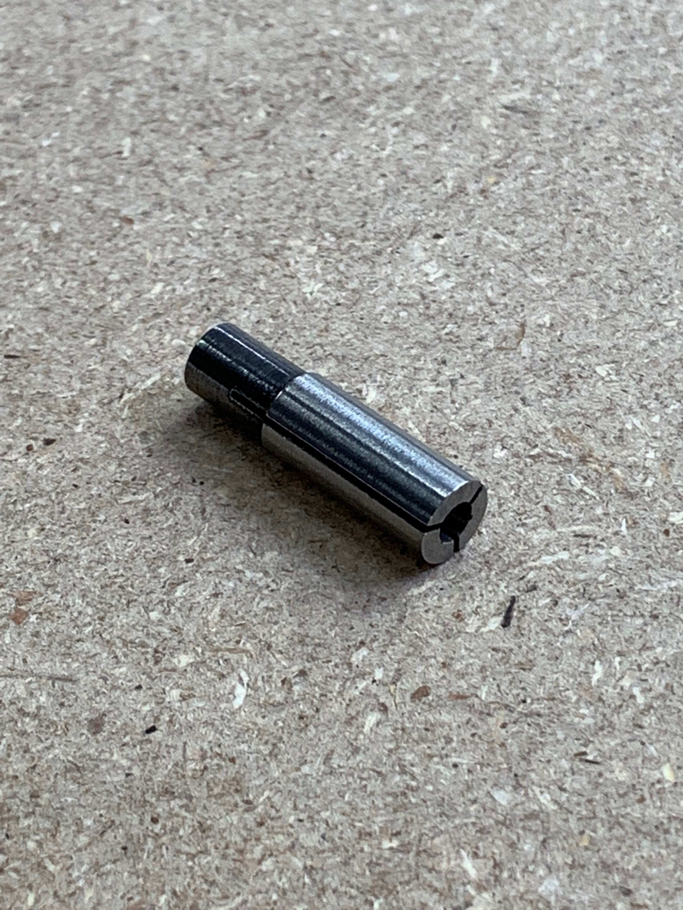
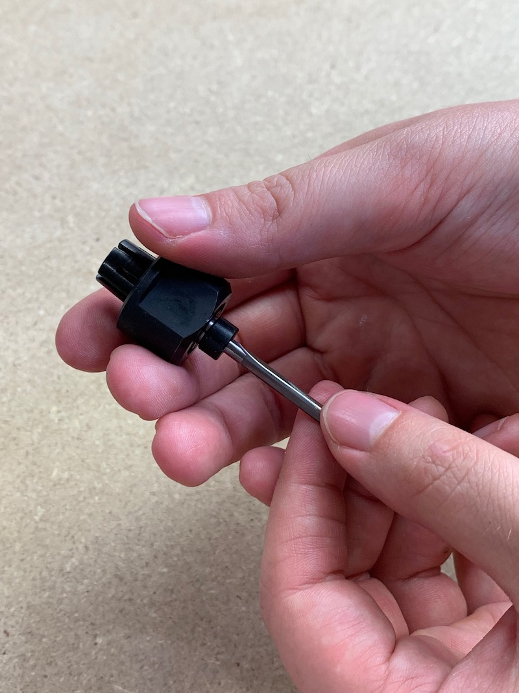

In this step you'll be mounting a DeWalt 611 router in the spindle mount. Begin by removing existing base and collar from the spindle. This will leave just the metal router body.

Use a screwdriver or other prying tool to gently pry the spindle mount open and insert the router until the yellow button shows through on the bottom of the spindle mount.

Tighten the three M4x16mm screws to hold the router in place.

The router power cable will be put in the drag chains alongside the stepper motor cables in the next step. The router is powered with a simple AC wall outlet.

<h2 id="install-collet-adapter">
  <strong>Install Collet Adapter</strong></h2>
  
  
 
 
  
 
 <table>
  <tr style="color:#fff;background: #383838;">
    		<td> <b>SKU</b> </td>
			<td> <b>Name</b> </td>
			<td> <b>Quantity</b> </td>
  </tr>
  <tr>
    <td> 30662 </td>
    <td> Collet Adapter </td>
    <td> 1 </td>
  </tr>
  </table> 
  
 Locate the collet adapter in your kit. This is inserted into the collet for the DeWalt 611 so that it can accept milling bits with a 1/8" shank.
  
 Insert the collet adapter into the collet as shown. The black piece on the adapter should go in first. Push it up until the end of the adapter is flush with the base of the collet.
 
  
 
  
 
 You can then insert a 1/8" bit. If it is an Inventables bit, push it up until the collar is against the base of the collet. Install all three components onto the router nose as one piece.
 
  
