<table>
  <tr>
    <td style="color:#fff;background: #CC3440" colspan="3">
      <b>1000mm Motor and Wiring Kit</b>
    </td>
  </tr>
  <tr>
    <td>
      <b>SKU</b>
    </td>
    <td>
      <b>Name</b>
    </td>
    <td>
      <b>Quantity</b>
    </td>
  </tr>
  <tr>
    <td>
      30679-09
    </td>
    <td>
      Stepper Motor Cable Assemblies Length 97 in (X-Axis)
    </td>
    <td>
      1
    </td>
  </tr>
  <tr>
    <td>
      30679-10
    </td>
    <td>
      Stepper Motor Cable Assemblies Length 42 in (Y1-Axis)
    </td>
    <td>
      1
    </td>
  </tr>
  <tr>
    <td>
      30679-11
    </td>
    <td>
      Stepper Motor Cable Assemblies Length 89 in long (Y2-Axis)
    </td>
    <td>
      1
    </td>
  </tr>
  <tr>
    <td>
      30679-12
    </td>
    <td>
      Stepper Motor Cable Assemblies Length 97 in long (Z-Axis)
    </td>
    <td>
      1
    </td>
  </tr>
</table>
<table>
  <tr>
    <td style="color:#fff;background: #8A52A1" colspan="3">
      <b>1000mm Drag Chain Kit</b>
    </td>
  </tr>
  <tr>
    <td>
      <b>SKU</b>
    </td>
    <td>
      <b>Name</b>
    </td>
    <td>
      <b>Quantity</b>
    </td>
  </tr>
  <tr>
    <td>
      30527-06
    </td>
    <td>
      Drag Chain Bracket
    </td>
    <td>
      1
    </td>
  </tr>
  <tr>
    <td>
      30680-01
    </td>
    <td>
      Zip Tie Mount
    </td>
    <td>
      5
    </td>
  </tr>
  <tr>
    <td>
      26016-03
    </td>
    <td>
      T-Slot Nut M5 Post-Assembly
    </td>
    <td>
      3
    </td>
  </tr>
  <tr>
    <td>
      30331-13
    </td>
    <td>
      Drag Chain 18x25 21 Links w/ Custom Ends
    </td>
    <td>
      2
    </td>
  </tr>
  <tr>
    <td>
      25986-03
    </td>
    <td>
      Cable Tie 4" (100 Pack)25286-44
    </td>
    <td>
      1
    </td>
  </tr>
  <tr>
    <td>
      25286-31
    </td>
    <td>
      Button Head Cap Screw M5 x 6
    </td>
    <td>
      1
    </td>
  </tr>
  <tr>
    <td>
      30554-06
    </td>
    <td>
      Flat Head Cap Screw M5 x 10
    </td>
    <td>
      2
    </td>
  </tr>
  <tr>
    <td>
      30554-07
    </td>
    <td>
      Flat Head Cap Screw M5 x 12
    </td>
    <td>
      6
    </td>
  </tr>
  <tr>
    <td>
      30265-10
    </td>
    <td>
      Nylon Insert Lock Nut M5
    </td>
    <td>
      6
    </td>
  </tr>
</table>
<table>
  <tr>
    <td style="color:#fff;background: #F47B44" colspan="3">
      <b>1000mm Homing Switch Kit</b>
    </td>
  </tr>
  <tr>
    <td>
      <b>SKU</b>
    </td>
    <td>
      <b>Name</b>
    </td>
    <td>
      <b>Quantity</b>
    </td>
  </tr>
  <tr>
    <td>
      30682-07
    </td>
    <td>
      Home Switch Cable Assembly 95"Lg X-Limit
    </td>
    <td>
      1
    </td>
  </tr>
  <tr>
    <td>
      30682-08
    </td>
    <td>
      Home Switch Cable Assembly 50"Lg Y-Limit
    </td>
    <td>
      1
    </td>
  </tr>
  <tr>
    <td>
      30682-09
    </td>
    <td>
      Home Switch Cable Assembly 95"Lg Z-Limit
    </td>
    <td>
      1
    </td>
  </tr>
</table>
<table>
  <tr>
    <td style="color:#fff;background: #000" colspan="3">
      <b>Z-Probe</b>
    </td>
  </tr>
  <tr>
    <td>
      <b>SKU</b>
    </td>
    <td>
      <b>Name</b>
    </td>
    <td>
      <b>Quantity</b>
    </td>
  </tr>
  <tr>
    <td>
      30611-02
    </td>
    <td>
      Z-Probe Kit
    </td>
    <td>
      1
    </td>
  </tr>
</table>

This section covers mounting the drag chain and wiring. 

Prepare the drag chain lengths by popping open the hinges using a flat head screw driver.

Using a flat head screw driver, carefully remove the drag chain end from the length of the drag chain. Locate two M5 10mm flat head cap screws and two post-assembly insertion nuts. Add the post-assembly insertion nuts into the center of the extrusion located behind the wide MakerSlide.

Mount the drag chain end to the extrusion by installing the flat head cap screws into the post-assembly insertion nuts. Adjust the drag chain end position as needed to allow extension of drag chain.  

<!-- begin z-probe -->
<h3>Attach Z-Probe (Optional)</h3>

If you ordered your machine with a Z-Probe, you can now fasten the Z-Probe barrel connector port and its wire to the x-carriage. However, if you have the dust control system, don't attach the barrel connector just yet. You will use an extension bracket that is included with the dust control system. You can follow the Z-Probe Relocation Kit installation instructions <a href="http://x-carve-instructions.inventables.com/1000mm/step10/" target="_blank">here</a> or skip this step and attach the Z-probe in a later step.

First, open your z-probe kit. Set aside the puck and alligator clip wiring harness for the moment; you'll use these to calibrate your machine after it's set up.

Locate the long wire with the barrel connector port as well as the slim hex nut and lock washer that accompany it.

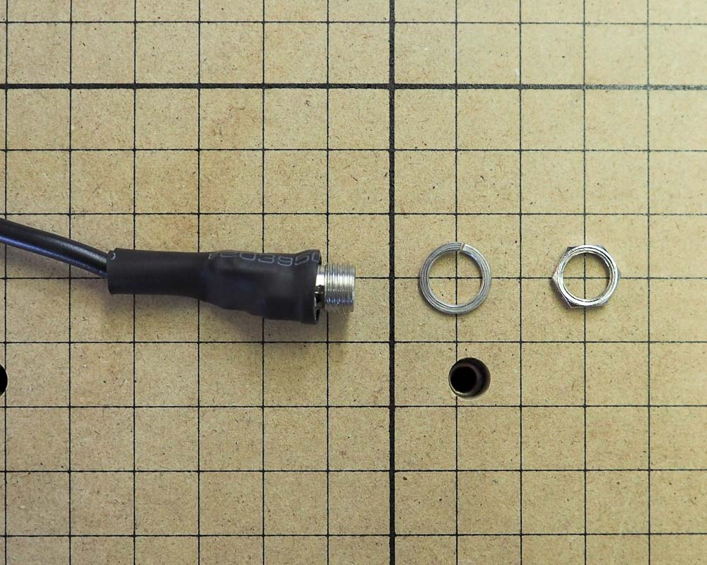

Insert the barrel connector port into the corresponding hole on the top right side of the x-carriage.

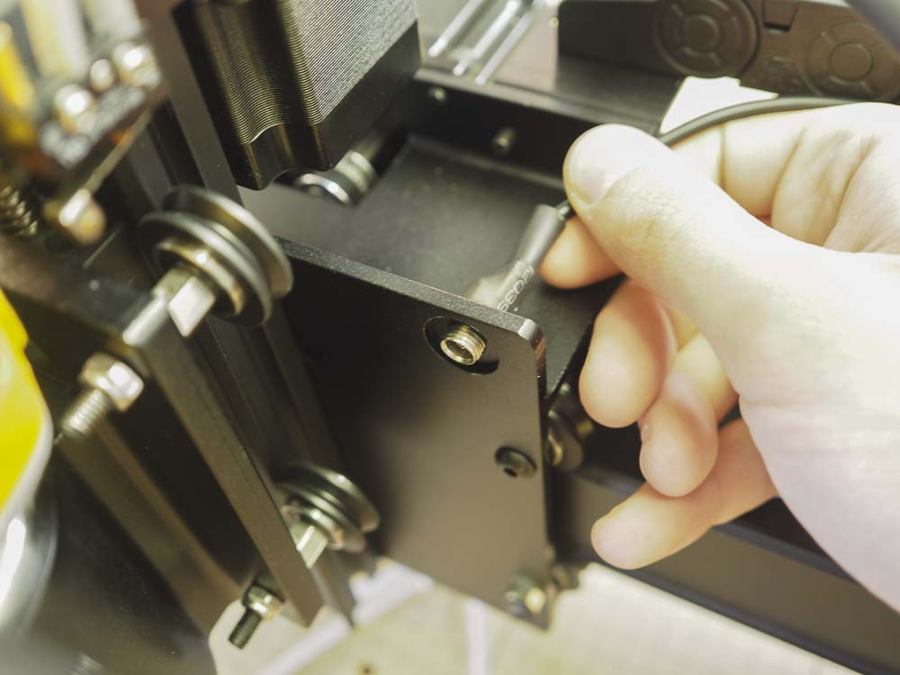

Use a 10mm wrench to secure the port in place, placing first the lock washer and then the hex nut over the port.

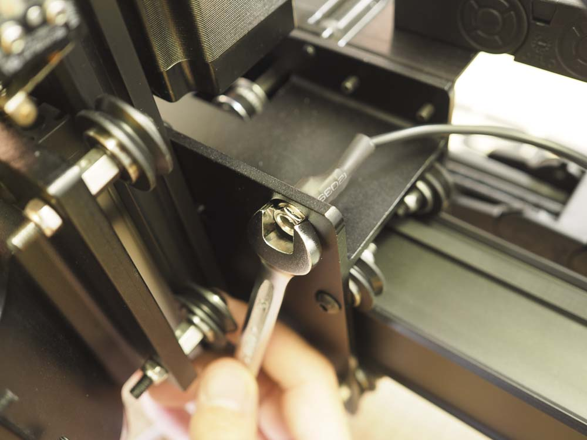
<!-- end z-probe -->

Place the spindle power cord, z-axis stepper motor wire (30679-12) , x-axis stepper motor wire (30679-09), z-axis homing switch wire (30682-09), x-axis homing switch wire (30682-07), and z-probe wire into the drag chain. Take note of the wiring orientation. Each wire will have a connector and an exposed wire end. The connectors should be placed together at the top of the drag chain and the exposed wire at the bottom of the drag chain. Close up the drag chain hinges.

Wire up z-axis and x-axis stepper motors and homing switches.  Make sure you attach the red wire to the middle pin and the black wire to the hinged side of the switch.  The stepper motors can only be wired in one way, so if it doesn't fit, flip it over and try again.

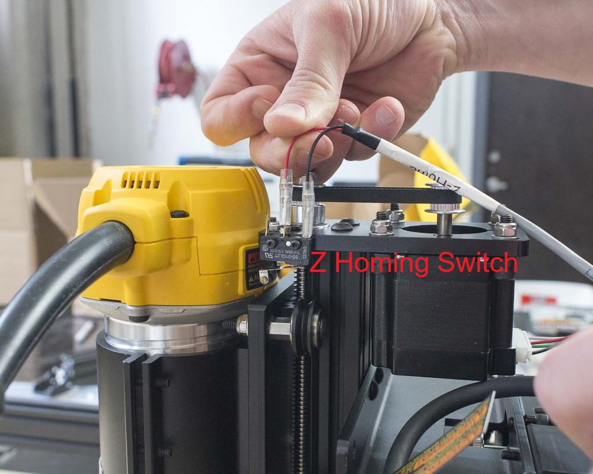

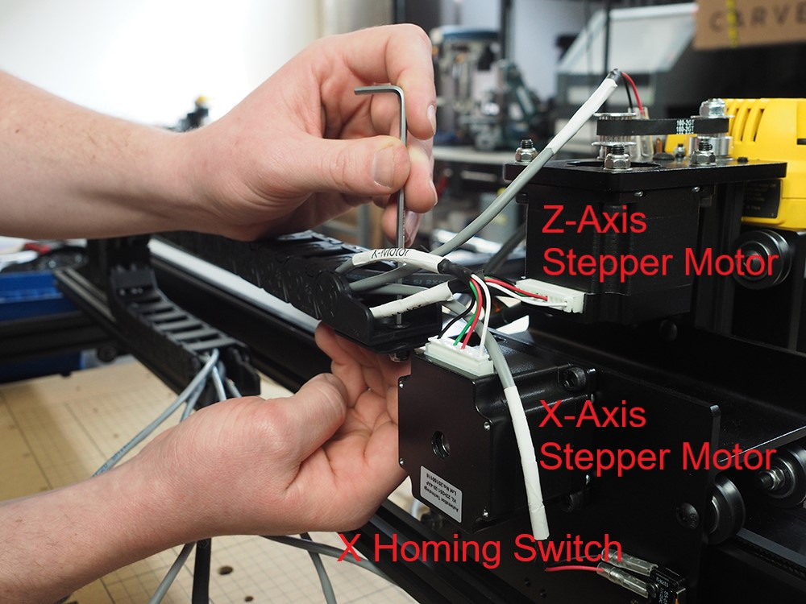

Attach the drag chain end to the drag chain bracket on the x-carriage using two M5 x 12mm flat head cap screws and two M5 nylon insert lock nuts.

Attach the length of drag chain to the drag chain bracket installed on the aluminum extrusion.

Try using a screw driver to pry open the length of drag chain. The drag chain end might feel like it's going to break, but it's very hard plastic and should hold up just fine.  This might be the most difficult part of the entire build.

Place the zip tie mounts in the aluminum extrusion slot and rotate them to secure in place. You can also use the open end of the 10mm wrench from your toolkit to easily rotate them.

 

Use three zip tie mounts on the top of the aluminum extrusion.

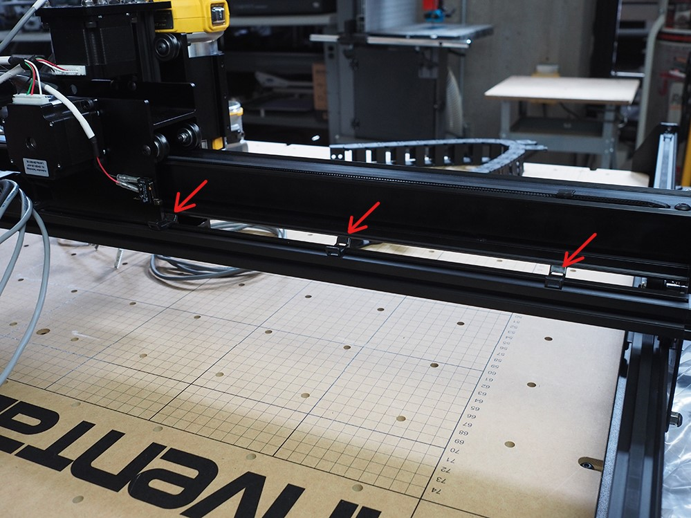

Use two zip tie mounts on the side of the aluminum extrusion for the lone Y2 stepper motor.

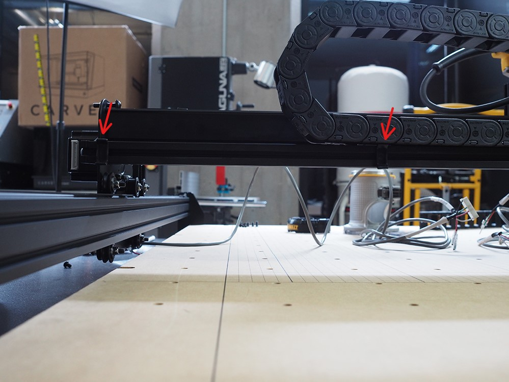

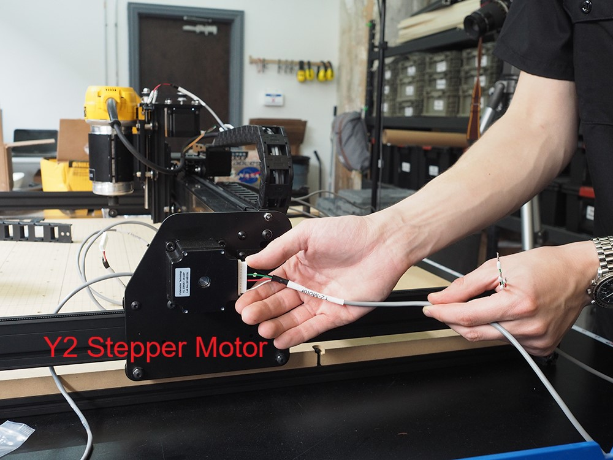

 Guide the Y2 stepper motor cable (30679-11) across the aluminum extrusion and secure with zip ties.

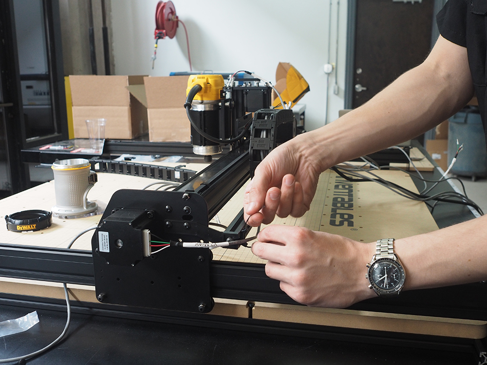

Gather up all the wires from the end of the top drag chain and the Y2 stepper motor. Zip tie them to the zip tie mounts.

Clip the ends off of the zip ties to clean everything up.

Attach the drag chain bracket to the aluminum extrusion frame <strong>under the wasteboard</strong> using the M5x6mm button head cap screw and post-assembly insertion nut.

Use the Y1 stepper motor cable (30679-10) to wire up the Y1 motor and use homing switch cable assembly (30682-08) to wire the y-axis homing switch.

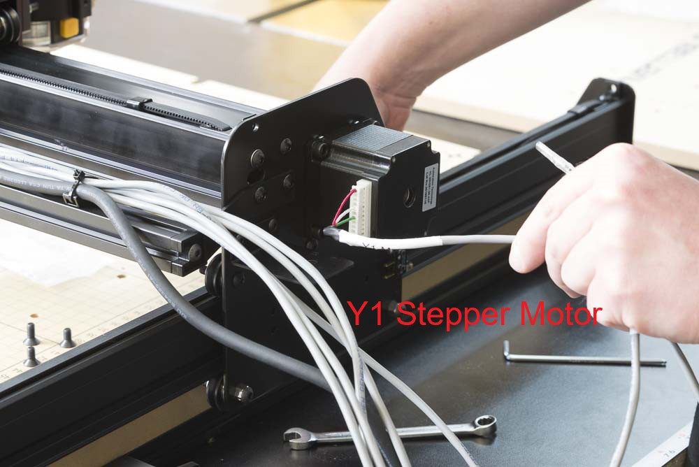
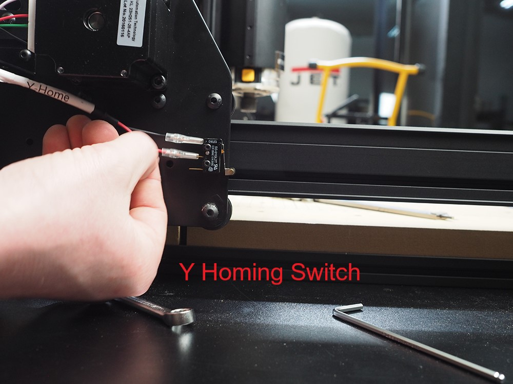
 

Gather up all wires into the drag chain and snap the hinges in place.

Attach the upper drag chain bracket to the left gantry side plate using two <strong>M5 x 12mm Flat Head Cap Screws</strong> and two <strong>M5 Nylon Insert Lock Nuts.</strong> Do not attach the lower drag chain bracket just yet as that is handled in the next step.

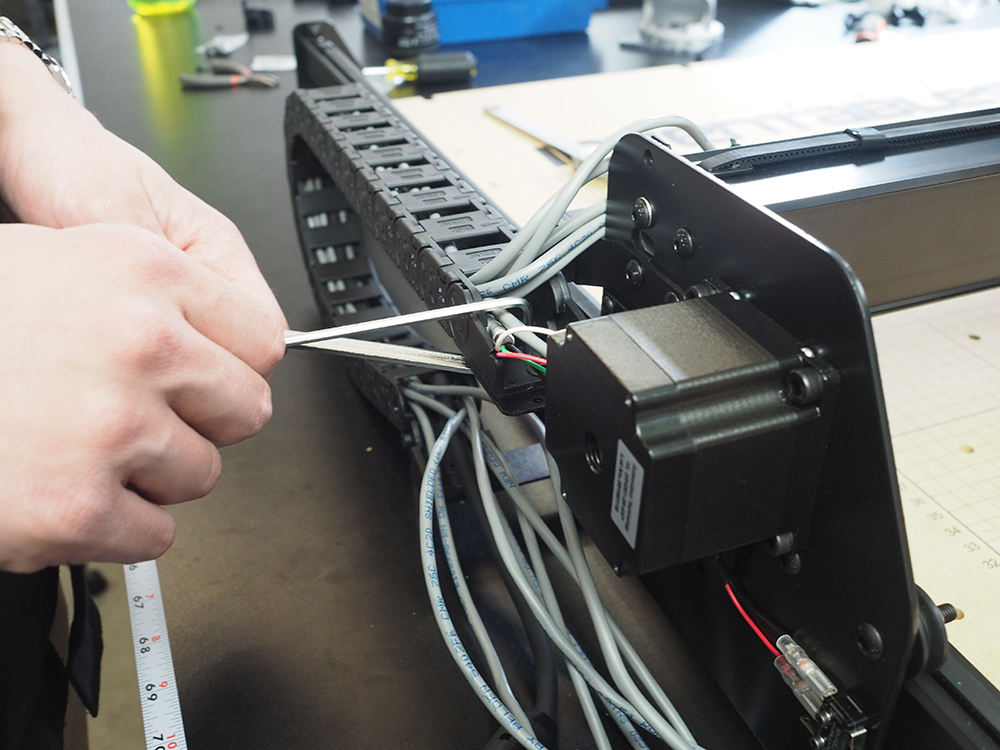

