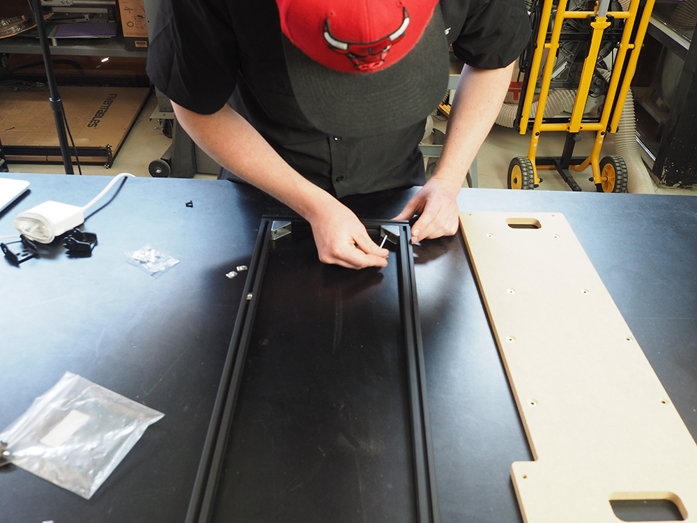
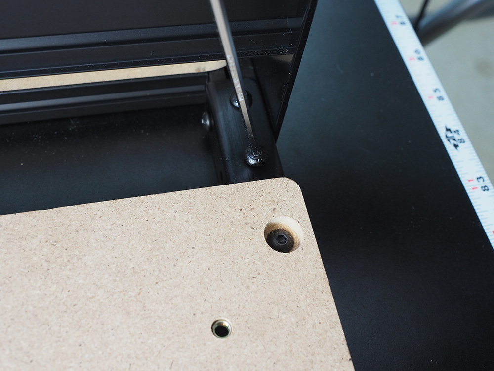

<table>
  <tr>
    <td style="color:#fff;background: #9D9FA2" colspan="3">
      <b>1000mm Side Board Kit</b>
    </td>
  </tr>
  <tr>
    <td>
      <b>SKU</b>
    </td>
    <td>
      <b>Name</b>
    </td>
    <td>
      <b>Quantity</b>
    </td>
  </tr>
  <tr>
    <td>
      30684-01
    </td>
    <td>
      Extrusion Connection Bracket
    </td>
    <td>
      2
    </td>
  </tr>
  <tr>
    <td>
      25281-13
    </td>
    <td>
      T-Slot Nut M5 Pre-Assembly
    </td>
    <td>
      21
    </td>
  </tr>
  <tr>
    <td>
      26018-01
    </td>
    <td>
      Cast Corner Bracket, Clear
    </td>
    <td>
      4
    </td>
  </tr>
  <tr>
    <td>
      30517-11
    </td>
    <td>
      Threaded Insert M5
    </td>
    <td>
      12
    </td>
  </tr>
  <tr>
    <td>
      30685-03
    </td>
    <td>
      Side Board, X-Carve 1000mm
    </td>
    <td>
      1
    </td>
  </tr>
  <tr>
    <td>
      26049-10
    </td>
    <td>
      Extrusion T-Slot 20x20 x 250mm
    </td>
    <td>
      2
    </td>
  </tr>
  <tr>
    <td>
      26049-04
    </td>
    <td>
      Extrusion T-Slot 20x20 x 958mm
    </td>
    <td>
      2
    </td>
  </tr>
  <tr>
    <td>
      25286-34
    </td>
    <td>
      Button Head Cap Screw M5 x 8
    </td>
    <td>
      8
    </td>
  </tr>
  <tr>
    <td>
      25286-37
    </td>
    <td>
      Button Head Cap Screw M5 x 10
    </td>
    <td>
      8
    </td>
  </tr>
  <tr>
    <td>
      25286-41
    </td>
    <td>
      Button Head Cap Screw M5 x 12
    </td>
    <td>
      5
    </td>
  </tr>
  <tr>
    <td>
      25286-47
    </td>
    <td>
      Button Head Cap Screw M5 x 14
    </td>
    <td>
      12
    </td>
  </tr>
</table>
<table>
  <tr>
    <td style="color:#fff;background: #8A52A1" colspan="3">
      <b>1000mm Drag Chain Kit</b>
    </td>
  </tr>
  <tr>
    <td>
      <b>SKU</b>
    </td>
    <td>
      <b>Name</b>
    </td>
    <td>
      <b>Quantity</b>
    </td>
  </tr>
  <tr>
    <td>
      26016-03
    </td>
    <td>
      T-Slot Nut M5 Post-Assembly
    </td>
    <td>
      2
    </td>
  </tr>
</table>

Install all threaded inserts into side board.

Insert 2 pre-assembly t-slot nuts on the inside each aluminum extrusion and 1 additional pre-assembly t-slot nut on the top side of the 958mm extrusions. These will be used to attach the gusset brackets to the extrusions and the single pre-assembly t-slot will attach to the middle countersunk hole of the sideboard.
 

Loosely assemble frame using the 20mm x 20mm aluminum extrusion, 4 gusset brackets, 8 pre-assembly insertion nuts and 8 M5x10mm button head cap screws.

Place sideboard over the frame and line up 958mm extrusion with the pre-assembly t-slot nut under the middle countersunk hole. Tighten all 8 M5x10mm button head cap screws to secure gusset brackets. Slide 2 pre-assembly t-slot nuts on the top of the 250mm aluminum extrusions. Attach the side board to the frame by placing 5 M5x12mm button head cap screws in the countersunk holes and securing into the pre-assembly insertion nuts. 

Insert pre-assembly t-slot nuts into the ends of the sideboard and wasteboard frame. These will be used to attach the side board to the X-Carve frame using the extrusion connection brackets. Use M5 x 8 button head cap screws to secure the extrusion connection brackets.

 Use 2 post-assembly t-slot nuts and 2 M5 x 10 flat head screws to secure the drag chain to the sideboard.

Lift the machine onto the side board and tighten down remaining button head cap screws.

Insert the two post-assembly t-slot nuts and slide into place, lining them up with the holes in the bracket, and secure the drag chain end in place.

<b>NOTE:</b> The M5 x 14 button head cap screws will be used to attach the X-Controller to the sideboard. Extra screws can be used to mount components not included with the X-Carve. 

