

Welcome to the X-Controller assembly instructions! The images shown at the beginning of each step show the finished results of that step. This provides context for what you're about to start working on, and offer those eager and willing to figure things out on their own a way to skim through more quickly. Click on the thumbnails to see more details.

Each step also begins with a bill of materials (BOM) that details the necessary components to complete the step. Please review the full bill of materials, listed below, before getting started. Few things are more frustrating than being partway through a build and suddenly discovering something is missing.
 

Click the black bar below to reveal the BOM and make sure you received everything. Note that the <strong>FRONT AND BACK PANELS</strong> are located in the styrofoam inserts. If any parts are missing, please contact us at help @ inventables.com for replacements.

	

		

			<a data-toggle="collapse" data-parent="#model-accordion" href="#model" aria-expanded="false" aria-controls="rail" style="color:#fff;background: #383838" class="panel-heading" role="tab" id="model-header">
				<h4 class="panel-title">
					<b>Bill of Materials</b>
				</h4>
				

					<i class="fa fa-plus"></i>
					 <i class="fa fa-minus"></i>
				

			</a>
			

				

					<table>
						<tr style="color:#fff;background: #383838;">
							<td> <b>SKU</b> </td>
							<td> <b>Name</b> </td>
							<td> <b>Quantity</b> </td>
						</tr>
						<tr>
							<td> 01 </td>
							<td> Chassis </td>
							<td> 1 </td>
						</tr>
						<tr>
							<td> 02 </td>
							<td> Enclosed Power Supply </td>
							<td> 1 </td>
						</tr>
						<tr>
							<td> 03 </td>
							<td> Power Supply Interface PCB </td>
							<td> 1 </td>
						</tr>
						<tr>
							<td> 04 </td>
							<td> Power Supply Phillips Head Screws</td>
							<td> 5 </td>
						</tr>
						<tr>
							<td> 05 </td>
							<td> Main Controller PCB </td>
							<td> 1 </td>
						</tr>
						<tr>
							<td> 06 </td>
							<td> Ribbon Cable </td>
							<td> 2 </td>
						</tr>
						<tr>
							<td> 07 </td>
							<td> E-Stop Cable </td>
							<td> 1 </td>
						</tr>
						<tr>
							<td> 08 </td>
							<td> E-Stop Button </td>
							<td> 1 </td>
						</tr>
						<tr>
							<td> 09 </td>
							<td> Top Panel </td>
							<td> 1 </td>
						</tr>
						<tr>
							<td> 10 </td>
							<td> Buttons PCB </td>
							<td> 1 </td>
						</tr>
						<tr>
							<td> 11 </td>
							<td> Nylon Threaded Standoff M3 </td>
							<td> 4 </td>
						</tr>
						<tr>
							<td> 12 </td>
							<td> Button Head Cap Screw M3 x 6mm </td>
							<td> 4 </td>
						</tr>
						<tr>
							<td> 13 </td>
							<td> USB Bulkhead Cable </td>
							<td> 1 </td>
						</tr>
						<tr>
							<td> 14 </td>
							<td> Front Panel </td>
							<td> 1 </td>
						</tr>
						<tr>
							<td> 15 </td>
							<td> Socket Head Cap Screw M4 x 6mm </td>
							<td> 8 </td>
						</tr>
						<tr>
							<td> 16 </td>
							<td> Back Panel </td>
							<td> 1 </td>
						</tr>
						<tr>
							<td> 17 </td>
							<td> Nylon Hex Nut M3 </td>
							<td> 4 </td>
						</tr>
						<tr>
							<td> 18 </td>
							<td> Terminal Block 4C 5mm Plug </td>
							<td> 4 </td>
						</tr>
						<tr>
							<td> 19 </td>
							<td> Terminal Block 8C 3.5mm Plug </td>
							<td> 1 </td>
						</tr>
						<tr>
							<td> 20 </td>
							<td> Terminal Block 7C 3.5mm Plug </td>
							<td> 1 </td>
						</tr>
						<tr>
							<td> 21 </td>
							<td> USB Cable </td>
							<td> 1 </td>
						</tr>
						<tr>
							<td> 22 </td>
							<td> Power Cord </td>
							<td> 1 </td>
						</tr>
					</table>
				

			

		

	

Gather up the following tools to get started.

<table>
	<tr>
		<td style="color:#fff;background: #383838;" colspan="3"><b>Tools</b> </td>
	</tr>
	<tr>
		<td colspan="3">Phillips Screwdriver </td>
	</tr>
	<tr>
		<td colspan="3">2.5mm Allen Wrench </td>
	</tr>
	<tr>
		<td colspan="3">3mm Allen Wrench </td>
	</tr>
	<tr>
		<td colspan="3">5.5mm Open End Wrench (Adjustable Wrench or Pliers) </td>
	</tr>
</table>

	<h2 id="install-power-supply">
	<strong>Install Power Supply</strong></h2>

	<ol class="step-contents">
		<li>
		Prepare Power Supply Power Supply</li>

		<li>
		Attach Power Supply Interface PCB</li>
	</ol>

	

	<table>
		<tr style="color:#fff;background: #383838;">
			<td> <b>SKU</b> </td>
			<td> <b>Name</b> </td>
			<td> <b>Quantity</b> </td>
		</tr>
		<tr>
			<td> 02 </td>
			<td> Enclosed Power Supply </td>
			<td> 1 </td>
		</tr>
		<tr>
			<td> 03 </td>
			<td> Power Supply Interface PCB </td>
			<td> 1 </td>
		</tr>
		<tr>
			<td> 04 </td>
			<td> Power Supply Phillips Head Screws </td>
			<td> 5 </td>
		</tr>
	</table>

	<h3>
	1. Prepare Enclosed Power Supply</h3>
	 
	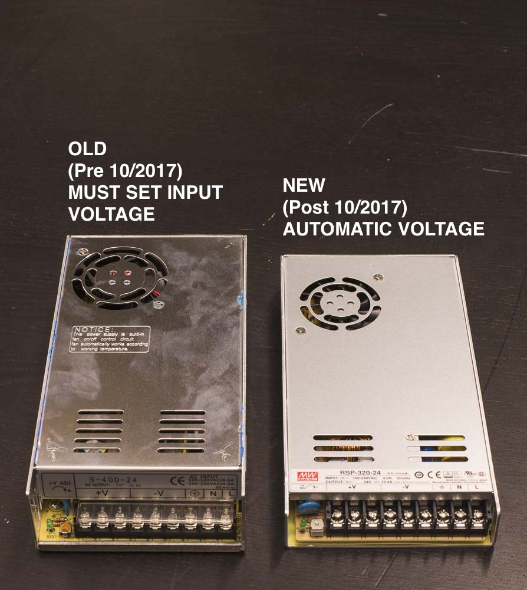

	

	Since approximately October 2017, we are shipping X-Controllers with a new style of power supply that will automatically work with any mains AC voltage between 100V and 240V. The new power supply is also thinner and has a slightly lower nominal wattage, but it is otherwise functionally identical to the old power supply. <b>If you have the old style,</b> flip the toggle switch on the side of the power supply to the voltage that corresponds to your <a href="https://en.wikipedia.org/wiki/Mains_electricity_by_country#Table_of_mains_voltages_and_frequencies">outlet voltage.</a>
	

	

	<h3>
	2. Attach Power Supply Interface PCB</h3>
	 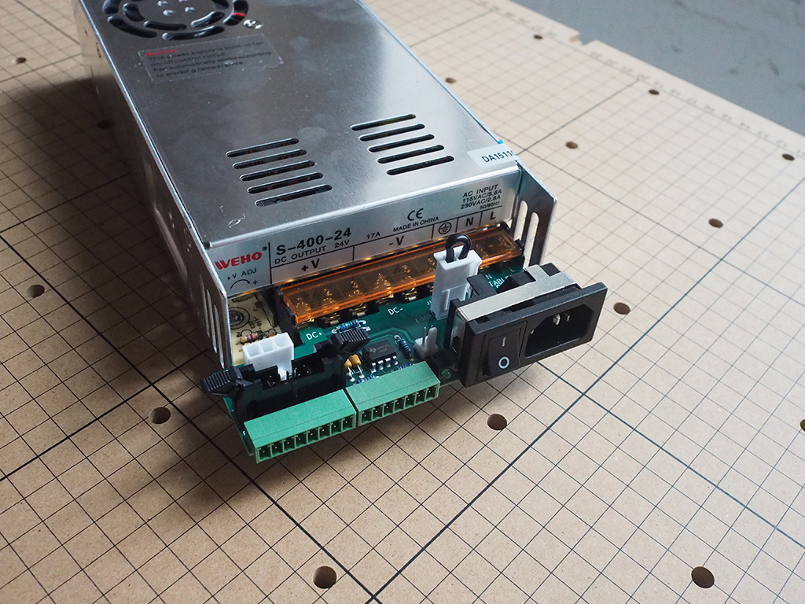

	

	On the enclosed power supply, flip back the transparent cover that corresponds to the "fingers" on the power supply interface PCB. Attach the power supply interface PCB using the power supply Phillips Head screws.

	

		

			<a href="#" class="thumbnail">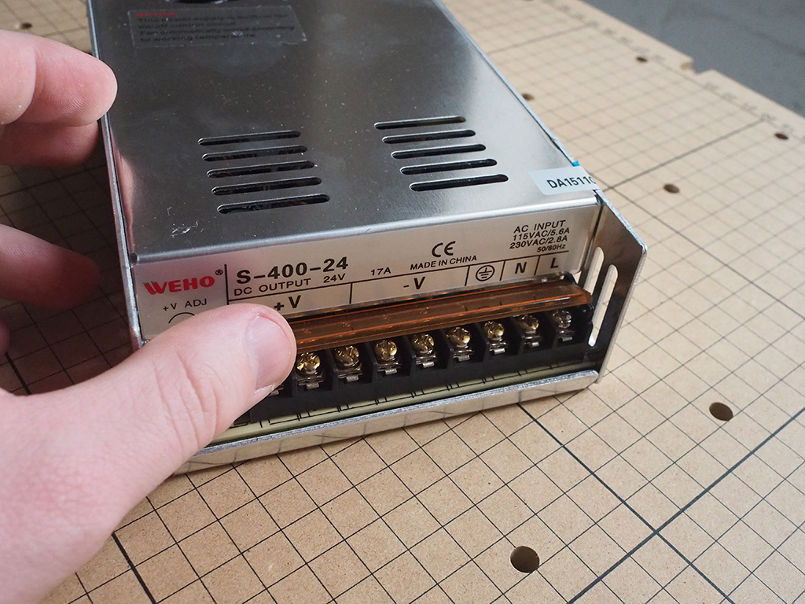</a>
		

		

			
		

		

			
		

		

			<a href="#" class="thumbnail">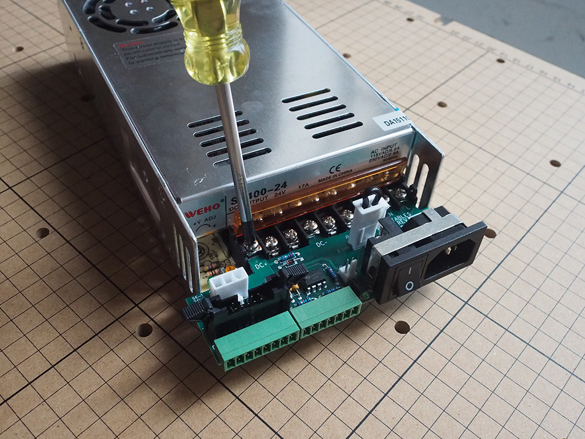</a>
		

	

	

		<i class="fa fa-hand-o-right"></i>
		 
		
<strong>Note:</strong> You won't have access to the side of the power supply from here on out, so double check your voltage before moving forward.

		 
	

	<h3>
	3. Attach Power Supply to Chassis</h3>
	 

	
	Using the M4 x 8mm button head cap screws, attach the power supply through the mounting holes on the underside of the chassis. The threaded holes on the base of the power supply are delicate, so try not to overtighten the screws when assembling.

	

		<i class="fa fa-hand-o-right"></i>
		 
		 <strong>Note: The chassis is not symmetrical.</strong> The power supply interface PCB will be flush with the end of the chassis when installed correctly.
		 
	

	<h2 id="install-controller-board">
	<strong>Install Controller Board</strong></h2>

	<ol class="step-contents">
	<li>
	Prepare Controller Board</li>

	<li>
	Wire Controller Board</li>

	<li>
	Attach Controller Board</li>

	</ol>
	
	<table>
		<tr style="color:#fff;background: #383838;">
			<td> <b>SKU</b> </td>
			<td> <b>Name</b> </td>
			<td> <b>Quantity</b> </td>
		</tr>
		<tr>
			<td> 06 </td>
			<td> Main Controller PCB </td>
			<td> 1 </td>
		</tr>
		<tr>
			<td> 07 </td>
			<td> Power Cable </td>
			<td> 1 </td>
		</tr>
		<tr>
			<td> 08 </td>
			<td> Ribbon Cable </td>
			<td> 1 </td>
		</tr>
		<tr>
			<td> 09 </td>
			<td> E-Stop Cable </td>
			<td> 1 </td>
		</tr>
	</table>

	<h3>
	1. Prepare Controller Board</h3>
	 

	
For your X-Controller to work correctly with your X-Carve, you must first set the current potentiometers and microstepping switches for each axis. The proper configuration is shown below

	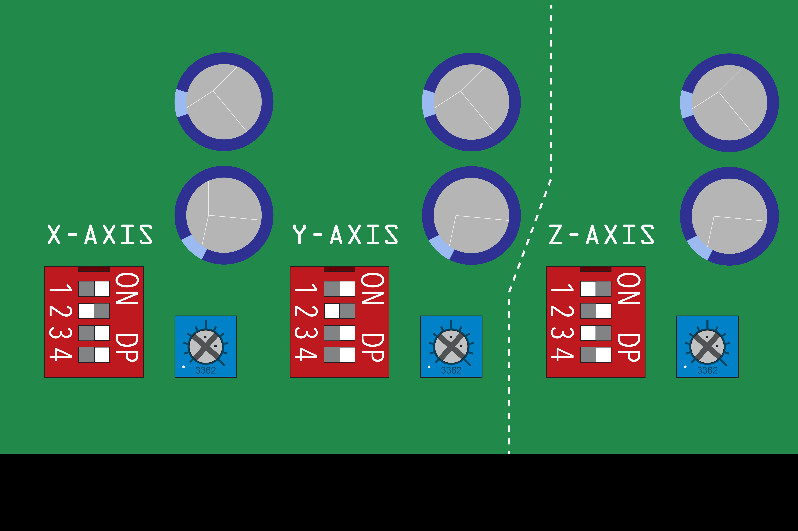

	
Note that the 'dial' of the potentiometer is the notch with the two small dots on either side. This should be tuned to roughly the 2 o'clock position to give roughly 2.6A-2.8A. this can be set with a small screwdriver. The X and Y dip switches are set to 8x microstepping with switches 1, 3, and 4 in the 'ON' position. For the Z axis, you'll set the driver to 2x microstepping with only switches 2 and 4 'ON'.

	<h3>
	2. Wire Controller Board</h3>
	 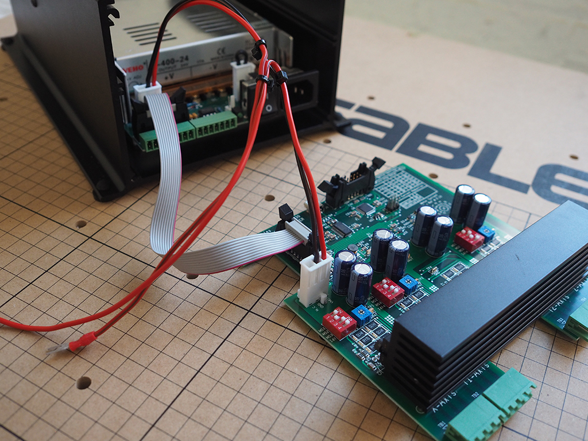

	

	Attach the cables from the controller board to the power supply interface PCB. The cables can only be connected in one orientation. Make sure the ribbon clamps are in the open position. If the cables don't attach well, double check them and try again. Try orienting the cables so that the wires easily travel from board to board.

	

		

			
		

		

			<a href="#" class="thumbnail">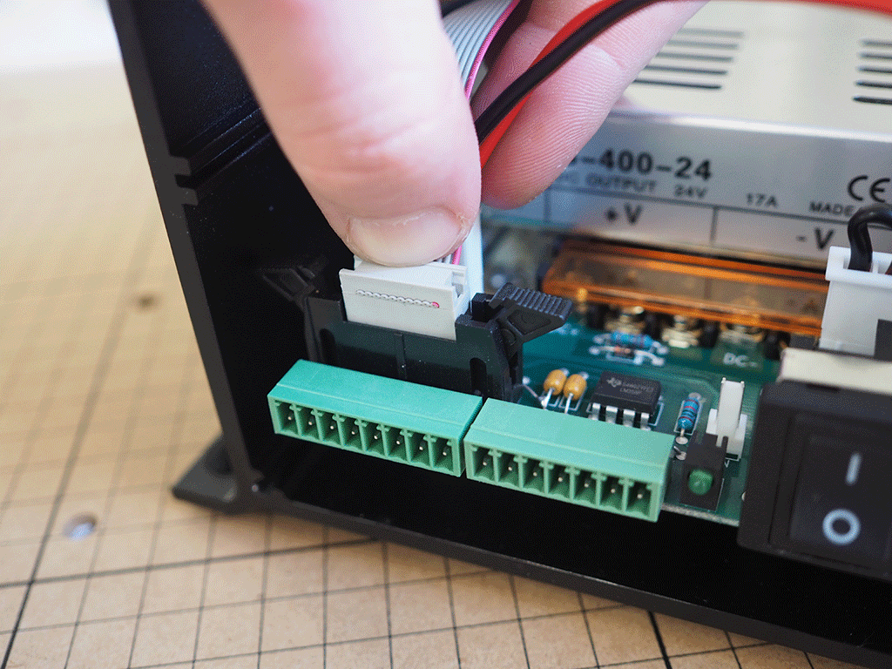</a>
		

		

			
		

		

			
		

	

	

		<i class="fa fa-hand-o-right"></i>
		 
		 <strong>Note:</strong> Make sure to tuck the e-stop cable along the edge of the enclosed power supply to prevent snagging or pinching.
		 
	

	<h3>3. Attach Controller Board</h3>
	 

	

	Slide the controller board into the channels of the chassis, making sure you route the wires through the cutout on the board to prevent snagging or pinching. The two remaining M4 x 8mm button head cap screws can be installed in the threaded holes on the sides of the chassis. The screws act as stoppers, preventing the controller board from moving around within the chassis.

	

		

			
		

		

			
		

	

	

		<i class="fa fa-hand-o-right"></i>
		 
		 <strong>Note:</strong> The wires might be stiff. If you're having trouble, don't force the wires. Try shaping the wire into place. Double check all of your connections before moving forward, in case the wires snag and become loose when sliding into position. 
		 
	

	<h2 id="install-front-panel">
	<strong>Install Front Panel</strong></h2>

	<ol class="step-contents">
	<li>
	Disassemble E-Stop Button</li>

	<li>
	Attach E-Stop Button</li>

	<li>
	Attach USB Cable</li>

	<li>
	Wire E-Stop And Attach Front Panel</li>

	</ol>
	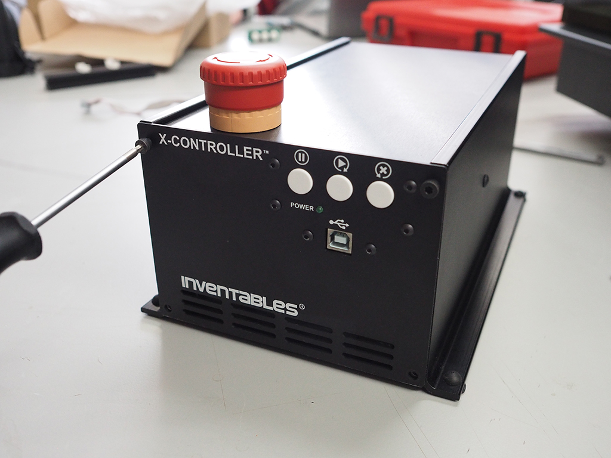

	<table>
		<tr style="color:#fff;background: #383838;">
			<td> <b>SKU</b> </td>
			<td> <b>Name</b> </td>
			<td> <b>Quantity</b> </td>
		</tr>
		<tr>
			<td> 08 </td>
			<td> Ribbon Cable </td>
			<td> 1 </td>
		</tr>
		<tr>
			<td> 10 </td>
			<td> E-Stop Button </td>
			<td> 1 </td>
		</tr>
		<tr>
			<td> 11 </td>
			<td> Top Panel </td>
			<td> 1 </td>
		</tr>
		<tr>
			<td> 12 </td>
			<td> Buttons PCB </td>
			<td> 1 </td>
		</tr>
		<tr>
			<td> 13 </td>
			<td> Threaded Standoff M3 </td>
			<td> 4 </td>
		</tr>
			<tr>
			<td> 13 </td>
			<td> Nylon Hex Nuts M3 </td>
			<td> 4 </td>
		</tr>
		<tr>
			<td> 14 </td>
			<td> Button Head Cap Screw M3 x 6mm </td>
			<td> 4 </td>
		</tr>
		<tr>
			<td> 15 </td>
			<td> USB Bulkhead Cable </td>
			<td> 1 </td>
		</tr>
		<tr>
			<td> 16 </td>
			<td> Front Panel </td>
			<td> 1 </td>
		</tr>
		<tr>
			<td> 17 </td>
			<td> Socket Head Cap Screw M4 x 6mm </td>
			<td> 4 </td>
		</tr>
	</table>

	<h3>
	1. Disassemble E-Stop Button</h3>
	 

	

	Remove the button from the screw terminals by gently pulling on the yellow tab. With the button upside down (as pictured), pull the tab towards you and then to the right to disengage the two parts. Unscrew the black nut attached to the base of the button. This nut will be used to secure the button to the enclosure.

	

	

	

	

	

	

	

	

	

	

	

	

	

	

	<h3>
	2. Attach E-Stop Button</h3>
	 

	

	Insert the button through the hole on the top panel and secure using the nut. Make sure the side of the button marked "TOP" is facing the center of the top panel.

	

	

	

	

	

	

	

	

	

	

	

	

	<i class="fa fa-hand-o-right"></i>
	 
	 <strong>Note:</strong> When wiring the e-stop in subsequent steps, make sure the "TOP" marking on the button lines up with the "TOP" marking on the screw terminals.
	 

	

	<h3>
	3. Attach Buttons And USB Cable</h3>
	 

	

	Remove the silver Phillips head screws from the USB cable terminal. Attach the USB cable terminal to the front panel from the backside of the panel. Secure it in place using the Phillips head screws. 

	

	Next, install the nylon threaded standoffs to the buttons PCB board. Insert the male end of the standoff through the buttons PCB from the front, securing each standoff in the back using a nylon hex nut. Secure one standoff to each corner of the board. Next, align the buttons PCB with the button holes in the front panel and attach the PCB with the M3 6mm button head screws. 

	

	Lastly, attach the other end of the USB cable to the main controller board. <strong>Don't attach the front panel</strong> to the chassis until the rest of the e-stop is installed in the next step.

	

		

			
		

		

			
		

		

			
		

		

			
		

		

			
		

		

			
		

	

	<h3>
	4. Wire And Attach Front Panel</h3>
	 

	

	The last item we need to wire to the front panel is the second ribbon cable. Insert one end of the cable to the remaining receiver on the main controller board, and the other end on the back of the buttons PCB board on the front panel. 
	

	

	Loosen the Phillips head screws on the e-stop screw terminals and attach one end of the e-stop cable to each side of the NC screw terminal. Both cables are red; it does not matter which cable goes into which side. Tighten the screws on the screw terminals to hold the cable in place. 

	
To attach the wired screw terminal to the button, <strong>line up the "TOP" marking on the button with the "TOP" marking on the screw terminal.</strong> Slide the top panel into the channels of the chassis, from the front of the X-Controller to the back, far enough back so you can access the Mini USB port on the main controller board. Once in position, move the yellow tab towards the back of the assembly to lock in place. Attach the front panel using the included M4 socket head cap screws.

	

		

			<a href="#" class="thumbnail">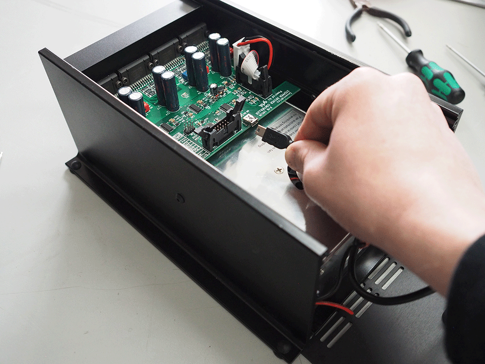</a>
		

		

			
		

		

			
		

		

			
		

		

			
		

		

			
		

		

			
		

	

	

		<i class="fa fa-hand-o-right"></i>
		 
		 <strong>Note:</strong> If your having any problems with this part of the assembly, check out the <a href="http://x-carve-instructions.inventables.com/accessories/e-stop-with-enclosure/">E-Stop with Enclosure instructions</a> for more detailed information.
		 
	

	<h2 id="install-back-panel">
	<strong>Install Back Panel</strong></h2>

	<ol class="step-contents">
	<li>
	Attach Fan</li>

	<li>
	Wire Fan And Attach Back Panel</li>

	</ol>
	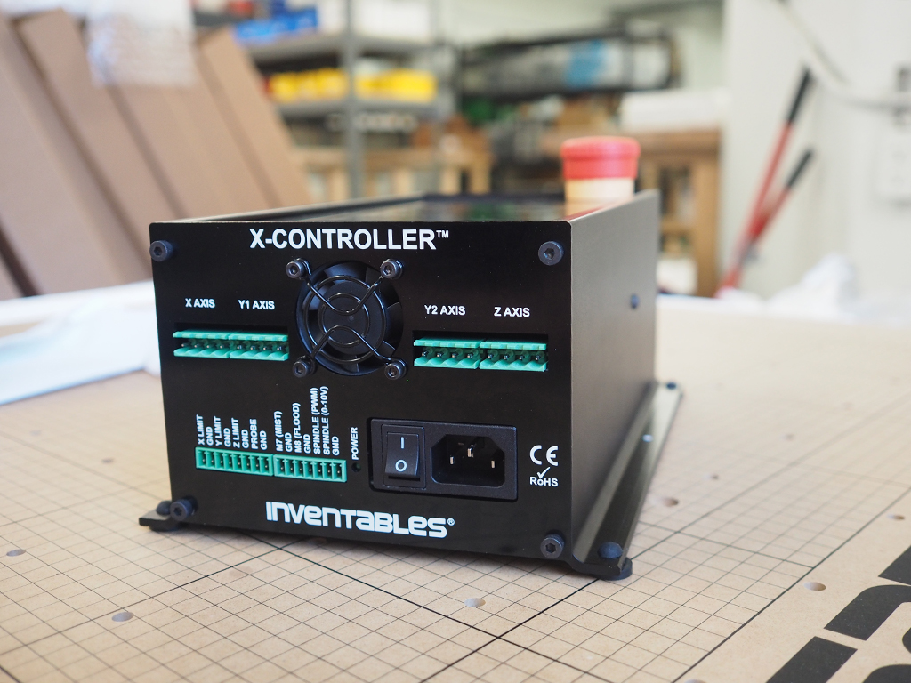

	<table>
		<tr style="color:#fff;background: #383838;">
			<td> <b>SKU</b> </td>
			<td> <b>Name</b> </td>
			<td> <b>Quantity</b> </td>
		</tr>
		<tr>
			<td> 17 </td>
			<td> Socket Head Cap Screw M4 x 6mm </td>
			<td> 4 </td>
		</tr>
		<tr>
			<td> 18 </td>
			<td> Back Panel </td>
			<td> 1 </td>
		</tr>
		<tr>
			<td> 19 </td>
			<td> Flat Washer #4/M3 </td>
			<td> 4 </td>
		</tr>
		<tr>
			<td> 20 </td>
			<td> Fan </td>
			<td> 1 </td>
		</tr>
		<tr>
			<td> 21 </td>
			<td> Socket Head Cap Screw M3 x 20mm </td>
			<td> 4 </td>
		</tr>
		<tr>
			<td> 22 </td>
			<td> Hex Nut M3 </td>
			<td> 4 </td>
		</tr>
	</table>

	<h3>1. Attach Fan</h3>
	 

	

	Using the included M3 socket head cap screws, nuts, and finger guard, attach the fan to the front panel with the <strong>wires pointed down.</strong>

	

		

			
		

		

			
		

	

	<h3>2. Wire Fan And Attach Back Panel</h3>
	 

	

	Attach the fan cable to the power supply interface PCB. The cable can only be connected in one orientation. If it doesn't attach well, double check it and try again. <strong>Check the ribbon cable connector at the power supply interface PCB</strong> and attach the back panel using the included M4 socket head cap screws. You may need to wiggle the lower PCB in place when installing it, in order for the back panel to align flush with the chassis.

	

		

			
		

		

			
		

		

			<a href="#" class="thumbnail">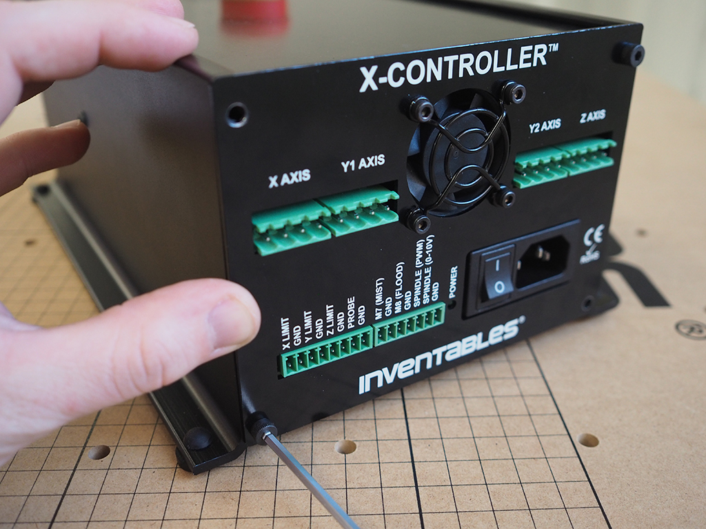</a>
		

	

	<h2>
	<strong>Wire X-Controller</strong></h2>

	
Wire the cables into the green terminal block plugs by inserting the exposed metal ends of each wire and tightening the screws until the wire is held firmly in place. Plug the block plugs into the corresponding spots on the X-Controller. The screws on the terminal blocks will face upward, and you should feel the blocks click into place.  Make sure the colors on the wires match the colors in the diagrams.

	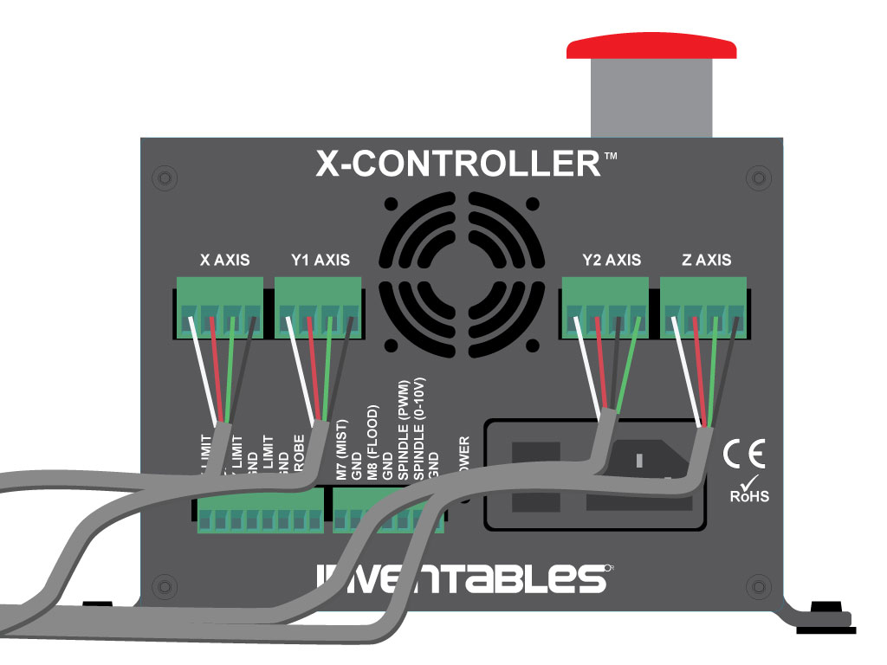

	
With two motors on the y axis facing each other, you'll need to flip one of the y pairs for the motors to move in the same direction. The diagram above shows the black and green wires flipped on Y2.

	

		<i class="fa fa-hand-o-right"></i>
		 
		 <strong>Note:</strong> The stepper motors will act as generators when moved manually and will feed current back into the X-Controller, potentially damaging the stepper drivers and other components. Generally it will be okay to move the X and Y axes slowly if necessary, but it should be avoided whenever possible.
		 
	

	<h3>
	Wire Limit Switches</h3>
	
	

	Wire the limit switches to their respective terminals on the X-Controller. Make sure that the red wire is connected to the limit switch pin and the black wire is connected to the 'GND' pin on the connector.

	

		<i class="fa fa-hand-o-right"></i>
		 
		 <strong>Note: NEVER hook a spindle directly up to the X-Controller.</strong> These are only control signals, <strong>NOT</strong> power.
		 
	

	<h3>Wire Z-Probe</h3>
	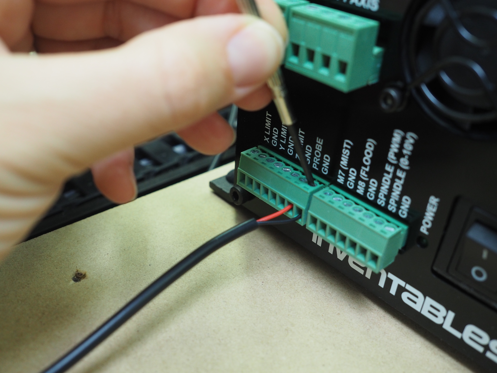
	

	If you have a Z-Probe on your machine, wire the red wire into the 'Probe' Port on the same terminal block as the limit switches and the black wire to the adjacent 'GND' connection.

	
The remaining terminal block plug is used for more advanced spindle options, such as a relay or VFD controlled spindle, and will not be used in a stock X-Carve configuration.

	<h2 id=”sideboard”>
	<strong>Attach To Sideboard</strong></h2>

Attach the X-Controller to the side board using four M5 x 14 Button Head Cap Screws (SKU 25286-47). These should be leftovers from the Side Board Kit. 

	

		
	

	

		
	

	

		
	

	<h2 id="troubleshooting">
	<strong>Troubleshooting</strong></h2>

	<ol class="step-contents">
	<li>
	Won't Turn On</li>

	<li>
	Limit Switches</li>

	<li>
	Won't Connect</li>

	</ol>
	<iframe width="560" height="315" src="https://www.youtube.com/embed/9P57CQ4Z0-0" frameborder="0" allowfullscreen>
	</iframe>
	

	This video is intended to help those with opening back up their X-Controllers for troubleshooting.

	<h3>
	My X-Controller won't turn on!</h3>

	

	Check to make sure your e-stop button is pulled out and not engaged.

	<iframe width="560" height="315" src="https://www.youtube.com/embed/_ZfAWHrgDno" frameborder="0" allow="autoplay; encrypted-media" allowfullscreen></iframe>

	<h3>
	My limit switches don't work!</h3>

	

	Check that the ribbon connectors are fully pushed into the mating connectors.

	

		<i class="fa fa-hand-o-right"></i>
		 
		 <h2><strong>SERVICE INFORMATION:</strong></h2> If any repairs need to be made to your X-Controller, <strong>make sure everything is unplugged and powered down before you do anything at all.</strong>  Failure to do so may cause damage to your X-Controller internals.
		 
	

