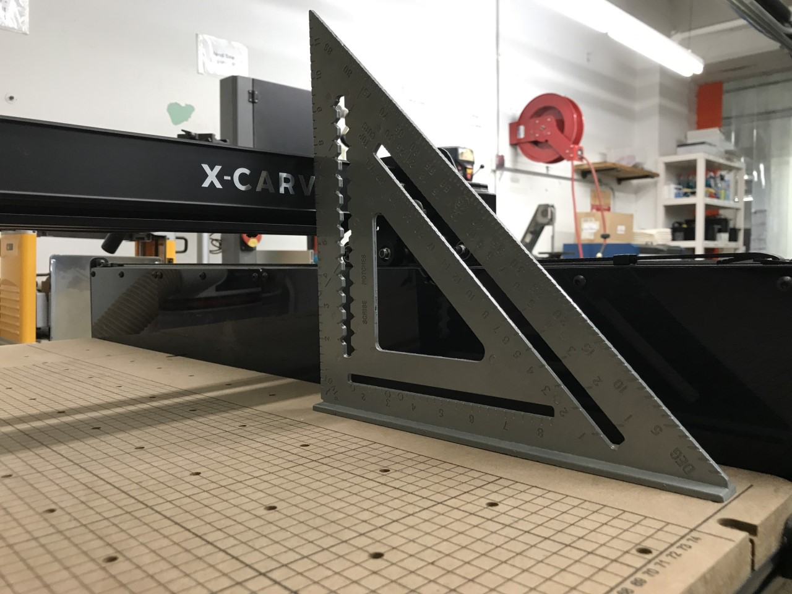
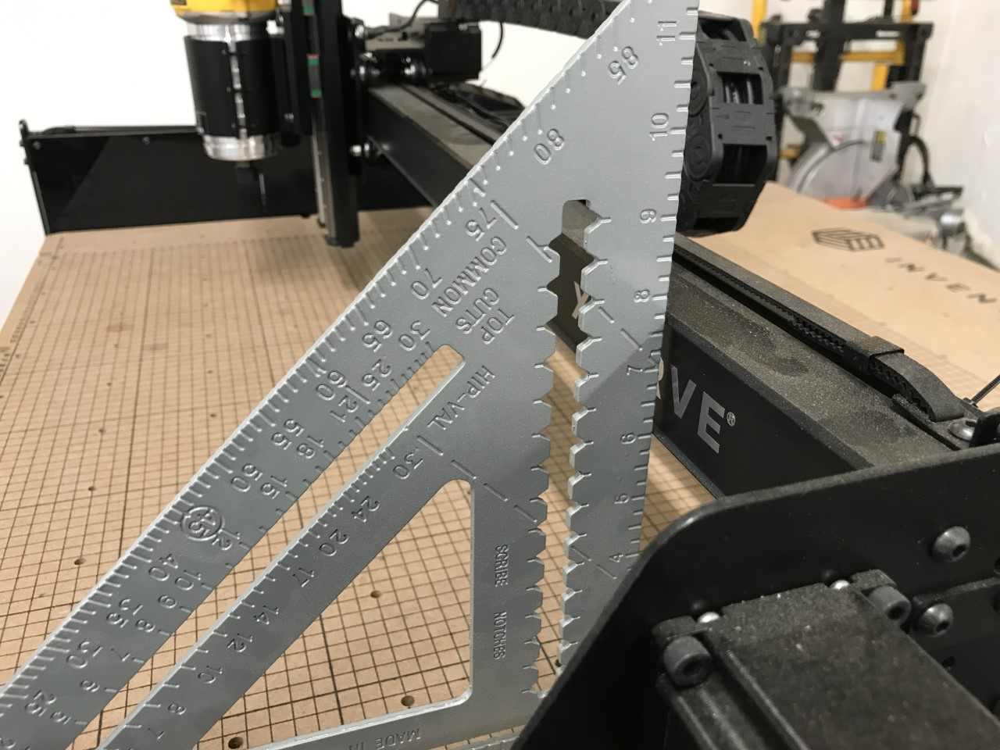
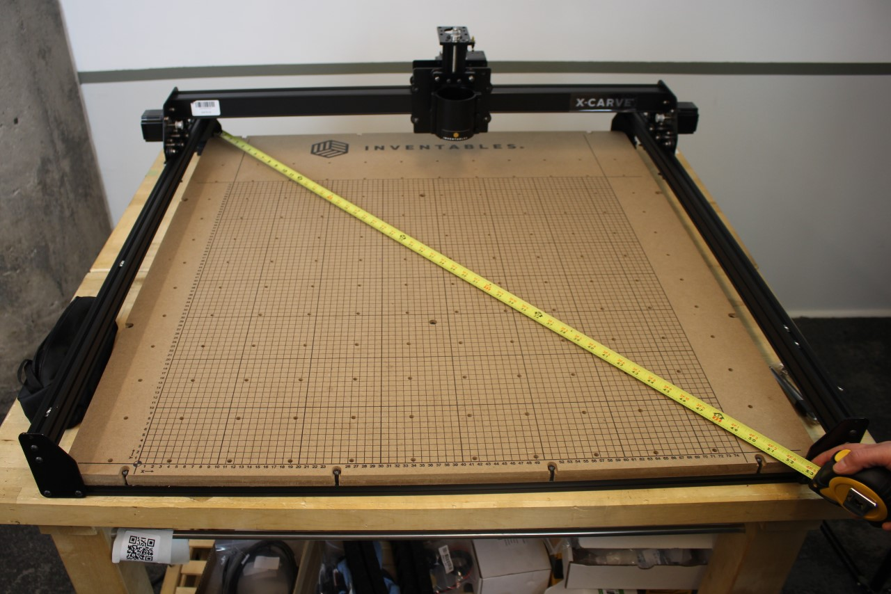
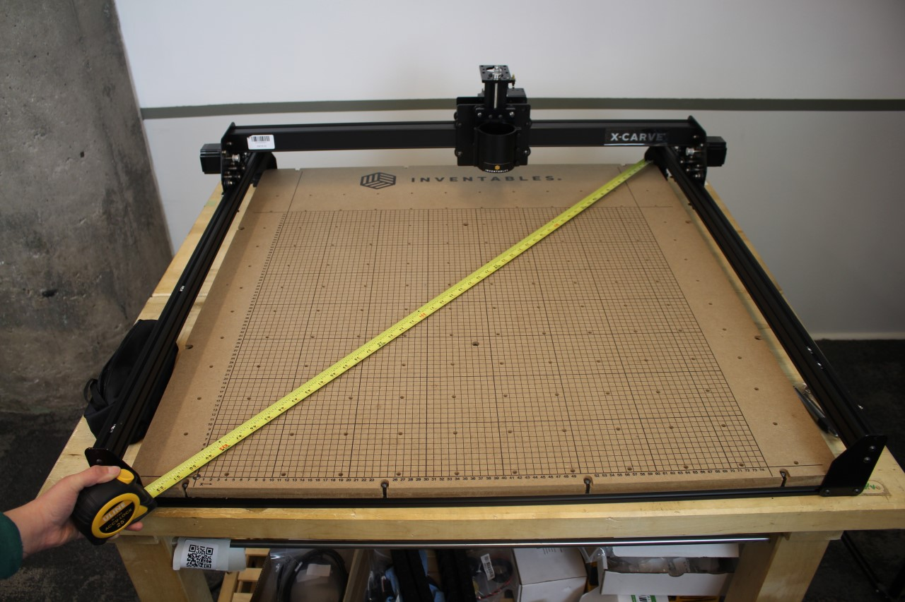
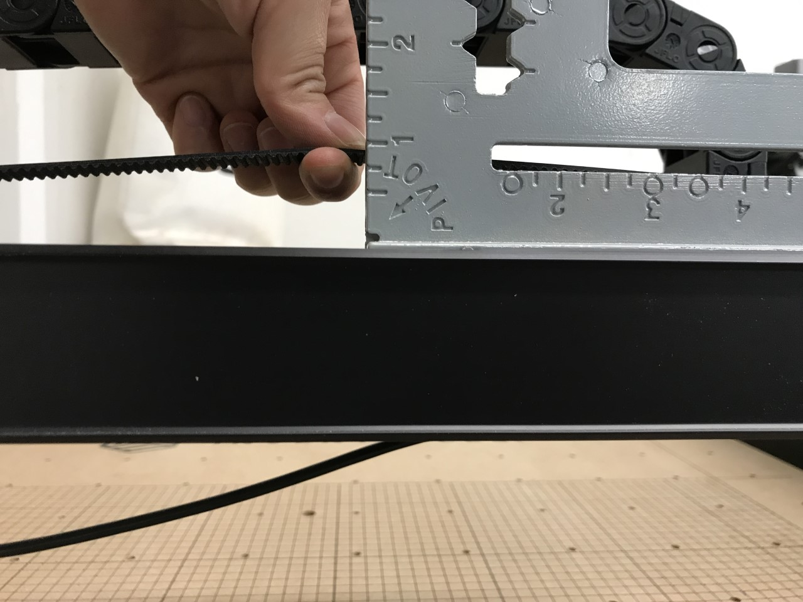

Many of the mechanical problems you'll face can be fixed using the following information.Consumable components include: 
[Belts](https://www.inventables.com/categories/machine-components/belting) 
[Router Brushes](https://www.inventables.com/technologies/dewalt-router-replacement-brush) 
[Wasteboard](https://www.inventables.com/technologies/x-carve-1000mm-waste-board-kit--2) 
You can find replacement parts in our [shop.](https://www.inventables.com/categories/machine-components) 

<h1>Calibration</h1>

Squaring your rails is essential for your X-Carve to move correctly and carve smoothly. 

<h3>Squaring the Z-Axis</h3>

If you see ridges in your carves, ensure the bit is perpendicular to the wasteboard by squaring the z-axis. Put the machine on a flat surface and use a large square ruler to see if the Z-Axis is square to the table (as pictured above). 
If it is not squared, locate the four button head cap screws that are behind the x-carriage. These button head cap screws hold the Z-Axis Makerslide in place (2 on the top and 2 on the bottom). Loosen the button head cap screws and adjust the Z-Axis until it is square to the table. Once it is squared, retighten the screws and square it one more time to make sure. 

<h3>Squaring the X-Carriage</h3>

You may also notice carves are deeper on one side than the other. This could be due to the wide Makerslide being tilted forward on the left or right side. 

Use a large square against the rail and on top of the wasteboard. There should be no gap between the square and the wide makerslide (as pictured above). 

If you see a gap, loosen the 4 button head cap screw at the end plate of the wide makerslide, turn the makerslide, and tighten the four screws back up. Repeat on the opposite side as needed. If your carves are still deeper on one side than the other, check the squaring of the Y-axis rails.

<h3>Squaring the Y-Axis Rails</h3>
To ensure your machine is moving correctly, you need to make sure the Y1 and Y2 rails are parallel from front to back. You can do this by measuring the diagonals between the end plates (left back to front right, then front left to back right). If those measurements aren't the same, you can adjust the rails by loosening up the screws holding the end plates to the waste board, allowing you to move the rail.

As you tighten the screws, push down on the rails to ensure the rails are tightened at the same height.

    <i class="fa fa-hand-o-right"></i>
     
    
TIP: Power off the X-Controller and unplug the stepper motors, then loosen the rails and push the machine back and forth to allow it to settle on itself before tightening the screws. Make sure the stepper motors are completely disconnected otherwise this can cause the stepper motors to damage the stepper driver chips inside the X-Controller.

     

<h3>Belts</h3>

If you notice your carves are offset or your X-Carve does not say on path, you may need to adjust the belt tension. 
Start by jogging the gantry/carriage all the way to one side. Once it is in position, make sure the X-Controller is powered off so there is no resistance on the motors.

For the z-axis belt, squeeze the closed loop belt. You should have about 1/4" gap in between the end. To add more tension, loosen the z-axis stepper motor, pull it back and tighten the screws. You may use a temporary shim (such as the DeWalt Router wrench) between the stepper motor and the z-axis makerslide.

You'll also want to make sure the setscrews on the leadscrew pulley are tightened.

For the x and y-axis belts, pull from the center of the belt up an inch and you should feel some resistance. It shouldn't be impossible to pull it up an inch, nor should it feel slack. You can adjust the tension by feeding more or less of the belt through the clip or tightening the tensioning screw.
  

<h2>Tensioning Belts</h2>

First, locate the belt clips without the tensioning screw. Ensure these clips are sitting straight and parallel with the makerslide and also make sure it is sitting flush with the end plates. Next, locate the belt clip with the tension screw and loosen M5 x 8mm screw that attaches the belt clip to the makerslide. Using an allen key and wrench, tighten the M5 nut on the tensioning screw a couple of turns to desired belt tension.  

Once the belt is tensioned, tighten the M5 x 8mm screw to secure the belt clip to the makerslide. 
Do not over tension as this can cause the belt to snap. Repeat these steps on the other belts.

    <i class="fa fa-hand-o-right"></i>
     
    
Optional: You can also check belt tension with a fish scale. We recommend 3lbs per inch displacement. For information on properly tensioning your belts, please check out this Community Forum thread: <a href="https://discuss.inventables.com/t/procedure-to-set-belt-tension/10837" target="_blank">Belt Tension.</a>

     

<h3>V-Wheels</h3>

If your machine is skipping steps or losing position, your eccentric v-wheels may not be properly positioned.

The first step is to locate the adjustable v-wheels. On the X-Carve, the v-wheels are categorized as either fixed or adjustable. The fixed v-wheels are attached by a regular nylock nut while the adjustable v-wheels are attached by an eccentric spacer. 
This video demonstrates how the adjustable v-wheels work:

<iframe width="560" height="315" src="https://www.youtube.com/embed/C0ejl-DHZFI" frameborder="0" allowfullscreen></iframe> 
 

Note that every fixed v-wheel has an adjustable v-wheel associated with it. There are 8 v-wheels on the X Carriage, 4 on each Y-Plate, and 4 on the Spindle Carriage.
After you’ve located the v-wheels, tighten the fixed v-wheels on the machine then adjust the corresponding adjustable v-wheel.

To properly position the adjustable v-wheel, take an open-ended wrench and slowly turn the eccentric spacer to the point where it takes a little bit of effort for it to spin. 

Do this slowly to ensure you do not over-tighten the v-wheel. This can cause the wheels to crack.
Now repeat this step for every pair of v-wheels. Finally, test the wheels by moving the carriage using the Jog Controls in Easel. If the wheels moves along with the carriage without much effort, then they are properly tightened.

<h1>Maintenance</h1>

<h3>Cleaning the rails and v-wheels</h3>

Use a soft cloth to wipe down the v-groove on the rails after every carve. To clean the v-wheels, use a soft brush such as an old toothbrush to clear debris. Compressed air can also be used. 

<h3> Changing DeWalt Router Brushes</h3>
Changing the brushes takes a few minutes. Follow the steps in this video: 
<iframe width="560" height="315" src="https://www.youtube.com/embed/6ZaeP-eCXBg" frameborder="0" allowfullscreen></iframe> 

<h3>Surfacing the Wasteboard</h3>
The wasteboard is made out of MDF and this material can warp with changing environmental conditions and after use as the pressure from the router carving down will press down on the material. It is meant to be cut into to make sure you get full through-cuts. We recommend surfacing the wasteboard so it is flat in relation to the router's cutting path. This is a known best practice when CNC milling.  
 
Planing the wasteboard is recommended after ensuring the X-Carve is squared and tuned.  
 
In Easel, you can set up a square the size of the work area to approximately .01" depth. Before carving, home the X-Carve and use the Z-Probe for the best results. We recommend using a <a href="https://www.inventables.com/technologies/carbide-tipped-surfacing-bit-1-in-x-1-4-in-shank" target="_blank">surfacing bit</a> like the one in our shop.  
 
If you're concerned about alignment without a grid, try carving out your own grid after you have surfaced it. This is beneficial as you can make a grid custom to your needs.  
 
Some users opt for putting an additional sheet of MDF on top of their wasteboard and underneath their material to preserve the screen printed grid. If you wanted to go this route, you would need to surface the "sacrificial" wasteboard to ensure it is flat and perpendicular to the spindle. 

 
 