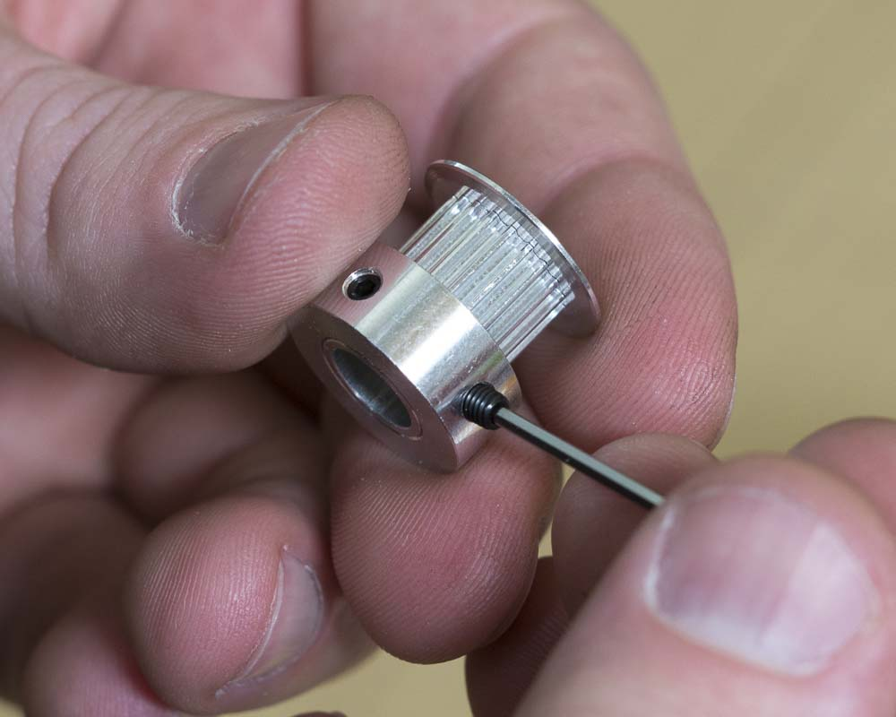
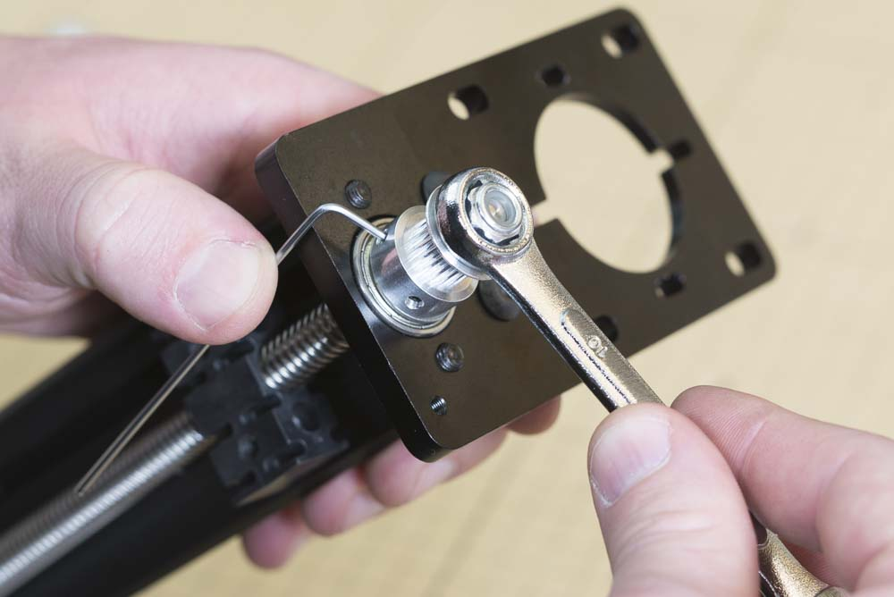

<table>
<tr><td style="color:#fff;background: #000;" colspan="3"><b>Components</b></td></tr>
	<tr>
		<td><b>SKU</b></td>
		<td><b>Name</b></td>
		<td><b>Quantity</b></td>
	</tr>
<tr>
<td>26054-04</td>
<td>Pulley GT2 8mm Bore 20 Tooth</td>
<td>1</td>
</tr>
<tr>
<td>30265-05</td>
<td>Hex Nut M6 Nylon Locking Steel/Zinc</td>
<td>1</td>
</tr>

</table>

Prepare the 20 tooth pulley by making sure that the small set screw that hold the pulley to the head of the leadscrew are inserted in the two holes and are loose. Slide the pulley on top of the leadscrew and tighten the set screws to secure.

Thread the M6 nylock nut onto the top of the leadscrew and tighten with a 10mm wrench. you can hold the leadscrew by its pulley or by applying a clamping force to the leadscrew itself. Make sure you don't mar the threads.

