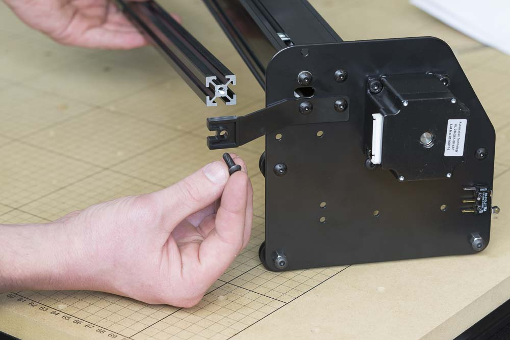

<table>
<tr><td style="color:#fff;background: #000;" colspan="3"><b>Components</b></td></tr>
	<tr>
		<td><b>SKU</b></td>
		<td><b>Name</b></td>
		<td><b>Quantity</b></td>
	</tr>
<tr>
<td>26049-09</td>
<td>Extrusion T-Slot 20x20 x 1000mm Long Black Tapped</td>
<td>1</td>
</tr>
<tr>
<td>25286-29</td>
<td>Button Head Screw M5 x 14 Steel/Black</td>
<td>2</td>
</tr>
</table>

Attach a piece of 1000mm 20mmx20mm extrusion to the plastic brackets of the gantry. Secure the ends with 2x M5x14mm button head cap screws. We'll attach the drag chain hardware on this in a later step.

