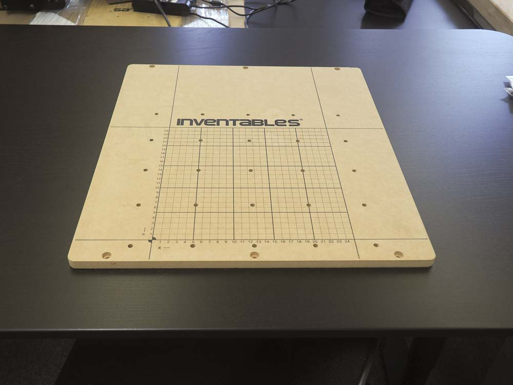
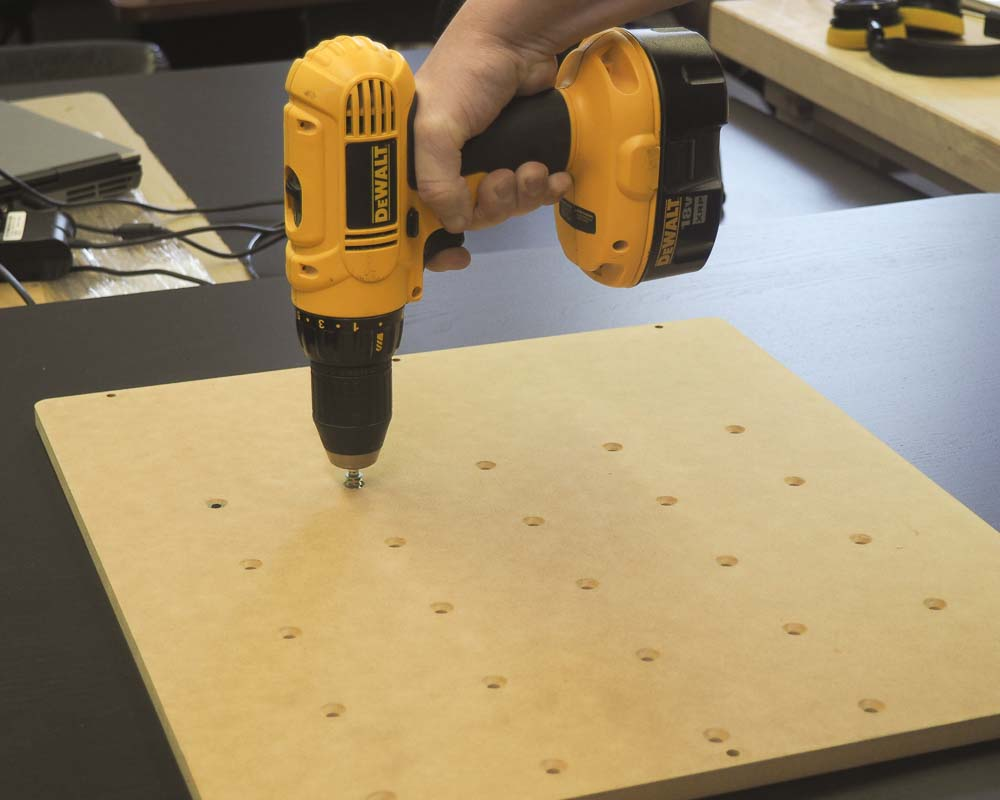
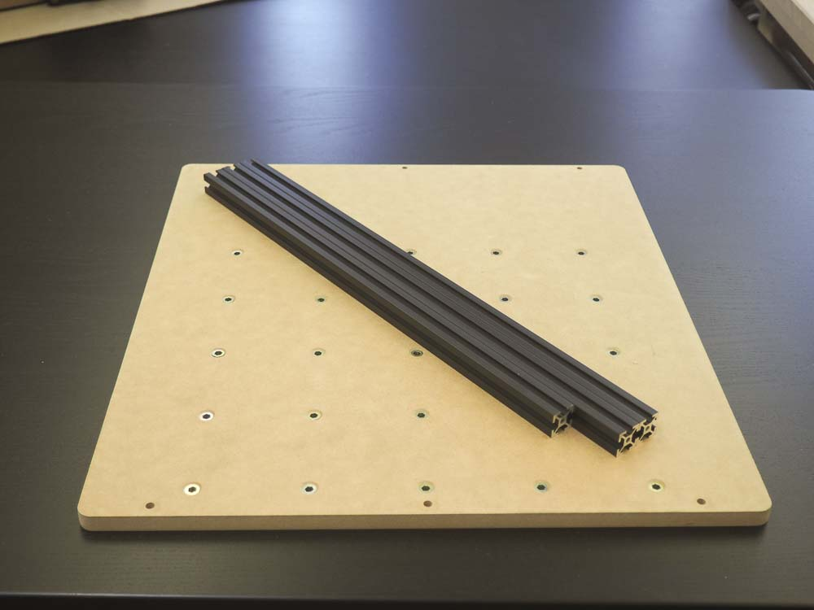
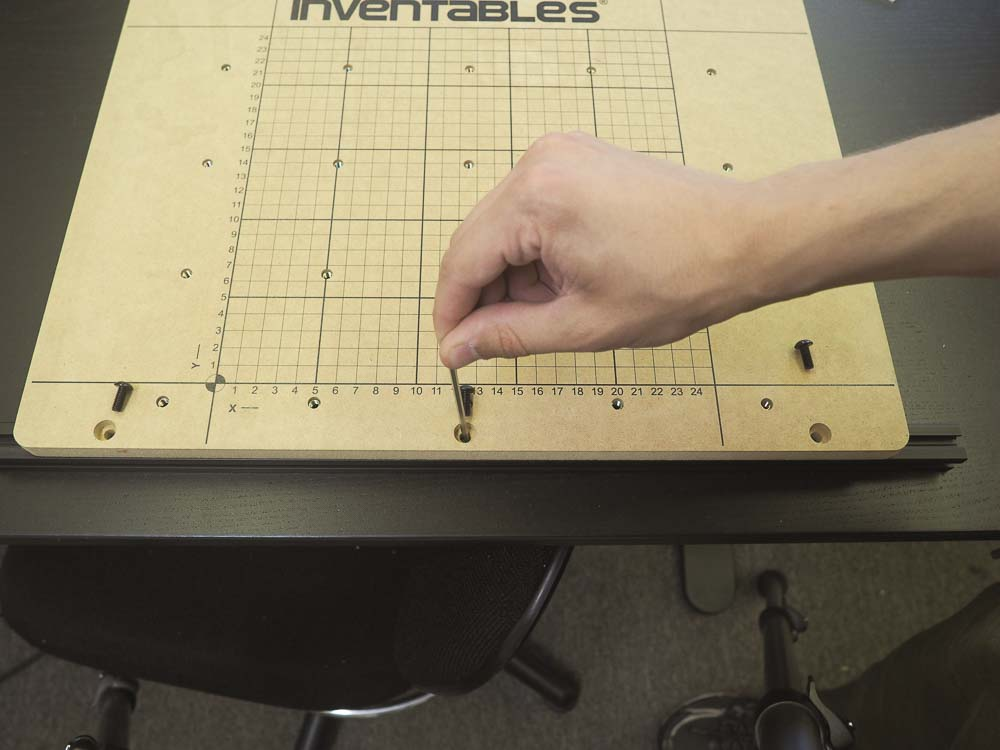
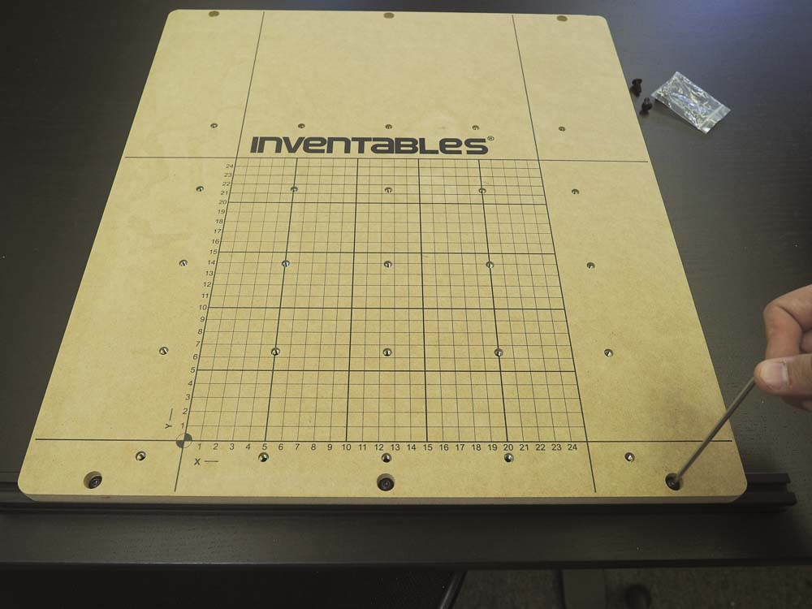
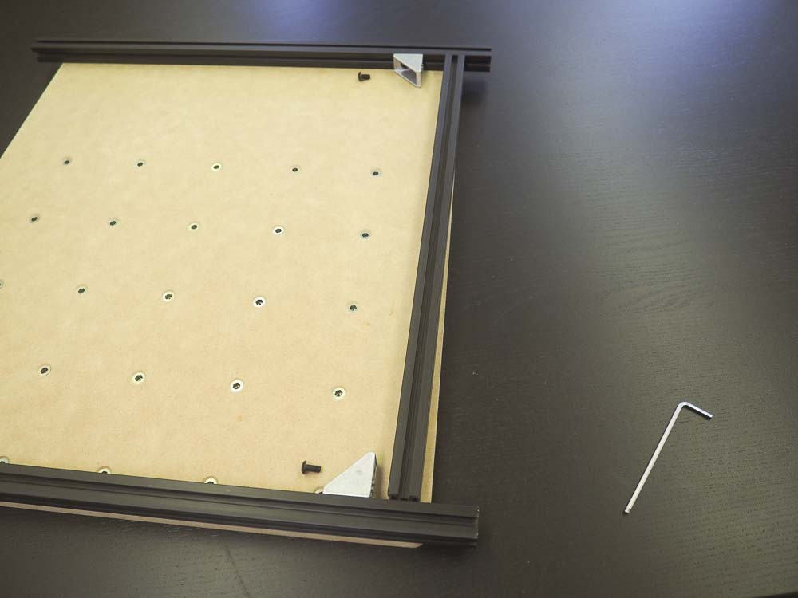

<table>
  <tr>
    <td style="color:#fff;background: #0a91d1" colspan="3">
      <b>500mm Waste Board Kit</b>
    </td>
  </tr>
  <tr>
    <td>
      <b>SKU</b>
    </td>
    <td>
      <b>Name</b>
    </td>
    <td>
      <b>Quantity</b>
    </td>
  </tr>
  <tr>
    <td>
      25281-05
    </td>
    <td>
      T-Slot Nut M5 Pre-Assembly
    </td>
    <td>
      6
    </td>
  </tr>
  <tr>
    <td>
      30517-03
    </td>
    <td>
      Threaded Insert M5 x 10
    </td>
    <td>
      25
    </td>
  </tr>
  <tr>
    <td>
      30535-02
    </td>
    <td>
      Wasteboard 500mm Carvey 2016
    </td>
    <td>
      1
    </td>
  </tr>
  <tr>
    <td>
      25286-19
    </td>
    <td>
      Button Head Cap Screw M5 x 12
    </td>
    <td>
      6
    </td>
  </tr>
</table>
<table>
  <tr>
    <td style="color:#000;background: #FFFFFF" colspan="3">
      <b>500mm Rail Kit</b>
    </td>
  </tr>
  <tr>
    <td>
      <b>SKU</b>
    </td>
    <td>
      <b>Name</b>
    </td>
    <td>
      <b>Quantity</b>
    </td>
  </tr>
  <tr>
    <td>
      26049-01
    </td>
    <td>
      Extrusion T-Slot 20x20 x 500mm
    </td>
    <td>
      2
    </td>
  </tr>
  <tr>
    <td>
      25281-05
    </td>
    <td>
      M5 pre-assembly insertion nut
    </td>
    <td>
      4
    </td>
  </tr>
  <tr>
    <td>
      26018-01
    </td>
    <td>
      cast corner bracket, clear
    </td>
    <td>
      2
    </td>
  </tr>
  <tr>
    <td>
      26049-11
    </td>
    <td>
      Extrusion T-Slot 20x20 x 458mm
    </td>
    <td>
      1
    </td>
  </tr>
  <tr>
    <td>
      25286-18
    </td>
    <td>
      Button Head Cap Screw M5 x 10
    </td>
    <td>
      4
    </td>
  </tr>
</table>

In this section you'll be assembling the work area of your machine. You'll then set this aside until you're ready to attach it to its rails.

First locate the 500mm waste board that came with your kit. This board has 25 clamping holes and six holes for mounting extrusion on the bottom of the board. Note that the six holes are counter-sunk from the top of the board.

This is the reverse side of the board. The 25 holes are countersunk to accept the M5 threaded inserts

Find the 25 threaded inserts in your wasteboard kit and use a 5mm hex driver to insert one into each hole from the back. This process is made infinitely easier by a drill driver with the appropriate bit.

Find the three pieces of 20mm x 20mm extrusion that make up the base of your machine. You should have two lengths of 500mm extrusion and one length of 458mm extrusion.

The two 500mm pieces of extrusion are mounted using the two sets of three holes on either end of the board. They should hang off of the board about 1.16" on either side.

Each extrusion is attached with 3x M5x12mm button head cap screws and 3x M5 pre-assembly insertion nuts.

insert three of the pre-assembly insertion nuts into the rail. Make sure that the protrusion on the nut is facing inwards toward the center of the extrusion. Visually align the nuts with the corresponding holes on the board.

Slide the extrusion under the board and align the three countersunk holes with the nuts in the extrusion. You can use an allen key to line them up.

Use a 3mm allen key to start the three M5 x 12mm screws. Before tightening, make sure the two sides of the extrusion extend off the board in roughly equal measure. This should be around 1.16" on either side.

Tighten each of the three screws until they are snug.

Repeat this procedure for the other side of the board using another 500mm rail, three M5 x 12mm button head cap screws, and three M5 pre-assembly insertion nuts. Afterwards, your board should look like this:

Now we'll attach the 458mm extrusion perpendicular to the two main rails using a pair of angle brackets. This allows the drag chain bracket to be attached later on, and provides some additional stability. This will be positioned on the left hand side of the machine, flush with the waste board.

Here we've flipped the board over so the 458mm extrusion should be on the right.

Insert a single M5 pre-assembly insertion nut into inside slot of each 500mm extrusion.

Align a cast corner bracket from your rail kit as well as an M5 x 10mm button head cap screw.

Thread in the button head cap screw so the  bracket is reasonably close to the extrusion but can still be moved.

Repeat this procedure to install a bracket on the other side.

Insert a pre-assembly insertion nut on either end of the 458mm extrusion.

Align the M5x10mm screws, angle brackets, and insertion nuts.

Thread in the screws with a 3mm hex key, make sure the 458mm extrusion is flush with the side of the waste board, then tighten all four M5x10mm screws to secure.

Your board should now look like this:

