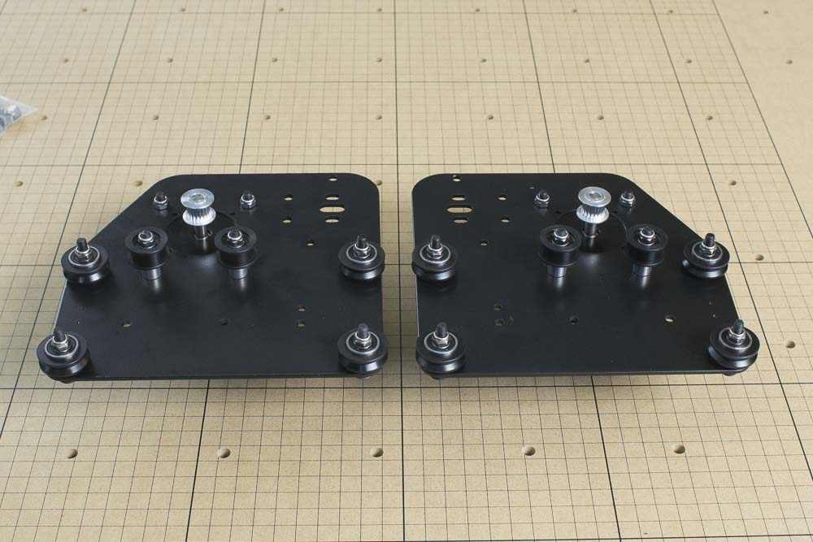

<table>
  <tr>
    <td style="color:#fff;background: #383838" colspan="3">
      <b>Core Components Kit</b>
    </td>
  </tr>
  <tr>
    <td>
      <b>SKU</b>
    </td>
    <td>
      <b>Name</b>
    </td>
    <td>
      <b>Quantity</b>
    </td>
  </tr>
  <tr>
    <td>
      30525-01
    </td>
    <td>
      Gantry Side Plate
    </td>
    <td>
      2
    </td>
  </tr>
</table>

Now that you've built the work area, we'll guide you through the construction of the main carriages and rails of the X-Carve. We'll start by assembling the plates and carriages of the Y and X axes, then we'll put it all together to form the gantry. If you have Limit Switches there will be a few extra steps to attach those to the plates.
<h2><strong>Assemble Gantry Side Plates</strong></h2>

The gantry side plates hold various wheels, brackets, and motors. They are joined by the main gantry rail included in your kit. There are a number of holes and slots on the plates. Below is a diagram of the plate. Note that when assembled, both plates will form mirror images of each other, though the beveled edge will always face up and towards the front of the machine with the holes for makerslide on top. We'll start by assembling the righthand plate.

