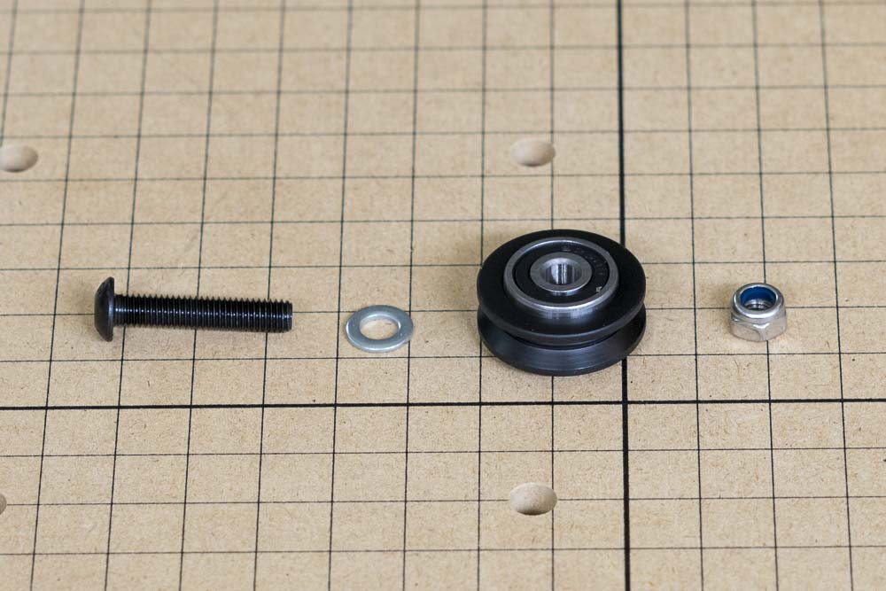
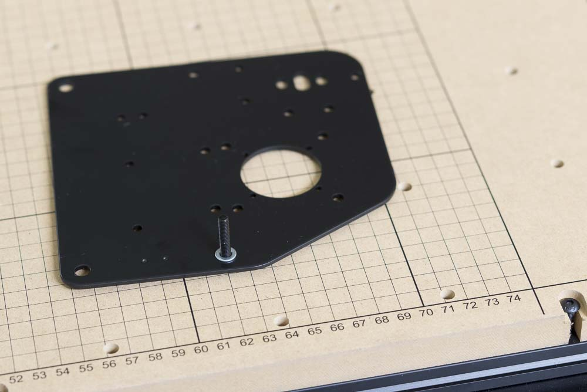
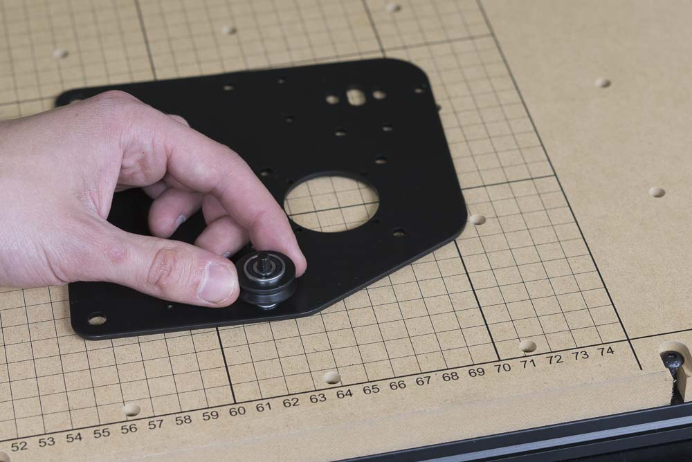

<table>
  <tr>
    <td style="color:#fff;background: #383838" colspan="3">
      <b>Core Components Kit</b>
    </td>
  </tr>
  <tr>
    <td>
      <b>SKU</b>
    </td>
    <td>
      <b>Name</b>
    </td>
    <td>
      <b>Quantity</b>
    </td>
  </tr>
  <tr>
    <td>
      25286-43
    </td>
    <td>
      Button Head Cap Screw M5 x 25
    </td>
    <td>
      4
    </td>
  </tr>
  <tr>
    <td>
      25287-12
    </td>
    <td>
      M5 Flat Washer
    </td>
    <td>
      4
    </td>
  </tr>
  <tr>
    <td>
      25203-01
    </td>
    <td>
      V Wheel Assembly
    </td>
    <td>
      4
    </td>
  </tr>
  <tr>
    <td>
      30265-09
    </td>
    <td>
      Nylon Insert Lock Nut M5
    </td>
    <td>
      4
    </td>
  </tr>
</table>

<h3>Attach Fixed V-Wheels</h3>

First, we'll attach the fixed v-wheels to the carriage. Insert the M5x25 bolt into one of the smaller v-wheel holes, then put on an M5 flat washer followed by a v-wheel. Use an M5 nylon lock nut to secure the assembly. Tighten the nut until secure using a 3mm hex key on the bolt and an 8mm wrench on the nut.

Repeat this for the other side. You should now have two mirrored plates that look like this:

