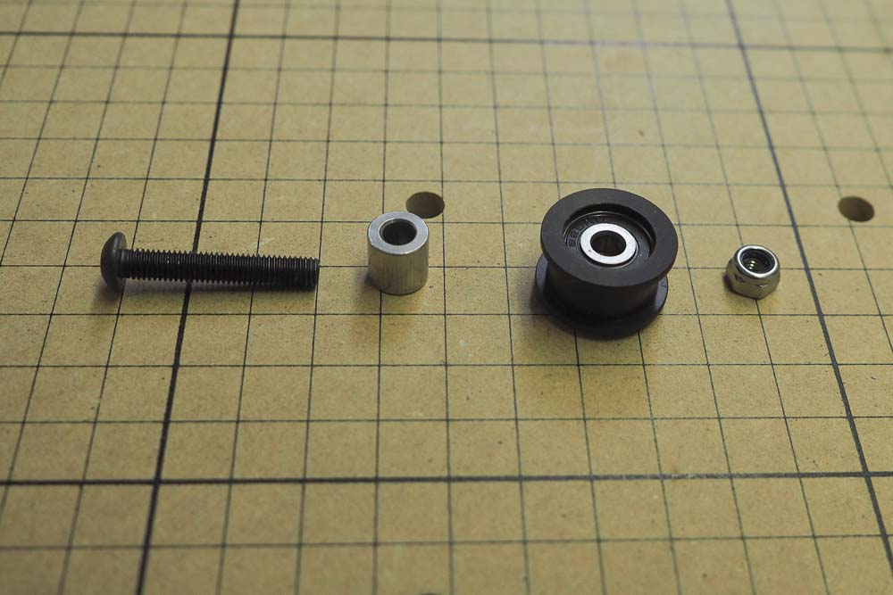

<table>
  <tr>
    <td style="color:#fff;background: #383838" colspan="3">
      <b>Core Components Kit</b>
    </td>
  </tr>
  <tr>
    <td>
      <b>SKU</b>
    </td>
    <td>
      <b>Name</b>
    </td>
    <td>
      <b>Quantity</b>
    </td>
  </tr>
  <tr>
    <td>
      25286-49
    </td>
    <td>
      Button Head Cap Screw M5 x 30
    </td>
    <td>
      4
    </td>
  </tr>
  <tr>
    <td>
      25197-01
    </td>
    <td>
      Smooth Idler Pulley Assembly
    </td>
    <td>
      4
    </td>
  </tr>
  <tr>
    <td>
      25312-23
    </td>
    <td>
      Aluminum Spacer 5.1mm ID 9.5mm OD 9.5mm LG
    </td>
    <td>
      4
    </td>
  </tr>
  <tr>
    <td>
      30265-09
    </td>
    <td>
      Nylon Insert Lock Nut M5
    </td>
    <td>
      4
    </td>
  </tr>
</table>

<h3>Attach Smooth Idler Wheels</h3>

These wheels ensure that the belt is held tightly against the motor pulley once they are installed. They are installed with aluminum spacers as they need to be aligned with the center of the makerslide rails. We show both wheels being attached at once for illustrative purposes, though as long as they're in the right places, assemble them in whichever order you want.

To attach the smooth idler wheels, begin by putting an M5x30 bolt through the appropriate hole on the plate. Slide an aluminum spacer onto the bolt.

Place an idler wheel onto each bolt. Make sure that the side of the wheel with the protruding bearing is facing the plate.

Thread an M5 nylock nut onto the bolt and secure with a 3mm hex key and 8mm wrench. The nut isn't the most accessible with the flange of the idler wheel in the way, so you may have to angle the wrench.

Repeat this for the other plate. You should now have two mirrored plates that look like this:

