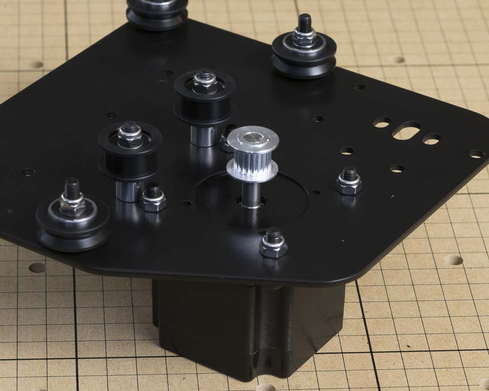
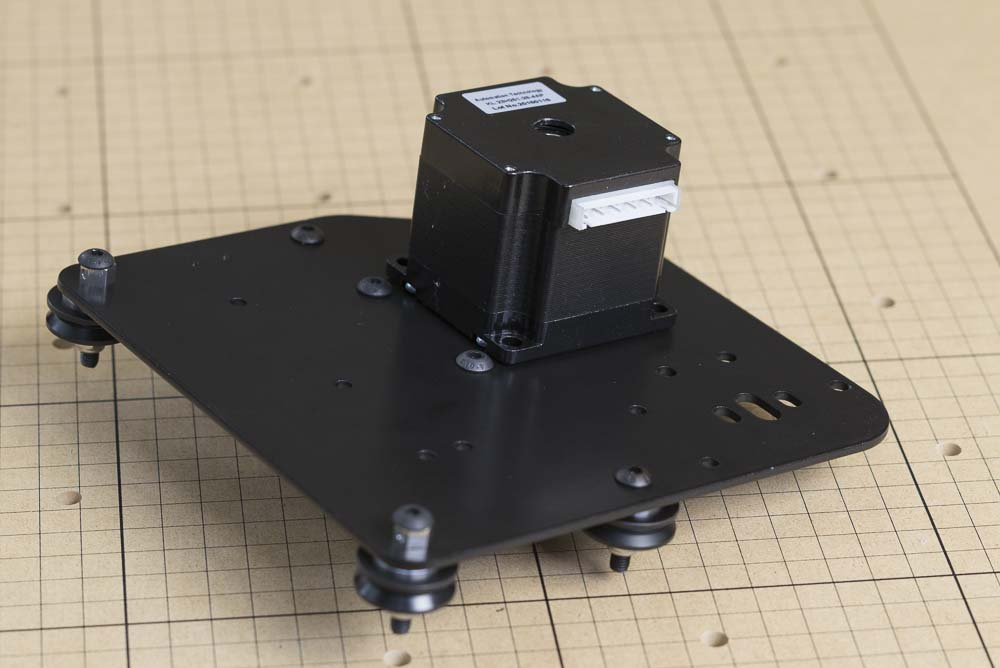
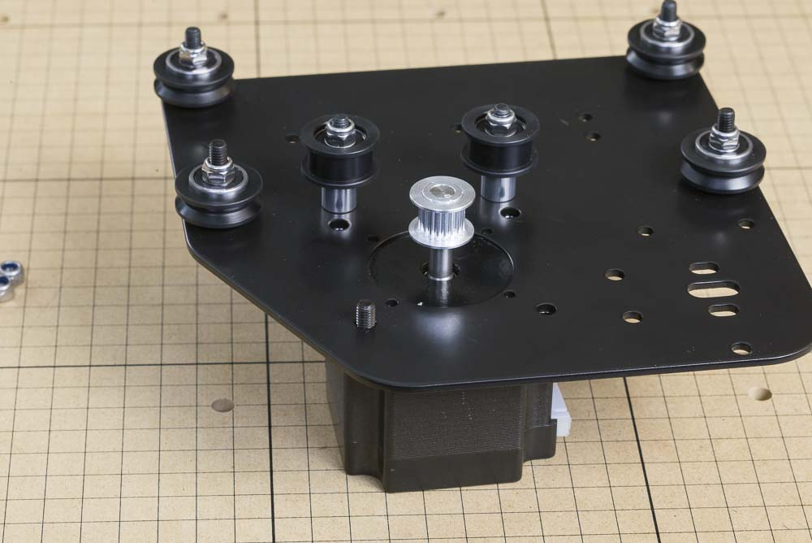

<h3>Attach NEMA 23 Motor to Plate</h3>

<table>
<tr><td style="color:#fff;background: #000;" colspan="3"><b>Components</b></td></tr>
<tr>
	<td><b>SKU</b></td>
	<td><b>Name</b></td>
	<td><b>Quantity</b></td>
</tr>
<tr>
<td>25311-06</td>
<td>Stepper Motor, NEMA 23 with Connected Pulley</td>
<td>2</td>
</tr>
<tr>
<td>25285-36</td>
<td>Socket Head Screw M5 x 16 Steel/Black</td>
<td>8</td>
</tr>
<tr>
<td>30265-04</td>
<td>Hex Nut M5 Nylon Locking Steel/Zinc</td>
<td>8</td>
</tr>
</table>
In this step, we'll be attaching the motors to the Y plates. The motor pulleys are already crimped to the shafts of the motors so you won't have to worry about attaching or adjusting them. You'll need two of the X-Axis motors, eight M5x16mm socket head cap screws, and eight M5 nylock nuts.

First, position the motor hub in the large hole on the gantry plate. Make sure that the white socket for the electrical connection is facing the rear of the gantry plate (it should be closest to the holes for the makerslide).

Insert the socket-head cap screws and thread on an M5 nylon locking nut to each.

Loosely tighten each bolt with a 4mm hex wrench, holding the nut with an 8mm wrench. Go back and secure each bolt until snug.

