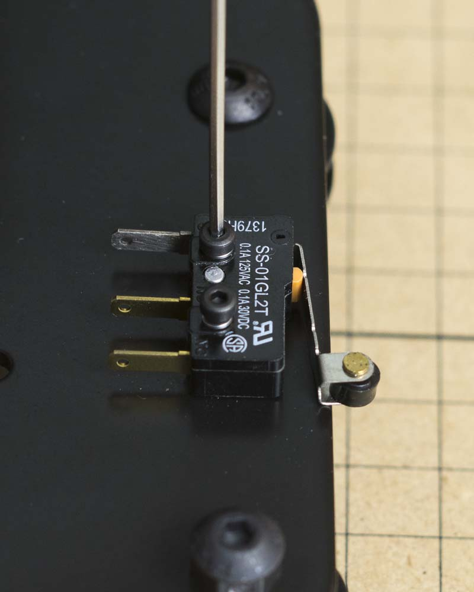

<table>
<tr><td style="color:#fff;background: #000;" colspan="3"><b>Components</b></td></tr>
	<tr>
		<td><b>SKU</b></td>
		<td><b>Name</b></td>
		<td><b>Quantity</b></td>
	</tr>
<tr>
<td>25285-50</td>
<td>Socket Head Screw M2 x 14 Stainless Steel</td>
<td>2</td>
</tr>
<tr>
<td>30555-02</td>
<td>Washer, Split Lock M2 Stainless</td>
<td>2</td>
</tr>
<tr>
<td>30557-02</td>
<td>Switch Lever SPDT 125VAC 5A Roller Actuator Tab Terminal</td>
<td>1</td>
</tr>

</table>

<h3>Attach Home Switch to Left Plate</h3>
If you ordered your machine with a home switch kit, you can now attach your switch to the outside of the left plate. To do this you'll need 2x M2x14mm socket head cap screws, 2x M2 split ring washers, and one of the microswitches from your kit. with the roller actuator pointing down and outside, secure the switch to the plate using the two screws and washers. The holes in the makerslide are already threaded to accept the screws.

