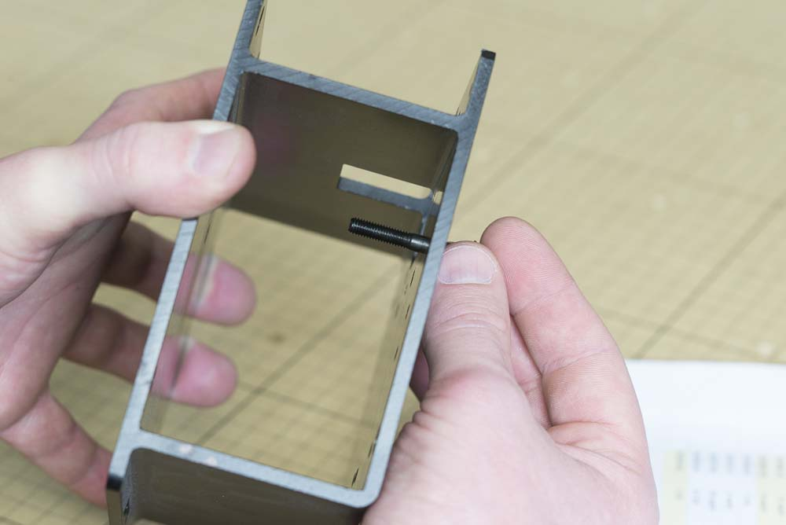

<table>
  <tr>
    <td style="color:#fff;background: #383838" colspan="3">
      <b>Core Components Kit</b>
    </td>
  </tr>
  <tr>
    <td>
      <b>SKU</b>
    </td>
    <td>
      <b>Name</b>
    </td>
    <td>
      <b>Quantity</b>
    </td>
  </tr>
  <tr>
    <td>
      30545-01
    </td>
    <td>
      X Carriage Extrusion
    </td>
    <td>
      1
    </td>
  </tr>
  <tr>
    <td>
      30552-05
    </td>
    <td>
      Flat Head Screw M5 x 35
    </td>
    <td>
      2
    </td>
  </tr>
  <tr>
    <td>
      25312-23
    </td>
    <td>
      Aluminum Spacer 5.1mm ID 9.5mm OD 9.5mm LG
    </td>
    <td>
      2
    </td>
  </tr>
  <tr>
    <td>
      25197-01
    </td>
    <td>
      Smooth Idler Pulley Assembly
    </td>
    <td>
      2
    </td>
  </tr>
  <tr>
    <td>
      30265-09
    </td>
    <td>
      Nylon Insert Lock Nut M5
    </td>
    <td>
      2
    </td>
  </tr>
</table>

<h3>Attach Smooth Idlers</h3>

Insert an M5x35 flat head screw into one of the countersunk holes in the X-Carriage.

Put an aluminum spacer on the bolt followed by an idler wheel and Nylon locking nut. Make sure that the side of the wheel with the protruding bearing faces the Aluminum spacer, similar to the Y plates. Use a 3mm hex key and 8mm wrench to tighten the assembly.

Repeat this process for the other countersunk hole. Your carriage should now look like this:

