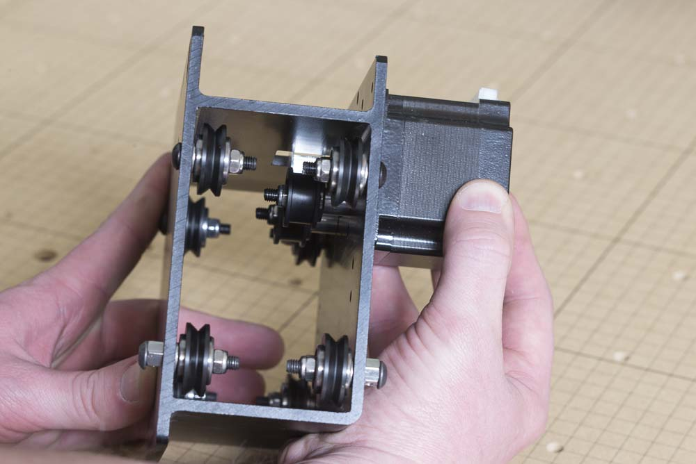

<table>
<tr><td style="color:#fff;background: #000;" colspan="3"><b>Components</b></td></tr>
	<tr>
		<td><b>SKU</b></td>
		<td><b>Name</b></td>
		<td><b>Quantity</b></td>
	</tr>
<tr>
<td>25311-06</td>
<td>Stepper Motor, NEMA 23 with Connected Pulley</td>
<td>1</td>
</tr>
<tr>
<td>25285-41</td>
<td>Socket Head Screw M5 x 10 Steel/Black</td>
<td>4</td>
</tr>

</table>
To attach a stepper motor to the X-Carriage, you'll need 4x M5x10mm socket head cap screws. Place the motor on the X-Carriage with the white connector facing up. Use a 3mm allen key to secure the motor in place using the threaded holes on the carriage. There may be a small gap between the motor and the carriage due to the heads of the M5x35mm flat head screws that hold the smooth idlers. Tighten the screws in an alternating pattern to ensure that they are evenly secured.

