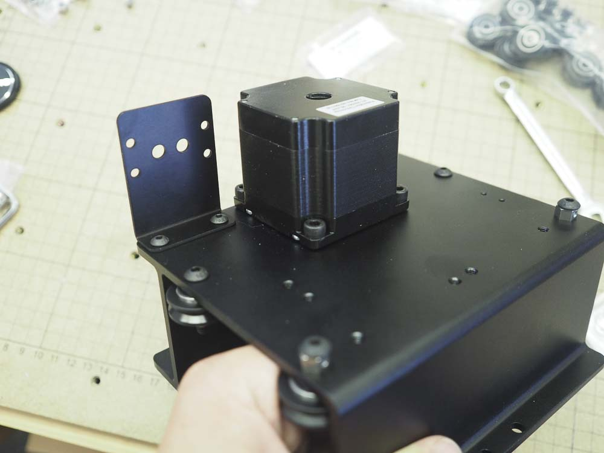
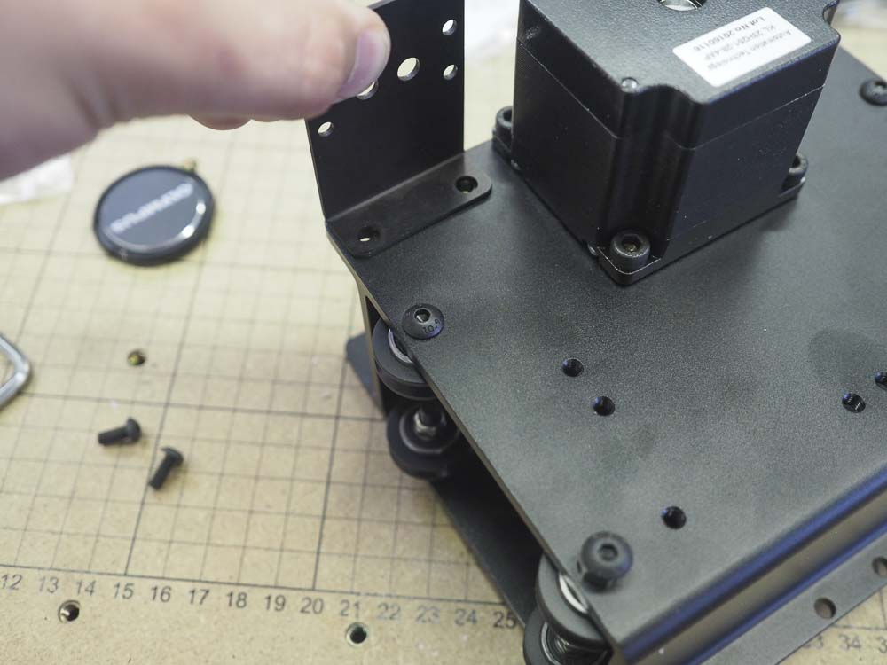

<table>
  <tr>
    <td style="color:#fff;background: #8A52A1" colspan="3">
      <b>1000mm Drag Chain Kit</b>
    </td>
  </tr>
  <tr>
    <td>
      <b>SKU</b>
    </td>
    <td>
      <b>Name</b>
    </td>
    <td>
      <b>Quantity</b>
    </td>
  </tr>
  <tr>
    <td>
      30527-05
    </td>
    <td>
      Drag Chain Bracket
    </td>
    <td>
      1
    </td>
  </tr>
  <tr>
    <td>
      25286-44
    </td>
    <td>
      Button Head Cap Screw M4 x 10
    </td>
    <td>
      2
    </td>
  </tr>
</table>

<h3>Attach Drag Chain Bracket to X-Carriage</h3>

Use 2x M4x10mm button head cap screws to fasten the drag chain bracket to the X-Carriage. This requires a 2.5mm hex key. You will install the drag chain later on.

