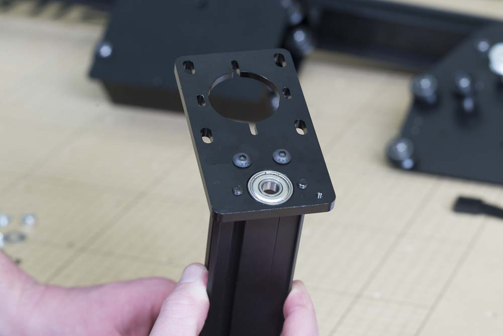

<table>
  <tr>
    <td style="color:#fff;background: #383838" colspan="3">
      <b>Core Components Kit</b>
    </td>
  </tr>
  <tr>
    <td>
      <b>SKU</b>
    </td>
    <td>
      <b>Name</b>
    </td>
    <td>
      <b>Quantity</b>
    </td>
  </tr>
  <tr>
    <td>
      25142-09
    </td>
    <td>
      MakerSlide 200mm Tapped Black
    </td>
    <td>
      1
    </td>
  </tr>
  <tr>
    <td>
      25286-46
    </td>
    <td>
      Button Head Cap Screw M5 x 14
    </td>
    <td>
      2
    </td>
  </tr>
</table>

<h3>Attach Z-Axis Rail</h3>

Flip the motor plate over and use 2x M5x14 button head cap screws to secure the plate onto the end of the makerslide. You should make sure that the V-rails of the short makerslide face forward toward the flanged bearing.

