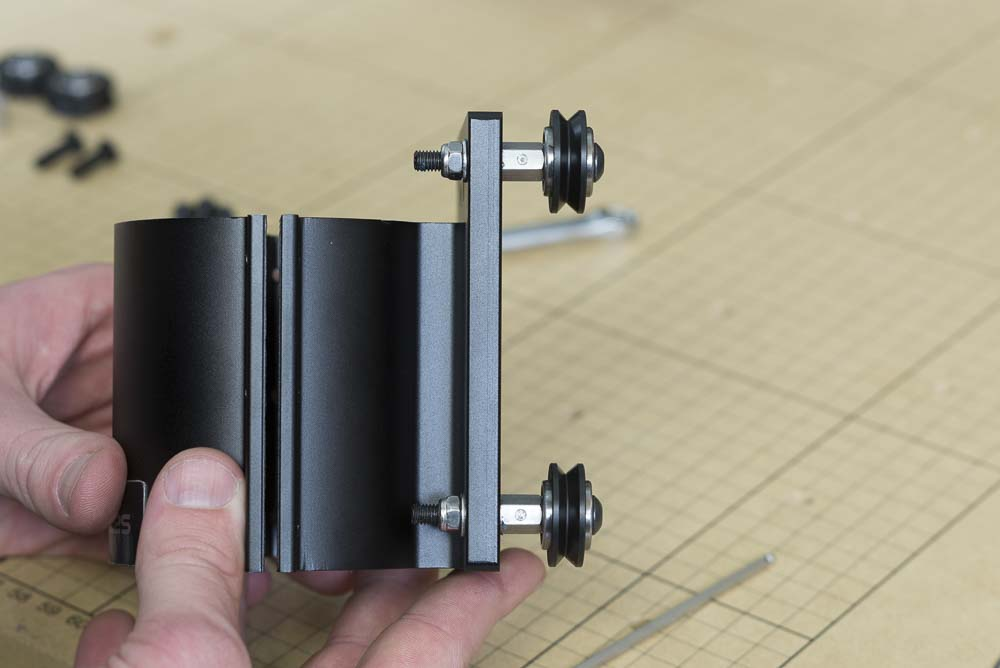
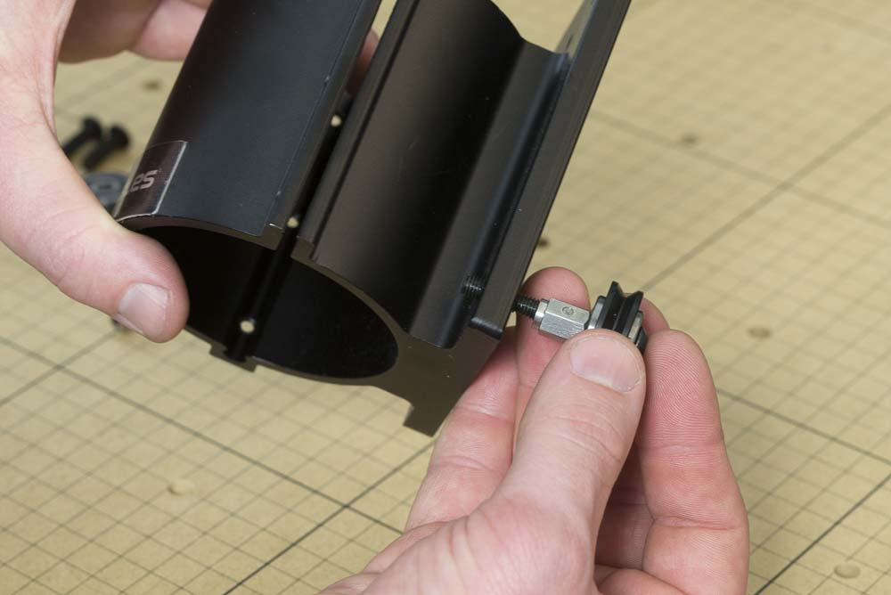
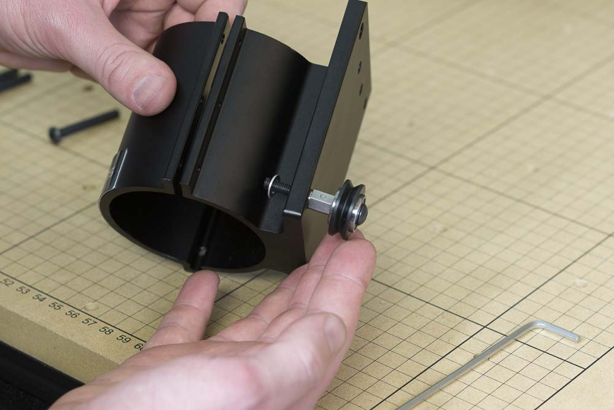
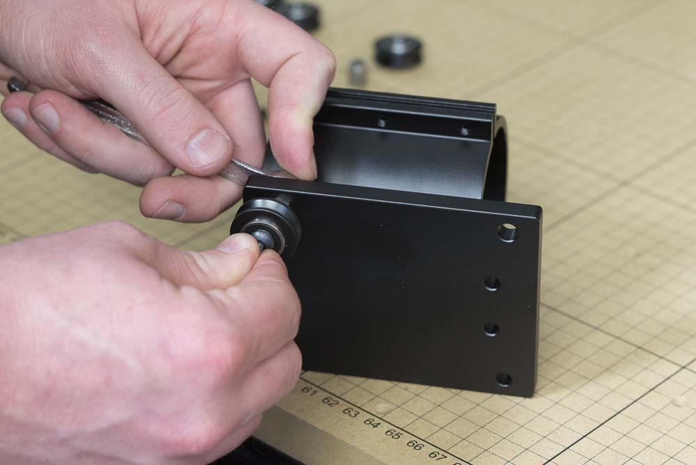

<table>
  <tr>
    <td style="color:#fff;background: #383838" colspan="3">
      <b>Core Components Kit</b>
    </td>
  </tr>
  <tr>
    <td>
      <b>SKU</b>
    </td>
    <td>
      <b>Name</b>
    </td>
    <td>
      <b>Quantity</b>
    </td>
  </tr>
  <tr>
    <td>
      25286-48
    </td>
    <td>
      Button Head Cap Screw M5 x 40
    </td>
    <td>
      2
    </td>
  </tr>
  <tr>
    <td>
      25195-08
    </td>
    <td>
      Eccentric Spacer 0.375" Long
    </td>
    <td>
      2
    </td>
  </tr>
  <tr>
    <td>
      30265-09
    </td>
    <td>
      Nylon Insert Lock Nut M5
    </td>
    <td>
      2
    </td>
  </tr>
  <tr>
    <td>
      25203-01
    </td>
    <td>
      V Wheel Assembly
    </td>
    <td>
      2
    </td>
  </tr>
  <tr>
    <td>
      25287-12
    </td>
    <td>
      M5 Flat Washer
    </td>
    <td>
      2
    </td>
  </tr>
</table>
<table>
  <tr>
    <td style="color:#fff;background: #42a44e" colspan="3">
      <b>DeWalt 611 Spindle and Mount</b>
    </td>
  </tr>
  <tr>
    <td>
      <b>SKU</b>
    </td>
    <td>
      <b>Name</b>
    </td>
    <td>
      <b>Quantity</b>
    </td>
  </tr>
  <tr>
    <td>
      30610-01
    </td>
    <td>
      X-Carve DeWalt 611 Spindle Mount
    </td>
    <td>
      1
    </td>
  </tr>
</table>

<h3>Attach Adjustable V-Wheels</h3>

Take an M5x40mm button head cap screw and thread on a v-wheel and eccentric spacer.

Insert this assembly into one of the large holes on the spindle mount. These are both on the right side of the mount when looking at it from the front. 

Put an M5 washer on the screw and tighten the assembly with an M5 nylon locking nut.

Repeat this procedure for the other wheel.

