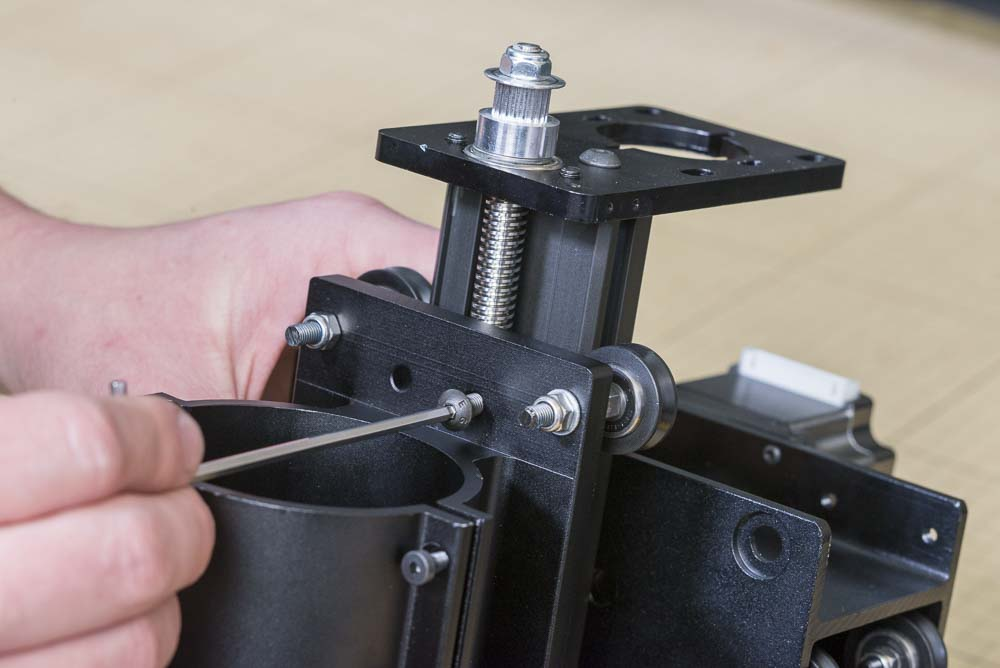
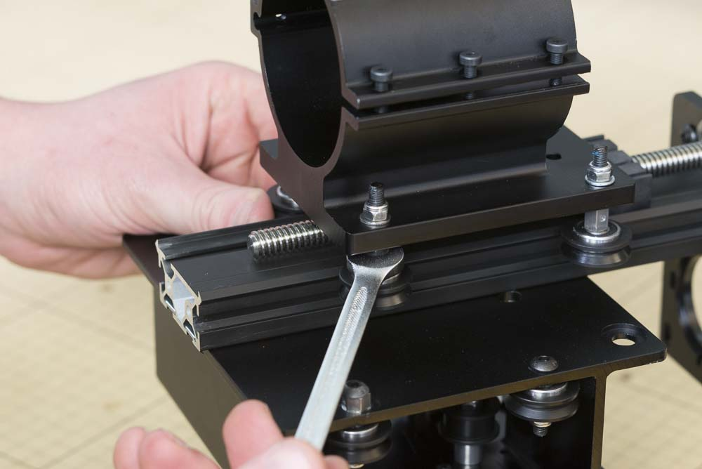

<table>
  <tr>
    <td style="color:#fff;background: #42a44e" colspan="3">
      <b>DeWalt 611 Spindle and Mount</b>
    </td>
  </tr>
  <tr>
    <td>
      <b>SKU</b>
    </td>
    <td>
      <b>Name</b>
    </td>
    <td>
      <b>Quantity</b>
    </td>
  </tr>
  <tr>
    <td>
      25286-45
    </td>
    <td>
      Button Head Cap Screw M5 × 16mm
    </td>
    <td>
      2
    </td>
  </tr>
</table>

<h3>Attach Spindle Carriage to Z-Axis</h3>

Starting from the bottom of the Z axis makerslide, slide on the spindle carriage. Make sure that the V-Wheels ride on the makerslide rails that stick out to each side. Use two M5x16mm button head cap screws to attach the carriage to the delrin nut of the leadscrew.

Use an 8mm wrench to adjust the variable wheels so they ride snugly on the X-Carriage, but not so tight that they can't be moved by hand. You can adjust this further once you mount the spindle.

