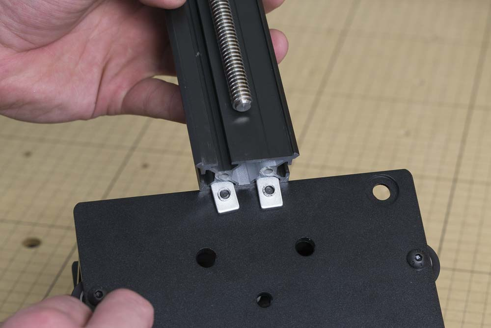
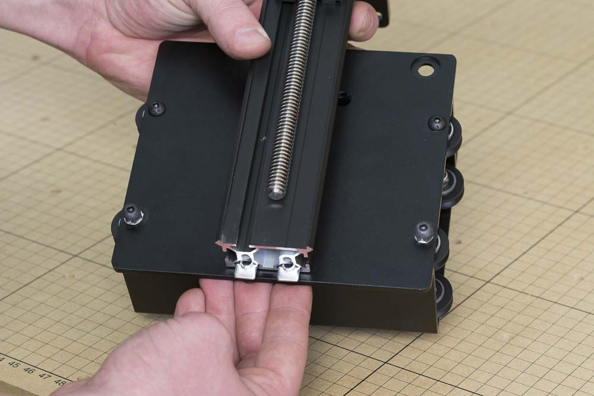
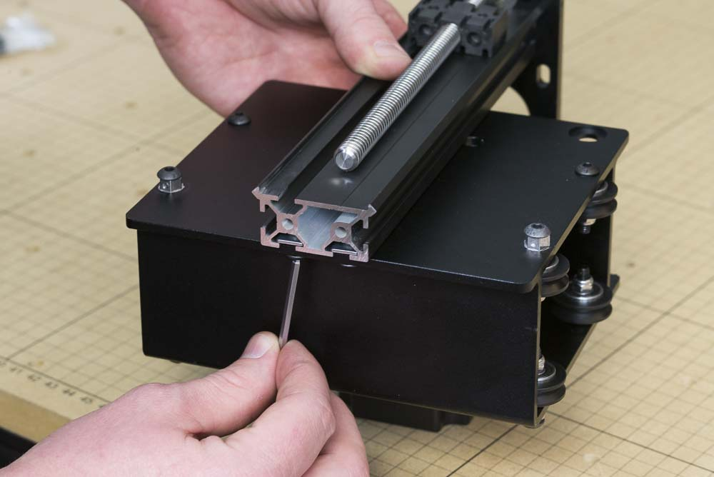

<table>
<tr><td style="color:#fff;background: #000;" colspan="3"><b>Components</b></td></tr>
	<tr>
		<td><b>SKU</b></td>
		<td><b>Name</b></td>
		<td><b>Quantity</b></td>
	</tr>
<tr>
<td>25286-18</td>
<td>Button Head Screw M5 x 10</td>
<td>4</td>
</tr>
<tr>
<td>25281-05</td>
<td>T-Slot Nut M5 Pre-Assembly</td>
<td>4</td>
</tr>

</table>
Insert an M5x10mm button head cap screw into one of the four holes on the X-Carriage's front flanges. Loosely thread a pre-assembly insertion nut onto the screw. Repeat this for the remaining three holes in the X-Carriage.

Take the X-Carriage assembly and slide it onto the pre-assembly nuts, just until the makerslide covers the bottom pair.

Use a 3mm hex key to tighten the four bolts.

