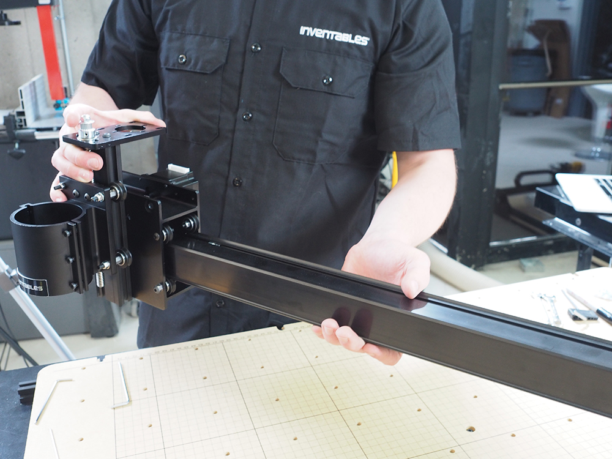

Slide the completed x-carriage onto the makerslide rail. The spindle mount should face in the same direction as the X-Carve logo and the beveled side of the plate. At this point you should insert two pre-assembly insertion nuts into the groove on the top of the makerslide. These allow for your belts to be tensioned. You may leave them loose for now.

