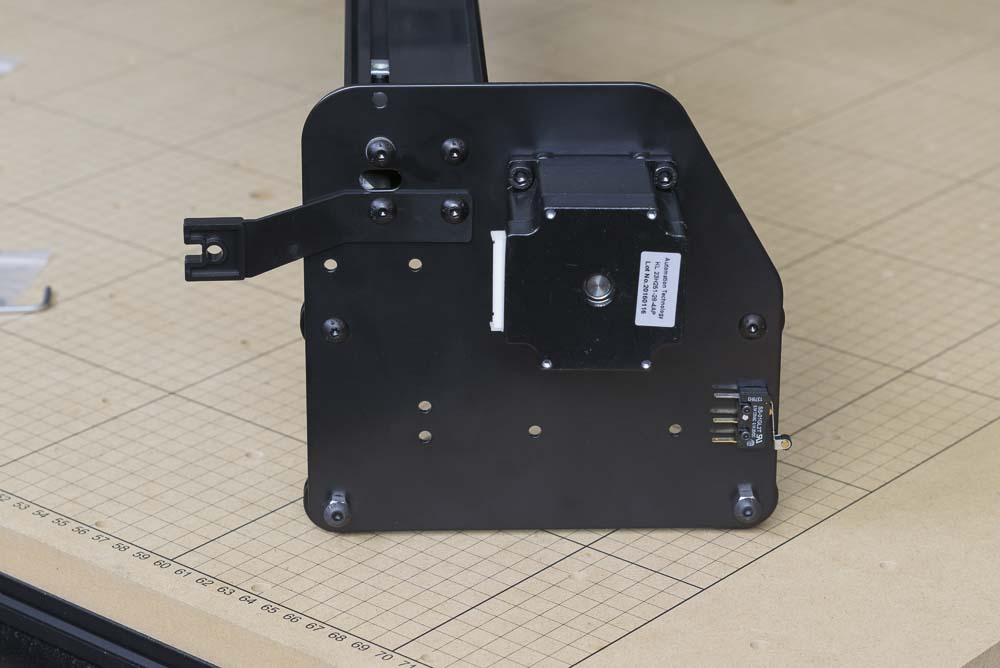

<table>
  <tr>
    <td style="color:#fff;background: #383838" colspan="3">
      <b>Core Components Kit</b>
    </td>
  </tr>
  <tr>
    <td>
      <b>SKU</b>
    </td>
    <td>
      <b>Name</b>
    </td>
    <td>
      <b>Quantity</b>
    </td>
  </tr>
  <tr>
    <td>
      25286-38
    </td>
    <td>
      Button Head Cap Screw M5 x 12
    </td>
    <td>
      4
    </td>
  </tr>
  <tr>
    <td>
      25287-12
    </td>
    <td>
      M5 Flat Washer
    </td>
    <td>
      1
    </td>
  </tr>
  <tr>
    <td>
      25281-12
    </td>
    <td>
      T-Slot Nut M5 Pre-Assembly
    </td>
    <td>
      2
    </td>
  </tr>
</table>
<table>
  <tr>
    <td style="color:#fff;background: #8A52A1" colspan="3">
      <b>1000mm Drag Chain Kit</b>
    </td>
  </tr>
  <tr>
    <td>
      <b>SKU</b>
    </td>
    <td>
      <b>Name</b>
    </td>
    <td>
      <b>Quantity</b>
    </td>
  </tr>
  <tr>
    <td>
      30681-01
    </td>
    <td>
      Drag Chain Support Arm
    </td>
    <td>
      1
    </td>
  </tr>
</table>

Before attaching the other gantry side plate, insert two pre-assembly insertion nuts into the top rail of the main rail so that the belting can be attached later

Attach the other Y plate with 4x M5x12mm , again paying attention to the placement of the plastic bracket and the single M5 washer on the exposed slotted hole in the plate.

Your Gantry is now complete and should look like this:

