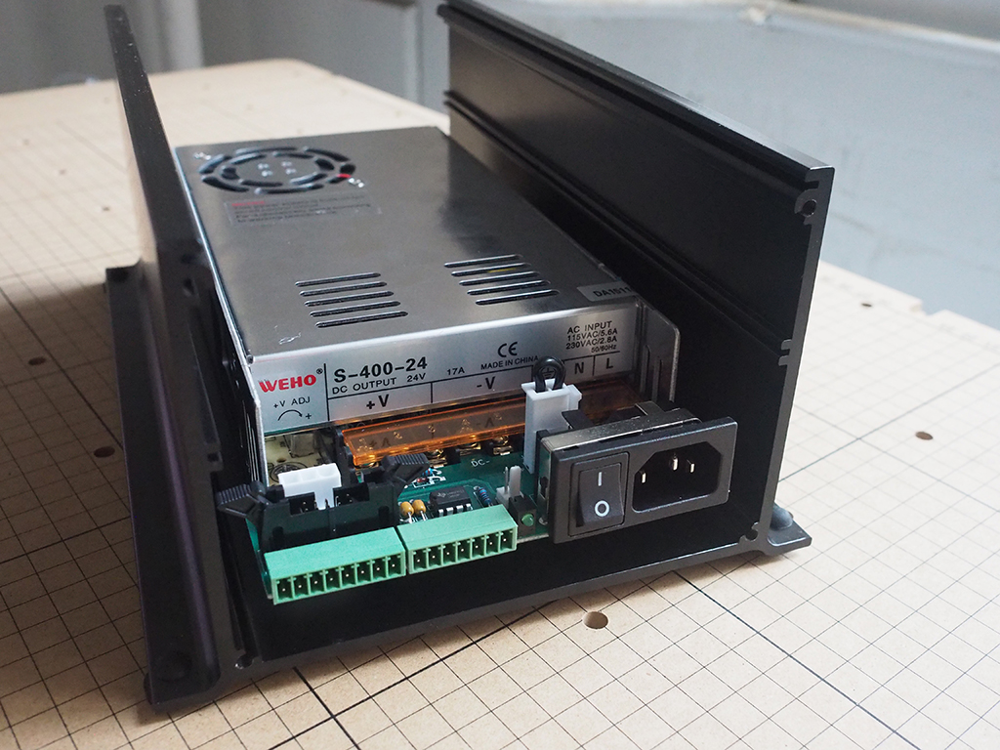
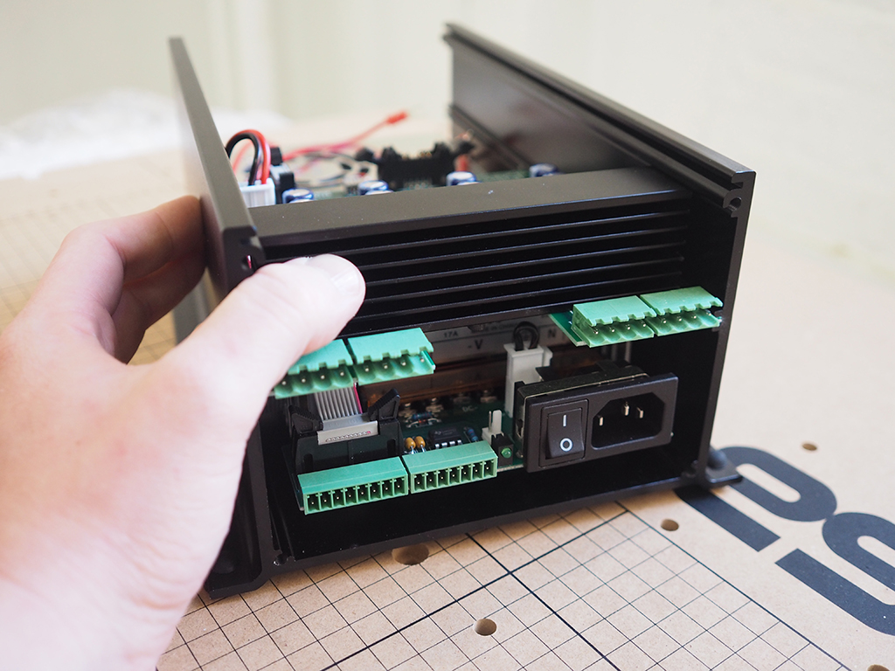
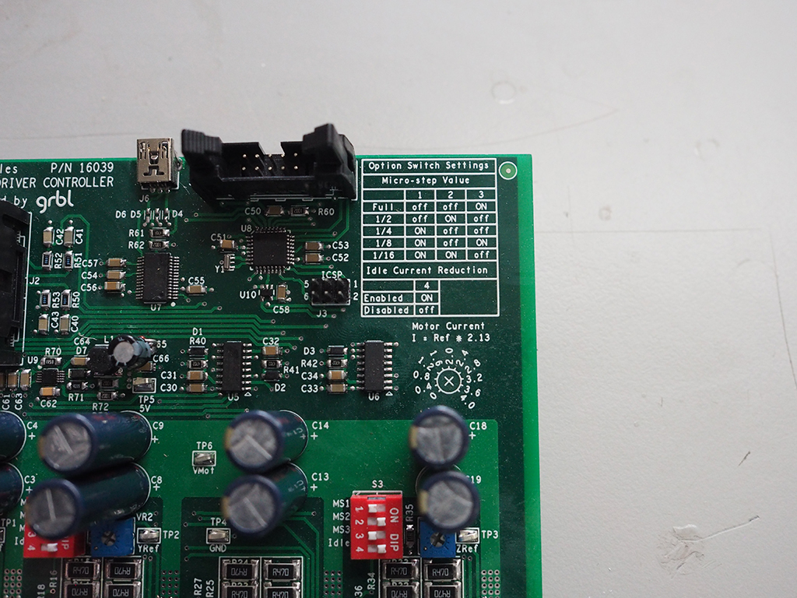
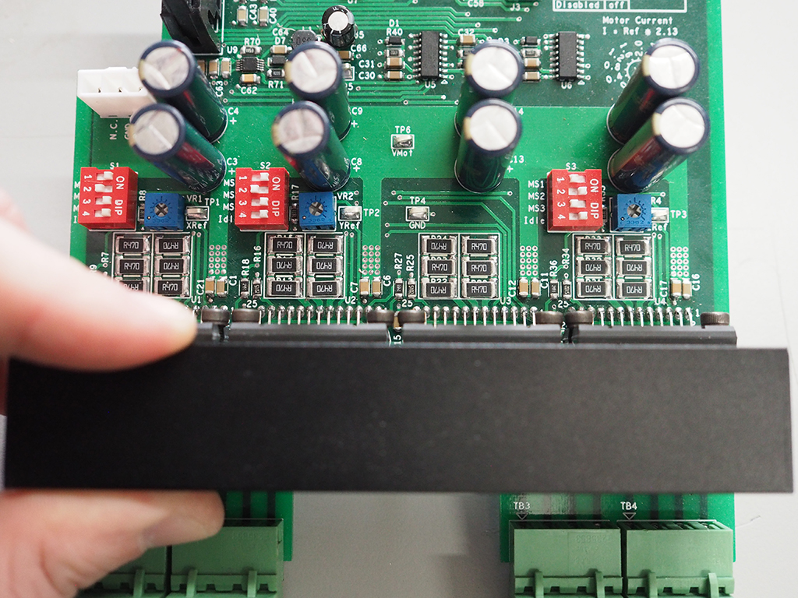
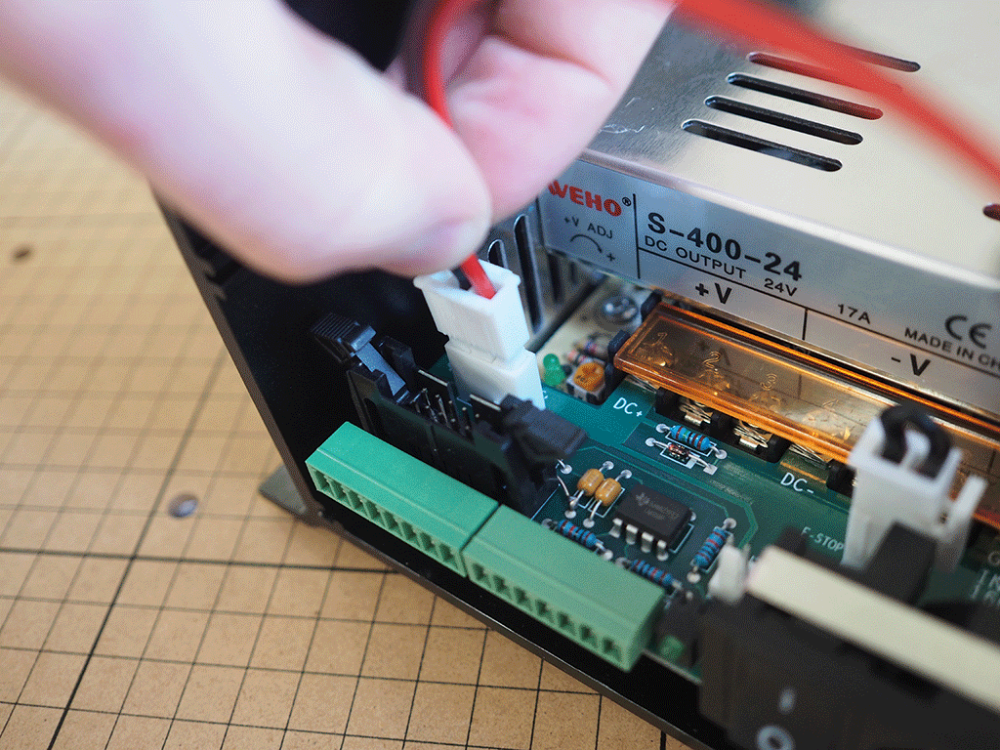
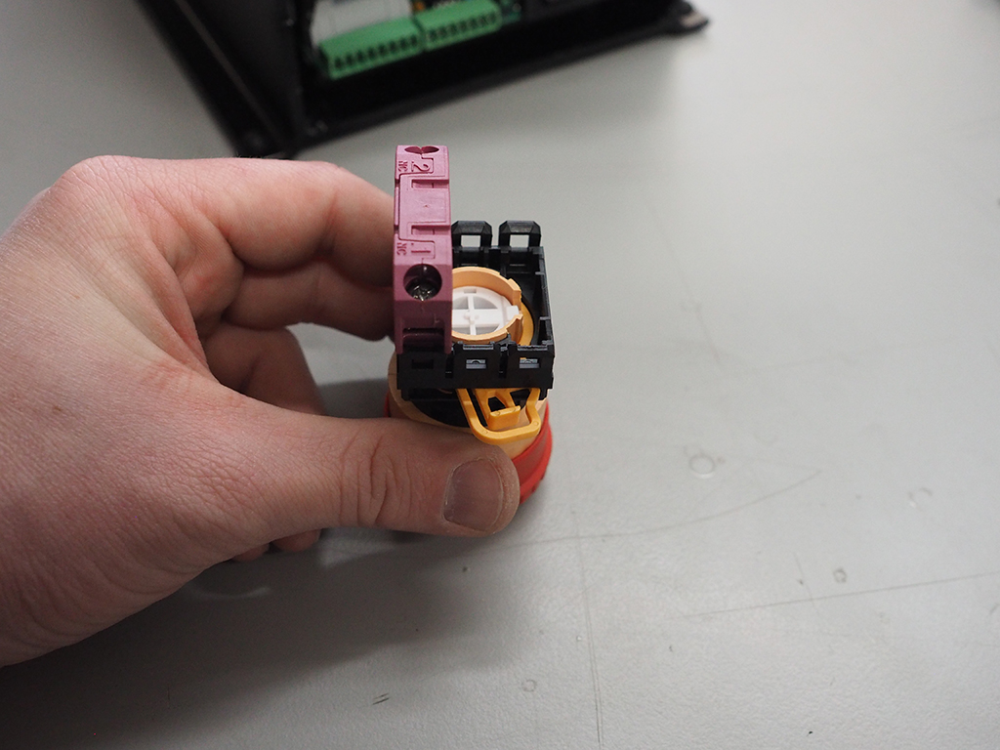
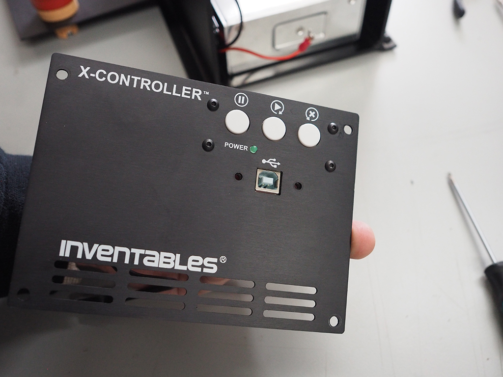
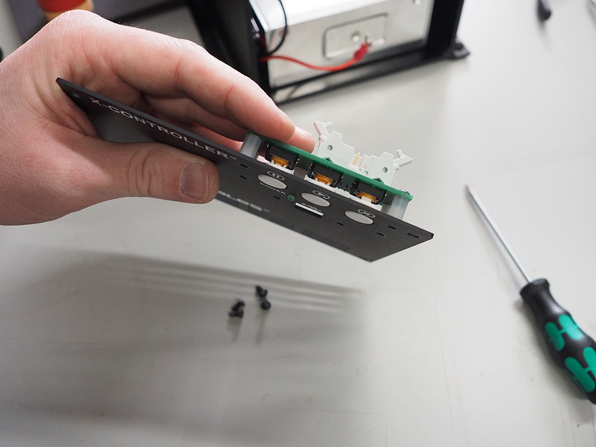
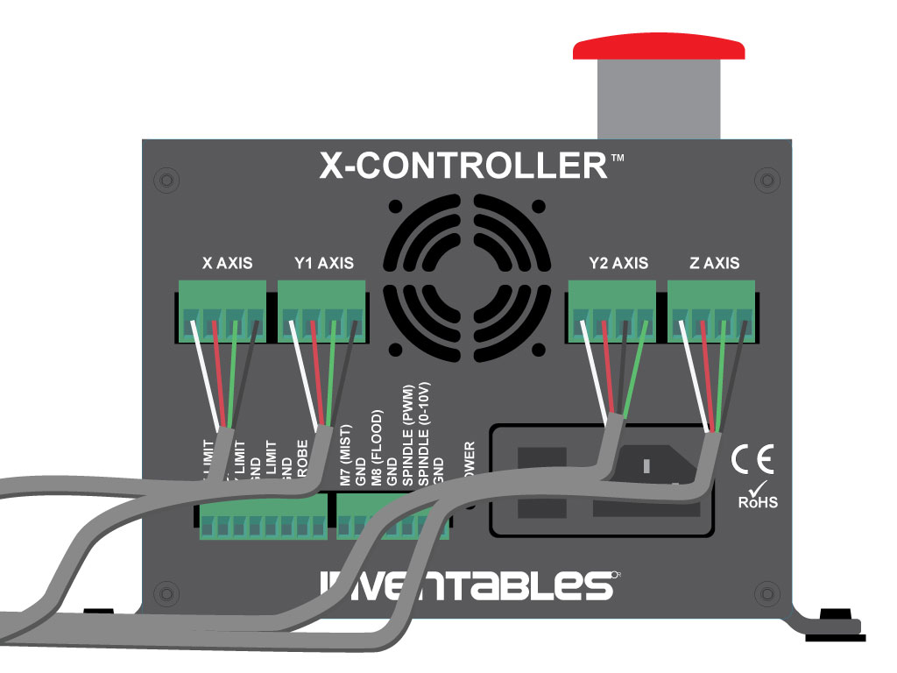

Welcome to the X-Controller assembly instructions! The images shown at the beginning of each step show the finished results of that step. This provides context for what you're about to start working on, and offer those eager and willing to figure things out on their own a way to skim through more quickly. Click on the thumbnails to see more details.

Each step also begins with a bill of materials (BOM) that details the necessary components to complete the step. Please review the full bill of materials, listed below, before getting started. Few things are more frustrating than being partway through a build and suddenly discovering something is missing.
 

Click the black bar below to reveal the BOM and make sure you received everything. If any parts are missing, please contact us at help @ inventables.com for replacements.

<a data-toggle="collapse" data-parent="#model-accordion" href="#model" aria-expanded="false" aria-controls="rail" style="color:#fff;background: #383838" class="panel-heading" role="tab" id="model-header">

<h4 class="panel-title">
<b>Bill of Materials</b>

</h4>

<i class="fa fa-plus"></i>
 <i class="fa fa-minus"></i>

</a>

<table>
	<tr style="color:#fff;background: #383838;">
		<td> <b>SKU</b> </td>
		<td> <b>Name</b> </td>
		<td> <b>Quantity</b> </td>
	</tr>
	<tr>
		<td> 01 </td>
		<td> Chassis </td>
		<td> 1 </td>
	</tr>
	<tr>
		<td> 02 </td>
		<td> Enclosed Power Supply </td>
		<td> 1 </td>
	</tr>
	<tr>
		<td> 03 </td>
		<td> Power Supply Interface PCB </td>
		<td> 1 </td>
	</tr>
	<tr>
		<td> 04 </td>
		<td> Power Supply Phillips Head Screws</td>
		<td> 5 </td>
	</tr>
	<tr>
		<td> 05 </td>
		<td> Main Controller PCB </td>
		<td> 1 </td>
	</tr>
	<tr>
		<td> 06 </td>
		<td> Ribbon Cable </td>
		<td> 2 </td>
	</tr>
	<tr>
		<td> 07 </td>
		<td> E-Stop Cable </td>
		<td> 1 </td>
	</tr>
	<tr>
		<td> 08 </td>
		<td> E-Stop Button </td>
		<td> 1 </td>
	</tr>
	<tr>
		<td> 09 </td>
		<td> Top Panel </td>
		<td> 1 </td>
	</tr>
	<tr>
		<td> 10 </td>
		<td> Buttons PCB </td>
		<td> 1 </td>
	</tr>
	<tr>
		<td> 11 </td>
		<td> Nylon Threaded Standoff M3 </td>
		<td> 4 </td>
	</tr>
	<tr>
		<td> 12 </td>
		<td> Button Head Cap Screw M3 x 6mm </td>
		<td> 4 </td>
	</tr>
	<tr>
		<td> 13 </td>
		<td> USB Bulkhead Cable </td>
		<td> 1 </td>
	</tr>
	<tr>
		<td> 14 </td>
		<td> Front Panel </td>
		<td> 1 </td>
	</tr>
	<tr>
		<td> 15 </td>
		<td> Socket Head Cap Screw M4 x 6mm </td>
		<td> 8 </td>
	</tr>
	<tr>
		<td> 16 </td>
		<td> Back Panel </td>
		<td> 1 </td>
	</tr>
	<tr>
		<td> 17 </td>
		<td> Nylon Hex Nut M3 </td>
		<td> 4 </td>
	</tr>
	<tr>
		<td> 18 </td>
		<td> Terminal Block 4C 5mm Plug </td>
		<td> 4 </td>
	</tr>
	<tr>
		<td> 19 </td>
		<td> Terminal Block 8C 3.5mm Plug </td>
		<td> 1 </td>
	</tr>
	<tr>
		<td> 20 </td>
		<td> Terminal Block 7C 3.5mm Plug </td>
		<td> 1 </td>
	</tr>
	<tr>
		<td> 21 </td>
		<td> USB Cable </td>
		<td> 1 </td>
	</tr>
	<tr>
		<td> 22 </td>
		<td> Power Cord </td>
		<td> 1 </td>
	</tr>
</table>

 

Gather up the following tools to get started.

<table>
	<tr>
		<td style="color:#fff;background: #383838;" colspan="3"><b>Tools</b> </td>
	</tr>
	<tr>
		<td colspan="3">Phillips Screwdriver </td>
	</tr>
	<tr>
		<td colspan="3">2.5mm Allen Wrench </td>
	</tr>
	<tr>
		<td colspan="3">3mm Allen Wrench </td>
	</tr>
	<tr>
		<td colspan="3">5.5mm Open End Wrench (Adjustable Wrench or Pliers) </td>
	</tr>
</table>

<h2 id="install-power-supply">
<strong>Install Power Supply</strong></h2>

<ol class="step-contents">

<li>
Prepare Power Supply Power Supply</li>

<li>
Attach Power Supply Interface PCB</li>

</ol>

<table>
	<tr style="color:#fff;background: #383838;">
		<td> <b>SKU</b> </td>
		<td> <b>Name</b> </td>
		<td> <b>Quantity</b> </td>
	</tr>
	<tr>
		<td> 02 </td>
		<td> Enclosed Power Supply </td>
		<td> 1 </td>
	</tr>
	<tr>
		<td> 03 </td>
		<td> Power Supply Interface PCB </td>
		<td> 1 </td>
	</tr>
	<tr>
		<td> 04 </td>
		<td> Power Supply Phillips Head Screws </td>
		<td> 5 </td>
	</tr>
</table>

<h3>
1. Prepare Enclosed Power Supply</h3>
 

This is a universal power supply capable of running at 110V or 220V. Flip the toggle switch on the side of the power supply to the voltage that corresponds to your <a href="https://en.wikipedia.org/wiki/Mains_electricity_by_country#Table_of_mains_voltages_and_frequencies">outlet voltage.</a>

<h3>
2. Attach Power Supply Interface PCB</h3>
 

On the enclosed power supply, flip back the transparent cover that corresponds to the "fingers" on the power supply interface PCB. Attach the power supply interface PCB using the power supply Phillips Head screws.

<i class="fa fa-hand-o-right"></i>
 

<strong>Note:</strong> You won't have access to the side of the power supply from here on out, so double check your voltage before moving forward.

 

<h3>
3. Attach Power Supply to Chassis</h3>
 

Using the M4 x 8mm button head cap screws, attach the power supply through the mounting holes on the underside of the chassis. The threaded holes on the base of the power supply are delicate, so try not to overtighten the screws when assembling.

<i class="fa fa-hand-o-right"></i>
 
 <strong>Note: The chassis is not symmetrical.</strong> The power supply interface PCB will be flush with the end of the chassis when installed correctly.
 

 

<h2 id="install-controller-board">
<strong>Install Controller Board</strong></h2>

<ol class="step-contents">
<li>
Prepare Controller Board (OPTIONAL)</li>

<li>
Wire Controller Board</li>

<li>
Attach Controller Board</li>

</ol>

<table>
	<tr style="color:#fff;background: #383838;">
		<td> <b>SKU</b> </td>
		<td> <b>Name</b> </td>
		<td> <b>Quantity</b> </td>
	</tr>
	<tr>
		<td> 06 </td>
		<td> Main Controller PCB </td>
		<td> 1 </td>
	</tr>
	<tr>
		<td> 07 </td>
		<td> Power Cable </td>
		<td> 1 </td>
	</tr>
	<tr>
		<td> 08 </td>
		<td> Ribbon Cable </td>
		<td> 1 </td>
	</tr>
	<tr>
		<td> 09 </td>
		<td> E-Stop Cable </td>
		<td> 1 </td>
	</tr>
</table>

<h3>
1. Prepare Controller Board</h3>
 

Unless you're an advanced user looking to make some tweaks or want to use your X-Controller without re-wiring your machine, you won't need to make any adjustments. That being said, in order for the Grbl firmware to know how far the machine will move, a few settings need to be adjusted on the controller board. 

 <b>Microstepping</b> allows the motors to move to positions between normal steps; increasing accuracy and smoothing the motion of the motor. Depending on the capabilities of your motors, there comes a point where the microstepping will no longer increase accuracy. By default, the X and Y axes will be set to 8x microstepping and the Z axis will be set to 2x microstepping. This is tied to the default step settings on the controller firmware so it's generally best not to touch these settings.

<b>Idle current reduction</b> is another feature that can be set on the controller board. This setting automatically reduces the amount of current shortly after the motor stops moving, reducing heat from the driver and the motor. This feature is especially great for the z-axis which spends a lot of its time idle. You can set this using the dip switches, just make sure to again check out the diagram for proper placement.

<b>Potentiometers</b> allow you to control the current sent to the motors. Clockwise turns increase the current and counter-clockwise turns decreases the current. Current ratings are different for NEMA 17 (1.6A) and NEMA 23 (2.8A) stepper motors and need to be set accordingly. The slot between the dots on the gray actuator is the pointer, and can be adjusted based on the diagram on the controller board.

For users interested in setting a precise current, you can measure the amount of voltage on the reference and ground test points. Use this formula: 

<svg id="Layer_1" data-name="Layer 1" width="150px" xmlns="http://www.w3.org/2000/svg" viewBox="0 0 73.45097 10.79173"><title>Untitled</title><path d="M4.98279,0.06953C5.0812-.3323,5.114-0.44711,5.99144-0.44711c0.26241,0,.35262,0,0.35262-0.205a0.13646,0.13646,0,0,0-.164-0.13121c-0.328,0-1.13986.03279-1.45968,0.03279-0.33621,0-1.13986-.03279-1.47606-0.03279A0.19,0.19,0,0,0,3.0229-.5619c0,0.11479.0984,0.11479,0.31162,0.11479,0.46741,0,.76263,0,0.76263.21323a0.57111,0.57111,0,0,1-.0246.18039L2.58007,5.90822c-0.0984.41-.13121,0.51662-1.00865,0.51662-0.25421,0-.35262,0-0.35262.22141a0.14222,0.14222,0,0,0,.17221.123c0.31982,0,1.12346-.03279,1.44327-0.03279,0.33621,0,1.15626.03279,1.48428,0.03279A0.18293,0.18293,0,0,0,4.54,6.556c0-.13121-0.09021-0.13121-0.33622-0.13121a3.244,3.244,0,0,1-.47562-0.0246c-0.22962-.0164-0.27062-0.0656-0.27062-0.1886a0.91429,0.91429,0,0,1,.041-0.2542l1.48427-5.8879" transform="translate(-1.21881 0.78331)"/><path d="M17.2342,5.29319c0.15581,0,.36083,0,0.36083-0.22141,0-.21321-0.205-0.21321-0.37722-0.21321H10.61648c-0.164,0-.37722,0-0.37722.21321,0,0.22141.21321,0.22141,0.369,0.22141H17.2342m-0.0164-2.1403c0.17221,0,.37722,0,0.37722-0.22141S17.39,2.71006,17.2342,2.71006H10.60827c-0.15581,0-.369,0-0.369.22141s0.21321,0.22141.37722,0.22141H17.2178Z" transform="translate(-1.21881 0.78331)"/><path d="M28.23906,0.47134a1.54752,1.54752,0,0,1,1.41871-.91845,0.20165,0.20165,0,0,0,.1394-0.205,0.11967,0.11967,0,0,0-.1394-0.13121c-0.287,0-.6067.03279-0.91026,0.03279-0.36066,0-.7379-0.03279-1.09059-0.03279a0.18194,0.18194,0,0,0-.21329.205c0,0.123.09846,0.13121,0.18054,0.13121a0.44585,0.44585,0,0,1,.50845.369,1.09568,1.09568,0,0,1-.17235.4182L24.56528,5.736,23.81919-.11088c0-.1886.25423-0.33622,0.76268-0.33622,0.15577,0,.2706,0,0.2706-0.22139a0.121,0.121,0,0,0-.14779-0.11481c-0.44274,0-.91845.03279-1.37757,0.03279-0.19691,0-.41-0.01639-0.60691-0.01639-0.1967,0-.41-0.0164-0.59851-0.0164a0.17441,0.17441,0,0,0-.20506.205c0,0.13121.09839,0.13121,0.27056,0.13121,0.62328,0,.63147.10663,0.66422,0.37722l0.87751,6.83095c0.03275,0.22141.0739,0.25421,0.22148,0.25421a0.30686,0.30686,0,0,0,.31154-0.205l3.97713-6.33893" transform="translate(-1.21881 0.78331)"/><path d="M29.54294,6.87587c0.00819-.04921.18873-0.74624,0.2051-0.78724a1.971,1.971,0,0,1,.48389-0.63145A1.04313,1.04313,0,0,1,30.855,5.244a0.82432,0.82432,0,0,1,.42658.1066,0.45774,0.45774,0,0,0-.33631.42643,0.28445,0.28445,0,0,0,.30335.287,0.45148,0.45148,0,0,0,.43477-0.47564,0.69374,0.69374,0,0,0-.8202-0.55762A1.39579,1.39579,0,0,0,29.7726,5.572a0.79567,0.79567,0,0,0-.78724-0.54122,0.68571,0.68571,0,0,0-.60691.39362,2.65364,2.65364,0,0,0-.287.78724,0.11133,0.11133,0,0,0,.13121.0984c0.10664,0,.11483-0.02458.17235-0.2296A0.85326,0.85326,0,0,1,28.9608,5.244c0.1967,0,.25423.17221,0.25423,0.37722a3.76742,3.76742,0,0,1-.123.63964c-0.05752.2132-.13121,0.52482-0.17214,0.697l-0.246.984a3.02737,3.02737,0,0,0-.08208.31981,0.24445,0.24445,0,0,0,.26241.246,0.36324,0.36324,0,0,0,.33631-0.22141c0.01638-.0492.09825-0.38541,0.14758-0.58222l0.20489-.82824" transform="translate(-1.21881 0.78331)"/><path d="M33.38089,6.45765A1.46869,1.46869,0,0,1,34.76665,5.244a0.54165,0.54165,0,0,1,.62326.45922c0,0.75445-1.30387.75445-1.632,0.75445h-0.377m0.41819,0.2132a4.31729,4.31729,0,0,0,1.24635-.164A0.84581,0.84581,0,0,0,35.726,5.7032a0.81936,0.81936,0,0,0-.95938-0.67243,2.13659,2.13659,0,0,0-2.173,2.02549,1.35045,1.35045,0,0,0,1.38573,1.45148,2.0857,2.0857,0,0,0,1.91079-.86924A0.15644,0.15644,0,0,0,35.759,7.5073a0.18186,0.18186,0,0,0-.123.07379,2.17027,2.17027,0,0,1-1.64018.71344,0.787,0.787,0,0,1-.77087-0.93486,2.94405,2.94405,0,0,1,.09026-0.68882h0.48391Z" transform="translate(-1.21881 0.78331)"/><path d="M39.39981,5.38339h0.76265c0.14761,0,.25423,0,0.25423-0.17221,0-.1066-0.10662-0.1066-0.23784-0.1066H39.45731c0.18035-.984.23787-1.33667,0.30335-1.55808a0.42837,0.42837,0,0,1,.39364-0.33622,0.731,0.731,0,0,1,.36085.09841,0.447,0.447,0,0,0-.3363.41822,0.28451,0.28451,0,0,0,.30356.287,0.45162,0.45162,0,0,0,.44273-0.46741,0.6725,0.6725,0,0,0-.77084-0.54943,1.06907,1.06907,0,0,0-.92664.58222,5.15216,5.15216,0,0,0-.37723,1.52529H38.23554c-0.156,0-.25423,0-0.25423.17221,0,0.1066.09824,0.1066,0.23763,0.1066h0.57417c-0.00819.04921-.4921,2.82094-0.68061,3.64918a0.826,0.826,0,0,1-.54119.75444,0.71192,0.71192,0,0,1-.3363-0.0902,0.44836,0.44836,0,0,0,.3363-0.42642,0.28933,0.28933,0,0,0-.30356-0.287A0.45921,0.45921,0,0,0,36.825,9.459a0.65778,0.65778,0,0,0,.7463.54943,1.20428,1.20428,0,0,0,.92662-0.68063,6.66986,6.66986,0,0,0,.4755-1.55807l0.42638-2.38632" transform="translate(-1.21881 0.78331)"/><path d="M48.75662,3.69411l-2.21414-2.1977a0.29178,0.29178,0,0,0-.23787-0.15581,0.22589,0.22589,0,0,0-.22146.22141,0.28333,0.28333,0,0,0,.13939.22139l2.21414,2.22232L46.22254,6.228a0.27306,0.27306,0,0,0-.13939.22141,0.2259,0.2259,0,0,0,.22146.22141A0.31486,0.31486,0,0,0,46.54248,6.515l2.20594-2.20591,2.2878,2.29611a0.44987,0.44987,0,0,0,.164.0656,0.21556,0.21556,0,0,0,.22149-0.22141,0.22443,0.22443,0,0,0-.03277-0.123c-0.00816-.02461-1.77137-1.7631-2.32076-2.32072l2.0256-2.02551c0.04912-.0656.22128-0.21321,0.27061-0.27881A0.222,0.222,0,0,0,51.42168,1.562a0.21555,0.21555,0,0,0-.22149-0.22141,0.35518,0.35518,0,0,0-.25423.164L48.75662,3.69411" transform="translate(-1.21881 0.78331)"/><path d="M56.88322,5.91641L58.0559,4.77657c1.72207-1.52529,2.38629-2.12391,2.38629-3.231a2.17072,2.17072,0,0,0-2.34536-2.1403A2.04357,2.04357,0,0,0,56.03027,1.4062a0.5827,0.5827,0,1,0,1.16449.03279A0.5589,0.5589,0,0,0,56.60444.865a0.54787,0.54787,0,0,0-.13939.00821,1.527,1.527,0,0,1,2.9766.67243,3.95779,3.95779,0,0,1-1.16449,2.44374L56.1533,6.35923a0.4,0.4,0,0,0-.123.41h4.10857l0.30335-1.92708H60.17157a3.80219,3.80219,0,0,1-.246.984,3.50936,3.50936,0,0,1-1.04965.09019H56.88322" transform="translate(-1.21881 0.78331)"/><path d="M63.14818,6.17882a0.59154,0.59154,0,0,0-.59031-0.58222,0.58446,0.58446,0,0,0-.58215.58222,0.59155,0.59155,0,0,0,.58215.59043,0.59861,0.59861,0,0,0,.59031-0.59043" transform="translate(-1.21881 0.78331)"/><path d="M67.32222-.30769c0-.27062,0-0.287-0.25423-0.287a2.73629,2.73629,0,0,1-2.009.70524V0.45494a3.29372,3.29372,0,0,0,1.44326-.287v5.7239c0,0.40181-.03273.533-1.02507,0.533H65.12469V6.76925c0.3852-.03279,1.3448-0.03279,1.78754-0.03279,0.443,0,1.40233,0,1.79595.03279V6.42484H68.34732c-0.99215,0-1.0251-.123-1.0251-0.533V-0.30769" transform="translate(-1.21881 0.78331)"/><path d="M72.82472,2.87407A2.13493,2.13493,0,0,0,74.37463.93056a1.8306,1.8306,0,0,0-2.042-1.52527A1.74228,1.74228,0,0,0,70.38111.906a0.52948,0.52948,0,0,0,.55758.574A0.54244,0.54244,0,0,0,71.50446.91417,0.56936,0.56936,0,0,0,70.82385.36474a1.78022,1.78022,0,0,1,1.46784-.68882A1.05431,1.05431,0,0,1,73.34953.91417,2.71986,2.71986,0,0,1,73.04618,2.177a1.06917,1.06917,0,0,1-.98414.574,4.18226,4.18226,0,0,1-.43457.03281c-0.09027.0164-.16393,0.0246-0.16393,0.13121,0,0.123.07366,0.123,0.26239,0.123h0.48391c0.91,0,1.32026.75445,1.32026,1.83689,0,1.50887-.76268,1.82868-1.24659,1.82868A2.01534,2.01534,0,0,1,70.586,5.859a0.60543,0.60543,0,0,0,.72994-0.60683,0.61937,0.61937,0,1,0-1.2384.0246,2.02183,2.02183,0,0,0,2.23871,1.73848A2.25877,2.25877,0,0,0,74.66978,4.875a2.13436,2.13436,0,0,0-1.84506-2.00089" transform="translate(-1.21881 0.78331)"/></svg>

on the diagram to determine the current. For example, if you measure 1V you get 2.13 amps.

<i class="fa fa-hand-o-right"></i>
 
 <strong>Note:</strong> Want to start using your X-Carve quickly without re-wiring your machine? Simply turn the y-axis potentiometer all the way up (4A). For other usage options, check out our <a href="http://x-carve-instructions.inventables.com/x-controller/usage/">usage instructions.</a> You can always change these settings in the future, but since you have access to the main controller board now, it's a good time to decide which route to take.
 

<h3>
2. Wire Controller Board</h3>
 

Attach the cables from the controller board to the power supply interface PCB. The cables can only be connected in one orientation. Make sure the ribbon clamps are in the open position. If the cables don't attach well, double check them and try again. Try orienting the cables so that the wires easily travel from board to board.

<i class="fa fa-hand-o-right"></i>
 
 <strong>Note:</strong> Make sure to tuck the e-stop cable along the edge of the enclosed power supply to prevent snagging or pinching.
 

<h3>
3. Attach Controller Board</h3>
 

Slide the controller board into the channels of the chassis, making sure you route the wires through the cutout on the board to prevent snagging or pinching.

<i class="fa fa-hand-o-right"></i>
 
 <strong>Note:</strong> The wires might be stiff. If you're having trouble, don't force the wires. Try shaping the wire into place. Double check all of your connections before moving forward, in case the wires snag and become loose when sliding into position. 
 

 

<h2 id="install-front-panel">
<strong>Install Front Panel</strong></h2>

<ol class="step-contents">
<li>
Disassemble E-Stop Button</li>

<li>
Attach E-Stop Button</li>

<li>
Attach USB Cable</li>

<li>
Wire E-Stop And Attach Front Panel</li>

</ol>

<table>
	<tr style="color:#fff;background: #383838;">
		<td> <b>SKU</b> </td>
		<td> <b>Name</b> </td>
		<td> <b>Quantity</b> </td>
	</tr>
	<tr>
		<td> 08 </td>
		<td> Ribbon Cable </td>
		<td> 1 </td>
	</tr>
	<tr>
		<td> 10 </td>
		<td> E-Stop Button </td>
		<td> 1 </td>
	</tr>
	<tr>
		<td> 11 </td>
		<td> Top Panel </td>
		<td> 1 </td>
	</tr>
	<tr>
		<td> 12 </td>
		<td> Buttons PCB </td>
		<td> 1 </td>
	</tr>
	<tr>
		<td> 13 </td>
		<td> Threaded Standoff M3 </td>
		<td> 4 </td>
	</tr>
		<tr>
		<td> 13 </td>
		<td> Nylong Hex Nuts M3 </td>
		<td> 4 </td>
	</tr>
	<tr>
		<td> 14 </td>
		<td> Button Head Cap Screw M3 x 6mm </td>
		<td> 4 </td>
	</tr>
	<tr>
		<td> 15 </td>
		<td> USB Bulkhead Cable </td>
		<td> 1 </td>
	</tr>
	<tr>
		<td> 16 </td>
		<td> Front Panel </td>
		<td> 1 </td>
	</tr>
	<tr>
		<td> 17 </td>
		<td> Socket Head Cap Screw M4 x 6mm </td>
		<td> 4 </td>
	</tr>
</table>

<h3>
1. Disassemble E-Stop Button</h3>
 

Remove the button from the screw terminals by gently pulling on the yellow tab. With the button upside down (as pictured), pull the tab towards you and then to the right to disengage the two parts. Unscrew the black nut attached to the base of the button. This nut will be used to secure the button to the enclosure.

<h3>
2. Attach E-Stop Button</h3>
 

Insert the button through the hole on the top panel and secure using the nut. Make sure the side of the button marked "TOP" is facing the center of the top panel.

<i class="fa fa-hand-o-right"></i>
 
 <strong>Note:</strong> When wiring the e-stop in subsequent steps, make sure the "TOP" marking on the button lines up with the "TOP" marking on the screw terminals.
 

<h3>
3. Attach Buttons And USB Cable</h3>
 

Remove the silver Phillips head screws from the USB cable terminal. Attach the USB cable teminal to the front panel from the backside of the panel. Secure it in place using the Phillips head screws. 

Next, install the nylon threaded standoffs to the buttons PCB board. Insert the male end of the standoff through the buttons PCB from the front, securing each standoff in the back using a nylon hex nut. Secure one standoff to each corner of the board. Next, align the buttons PCB with the button holes in the front panel and attach the PCB with the button head screws. 

Lastly, attach the other end of the USB cable to the main controller board. <strong>Don't attach the front panel</strong> to the chassis until the rest of the e-stop is installed in the next step.

<h3>
4. Wire And Attach Front Panel</h3>
 

The last item we need to wire to the front panel is the second ribbon cable. Insert one end of the cable to the black receiver on the main controller board, and the other end on the back of the buttons PCB board on the front panel. 

Loosen the phillips head screws on the e-stop screw terminals and attach one end of the e-stop cable to each side of the NC screw terminal. Both cables are red; it does not matter which cable goes into which side. Tighten the screws on the screw terminals to hold the cable in place. 

To attach the wired screw terminal to the button, <strong>line up the "TOP" marking on the button with the "TOP" marking on the screw terminal.</strong> Slide the top panel into the channels of the chassis, from the front of the X-Controller to the back, far enough back so you can access the Mini USB port on the main controller board. Once in position, move the yellow tab towards the back of the assembly to lock in place. Attach the front panel using the included M4 socket head cap screws.

<i class="fa fa-hand-o-right"></i>
 
 <strong>Note:</strong> If your having any problems with this part of the assembly, check out the <a href="http://x-carve-instructions.inventables.com/accessories/e-stop-with-enclosure/">E-Stop with Enclosure instructions</a> for more detailed information.
 

 

<h2 id="install-back-panel">
<strong>Install Back Panel</strong></h2>

<ol class="step-contents">
<li>
Attach Fan</li>

<li>
Wire Fan And Attach Back Panel</li>

</ol>

<table>
	<tr style="color:#fff;background: #383838;">
		<td> <b>SKU</b> </td>
		<td> <b>Name</b> </td>
		<td> <b>Quantity</b> </td>
	</tr>
	<tr>
		<td> 17 </td>
		<td> Socket Head Cap Screw M4 x 6mm </td>
		<td> 4 </td>
	</tr>
	<tr>
		<td> 18 </td>
		<td> Back Panel </td>
		<td> 1 </td>
	</tr>
	<tr>
		<td> 19 </td>
		<td> Flat Washer #4/M3 </td>
		<td> 4 </td>
	</tr>
	<tr>
		<td> 20 </td>
		<td> Fan </td>
		<td> 1 </td>
	</tr>
	<tr>
		<td> 21 </td>
		<td> Socket Head Cap Screw M3 x 20mm </td>
		<td> 4 </td>
	</tr>
	<tr>
		<td> 22 </td>
		<td> Hex Nut M3 </td>
		<td> 4 </td>
	</tr>
</table>

<h3>Wire Fan And Attach Back Panel</h3>
 

Attach the fan cable to the power supply interface PCB. The cable can only be connected in one orientation. If it doesn't attach well, double check it and try again. <strong>Check the ribbon cable connector at the power supply interface PCB</strong> and attach the back panel using the included M4 socket head cap screws. You may need to wiggle the lower PCB in place when installing it, in order for the back panel to align flush with the chassis.

Lastly, attach the green terminal blocks to the corresponding PCB ports on the back panel. The screws on the terminal blocks will face upward, and you should feel the blocks click into place. 

<h2>
<strong>Wire X-Controller</strong></h2>

Wire the cables into the green terminal block plugs and plug them into the corresponding spots on the X-Controller. Make sure the colors on the wires match the colors in the diagrams

With two motors on the y axis facing each other, you'll need to flip one of the y pairs for the motors to move in the same direction. The diagram above shows the black and green wires flipped on Y2.

<h3>
Wire Limit Switches</h3>

Wire the limit switches to their respective terminals on the X-Controller. Make sure that the red wire is connected to the limit switch pin and the black wire is connected to the 'GND' pin on the connector.

<i class="fa fa-hand-o-right"></i>
 
 <strong>Note: NEVER hook a spindle directly up to the X-Controller.</strong> These are only control signals, <strong>NOT</strong> power.
 

<h2 id="troubleshooting">
<strong>Troubleshooting</strong></h2>

<ol class="step-contents">
<li>
Won't Turn On</li>

<li>
Limit Switches</li>

<li>
Won't Connect</li>

</ol>
<iframe width="560" height="315" src="https://www.youtube.com/embed/9P57CQ4Z0-0" frameborder="0" allowfullscreen>
</iframe>

This video is intended to help those with opening back up their X-Controllers for troubleshooting.

<h3>
My X-Controller won't turn on!</h3>

Check to make sure your e-stop button is pulled out and not engaged.

<h3>
My limit switches don't work!</h3>

Check that the ribbon connectors are fully pushed into the mating connectors.

