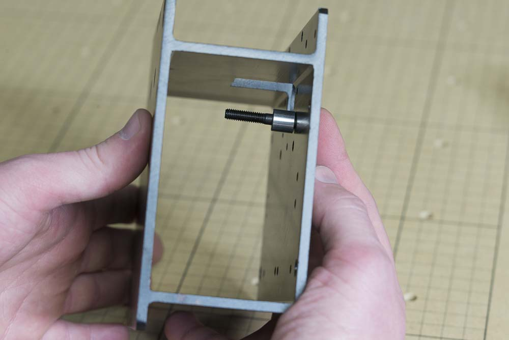
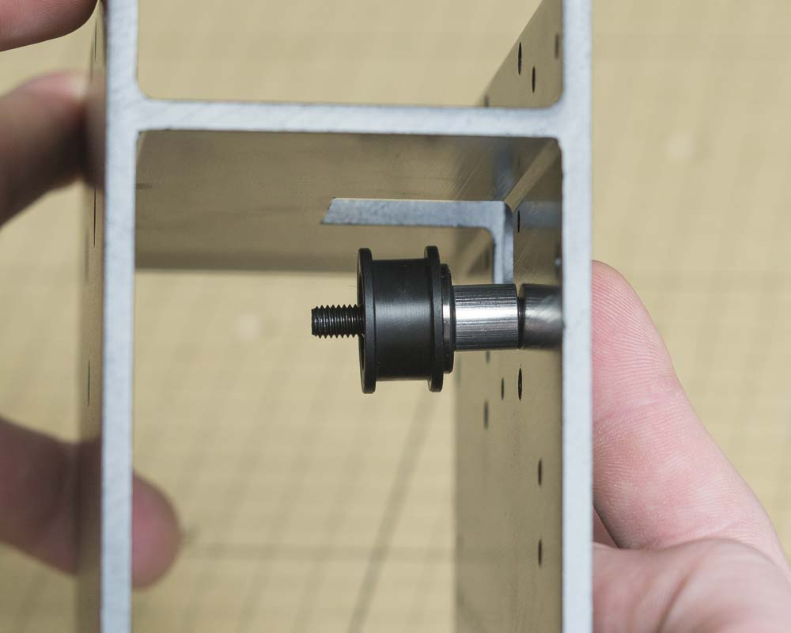
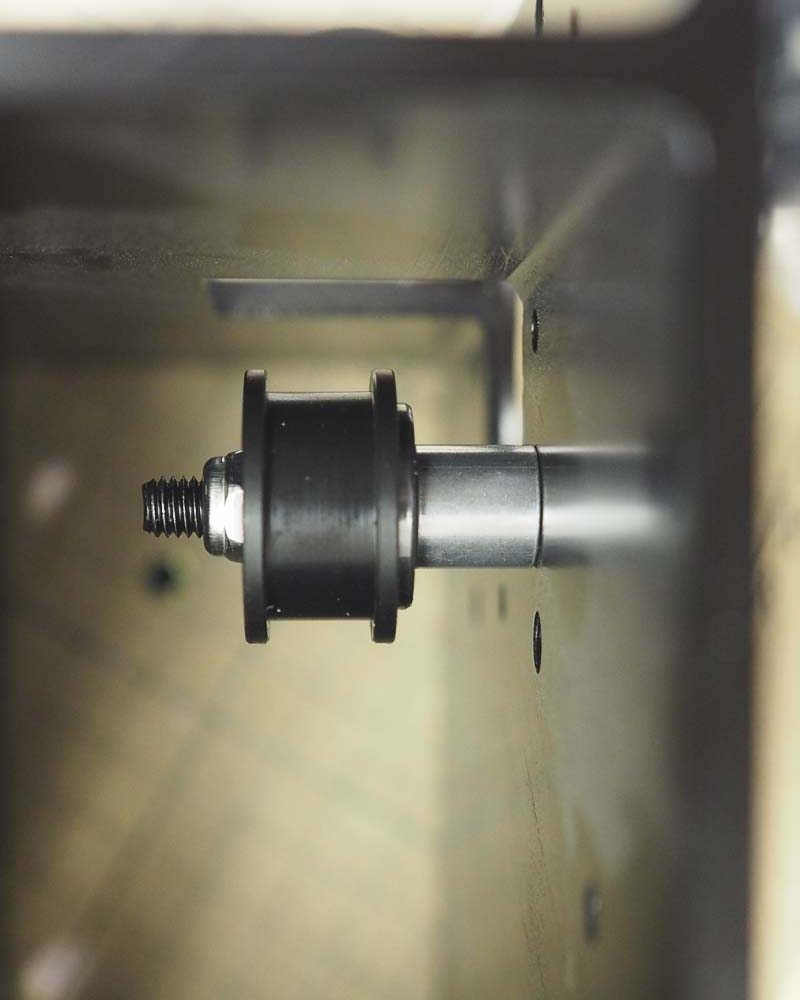

<table>
<tr><td style="color:#fff;background: #000;" colspan="3"><b>Components</b></td></tr>
	<tr>
		<td><b>SKU</b></td>
		<td><b>Name</b></td>
		<td><b>Quantity</b></td>
	</tr>
<tr>
<td>30552-01</td>
<td>Flat Head Screw M5 x 35 Steel/Black</td>
<td>2</td>
</tr>
<tr>
<td>25312-23</td>
<td>Spacer 5.1mm ID 0.375in OD 9.5mm Lg Aluminum</td>
<td>2</td>
</tr>
<tr>
<td>25197-01</td>
<td>Smooth Idler Pulley Assembly</td>
<td>2</td>
</tr>
<tr>
<td>30265-04</td>
<td>Hex Nut M5 Nylon Locking Steel/Zinc</td>
<td>4</td>
</tr>

</table>
Insert an M5x35 flat head screw into one of the countersunk holes in the X-Carriage.

Put an aluminum spacer on the bolt followed by an idler wheel and Nylon locking nut. Make sure that the side of the wheel with the protruding bearing faces the Aluminum spacer, similar to the Y plates. Use a 3mm hex key and 8mm wrench to tighten the assembly.

