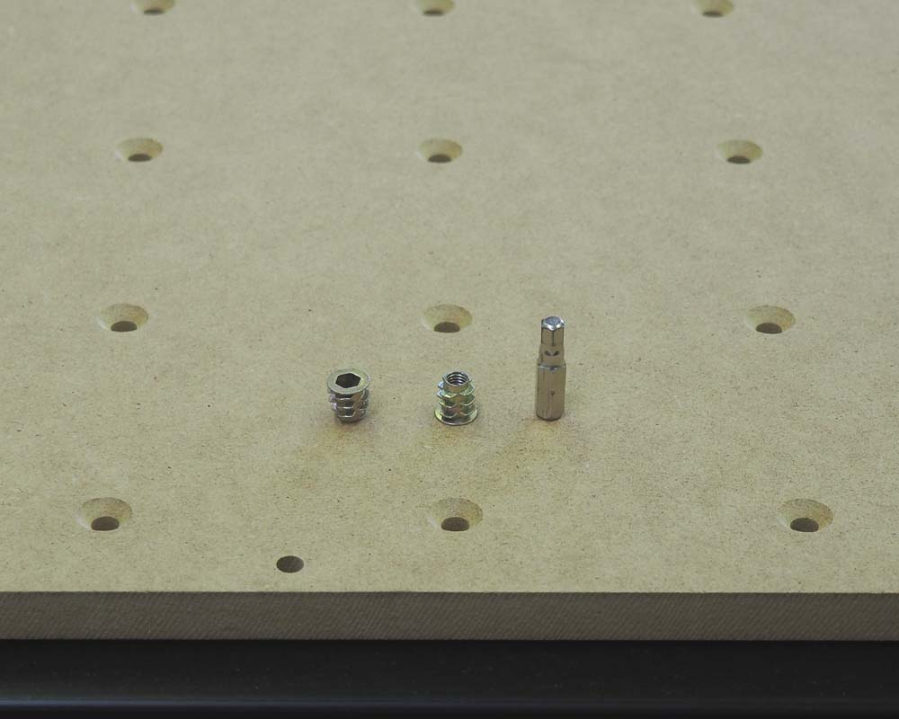
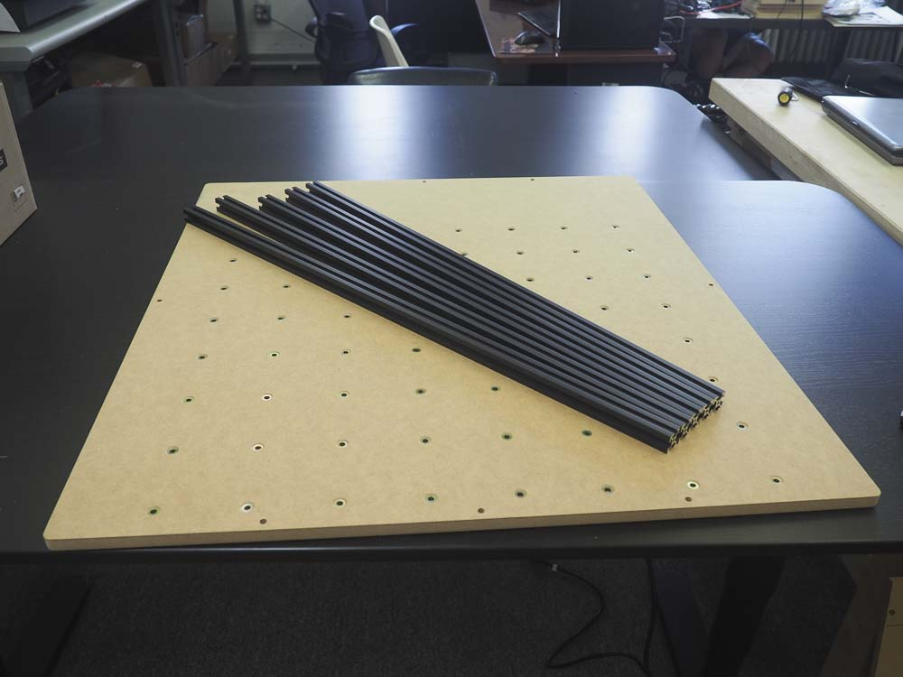
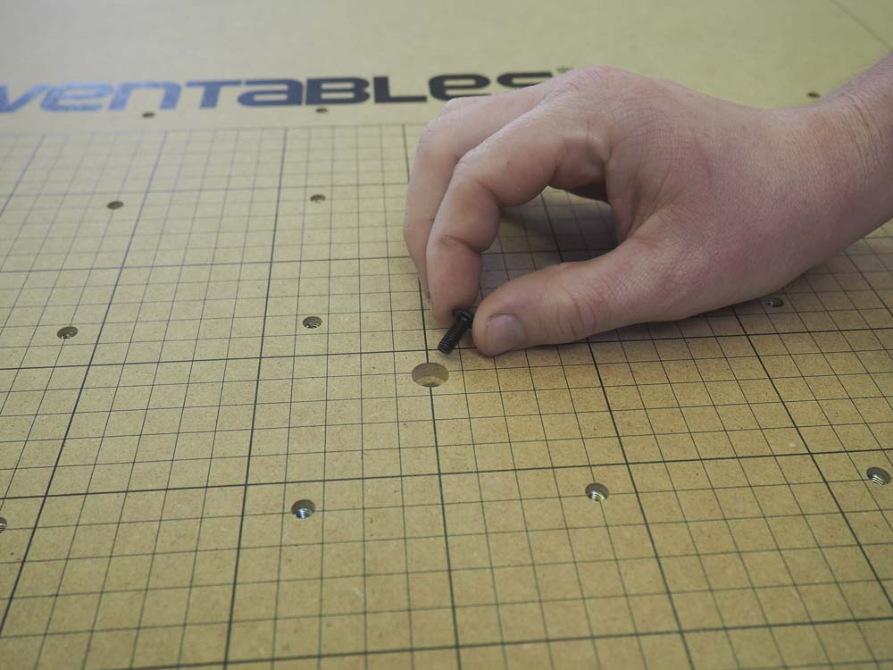
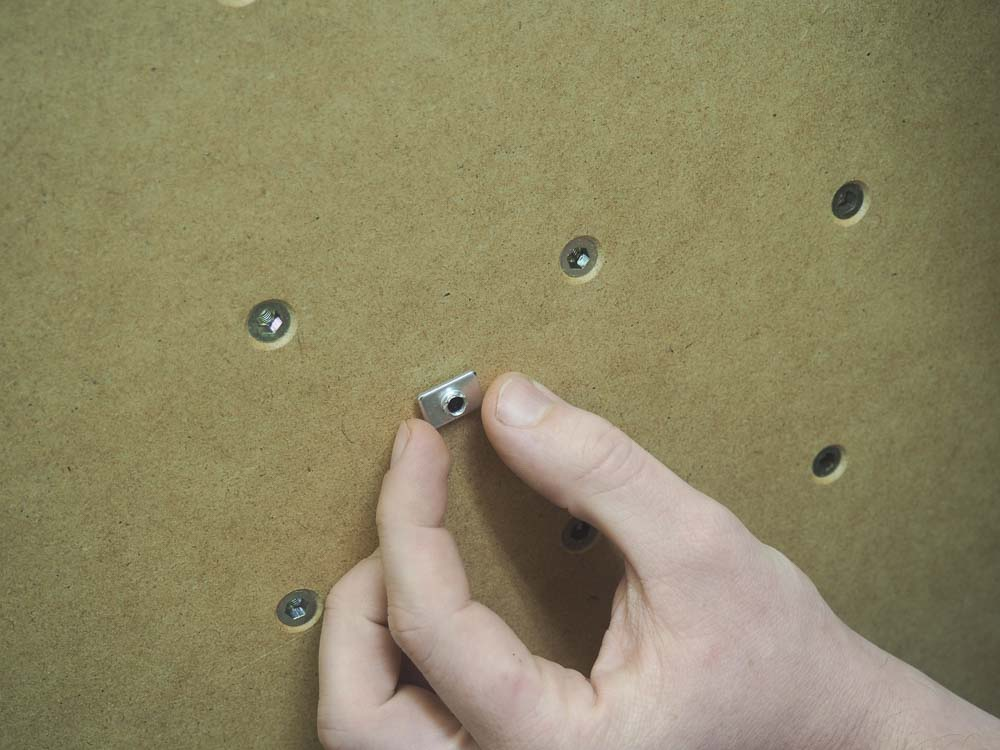
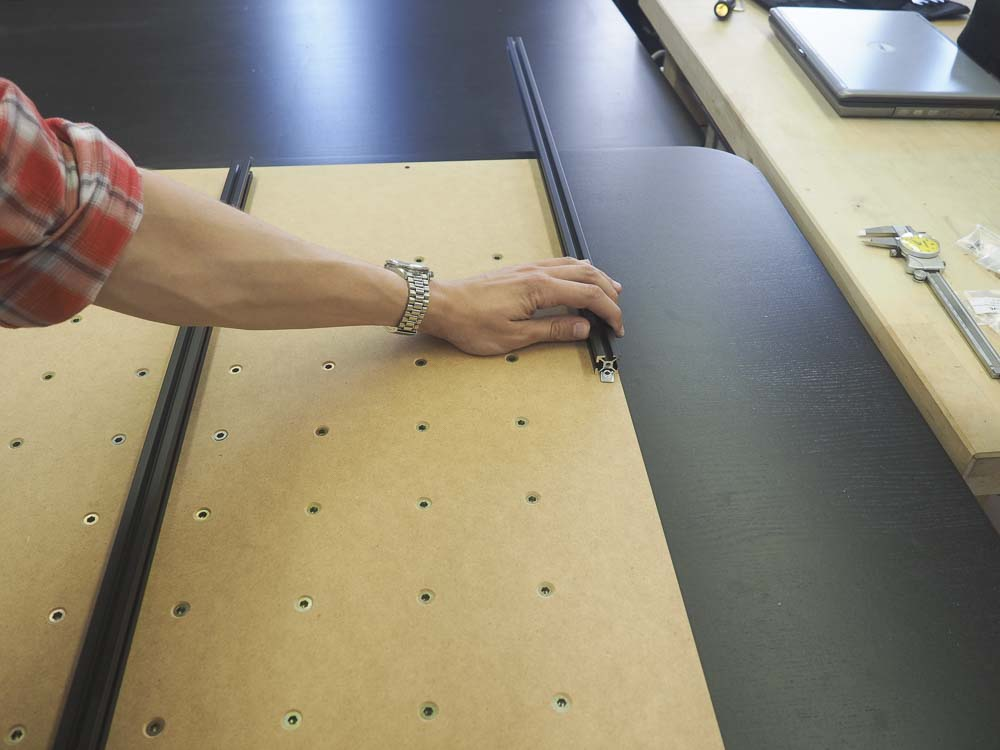
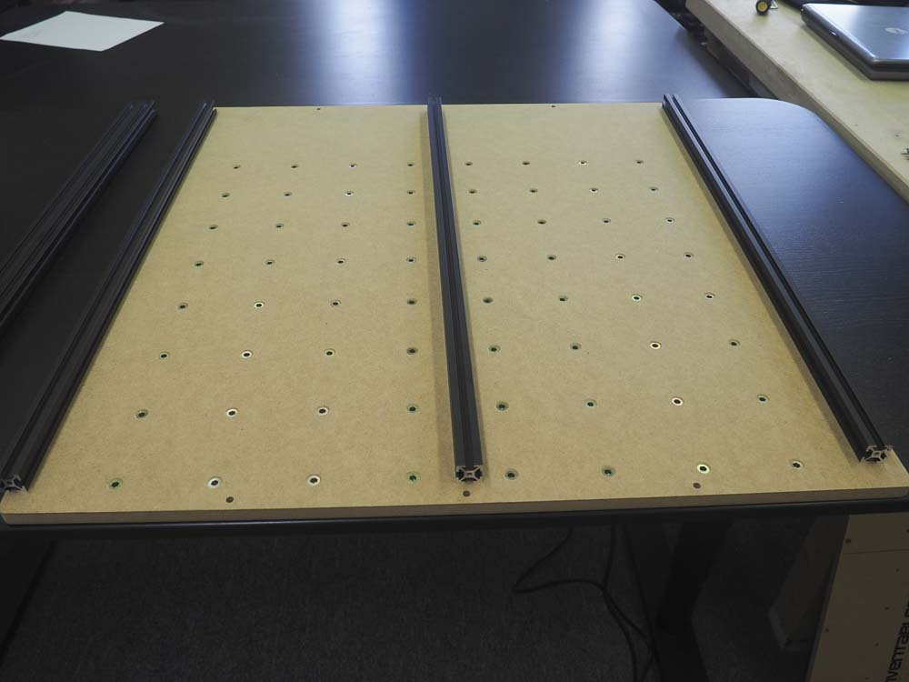
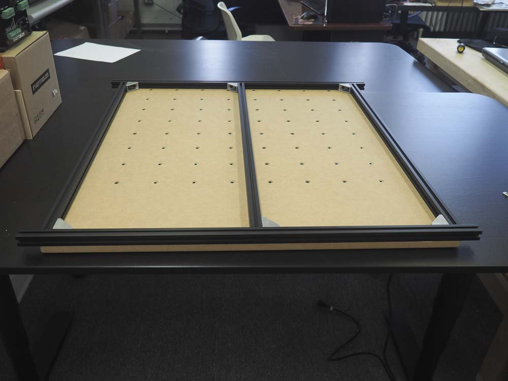

<table>
  <tr>
    <td style="color:#000;background: #FFFFFF" colspan="3">
      <b>750mm Rail Kit</b>
    </td>
  </tr>
  <tr>
    <td>
      <b>SKU</b>
    </td>
    <td>
      <b>Name</b>
    </td>
    <td>
      <b>Quantity</b>
    </td>
  </tr>
  <tr>
    <td>
      25281-10
    </td>
    <td>
      T-Slot Nut M5 Pre-Assembly
    </td>
    <td>
      12
    </td>
  </tr>
  <tr>
    <td>
      26018-01
    </td>
    <td>
      Extrusion Bracket (Gusset)
    </td>
    <td>
      6
    </td>
  </tr>
  <tr>
    <td>
      26049-05
    </td>
    <td>
      Aluminum Extrusion 20mm × 20mm Black 708mm Lg
    </td>
    <td>
      3
    </td>
  </tr>
  <tr>
    <td>
      26049-06
    </td>
    <td>
      Aluminum Extrusion 20mm × 20mm Black 750mm Lg
    </td>
    <td>
      2
    </td>
  </tr>
  <tr>
    <td>
      25286-36
    </td>
    <td>
      Button Head Cap Screw M5 x 10
    </td>
    <td>
      12
    </td>
  </tr>
</table>
<table>
  <tr>
    <td style="color:#fff;background: #0a91d1" colspan="3">
      <b>750mm Waste Board Kit</b>
    </td>
  </tr>
  <tr>
    <td>
      <b>SKU</b>
    </td>
    <td>
      <b>Name</b>
    </td>
    <td>
      <b>Quantity</b>
    </td>
  </tr>
  <tr>
    <td>
      25281-10
    </td>
    <td>
      T-Slot Nut M5 Pre-Assembly
    </td>
    <td>
      12
    </td>
  </tr>
  <tr>
    <td>
      30517-08
    </td>
    <td>
      Threaded Insert M5 x 10
    </td>
    <td>
      64
    </td>
  </tr>
  <tr>
    <td>
      30683-01
    </td>
    <td>
      750mm Waste Board
    </td>
    <td>
      1
    </td>
  </tr>
  <tr>
    <td>
      25286-40
    </td>
    <td>
      Button Head Cap Screw M5 x 12
    </td>
    <td>
      12
    </td>
  </tr>
</table>

In this section you'll be assembling the work area of your machine. You'll then set this aside until you're ready to attach it to its rails.

First locate the 750mm waste board that came with your kit. This board has 64 clamping holes and eight holes for mounting extrusion on the bottom of the board. Note that the eight holes are counter-sunk from the top of the board.

This is the reverse side of the board. The 64 holes are countersunk to accept the M5 threaded inserts

Find the 64 threaded inserts in your wasteboard kit and use a 5mm hex driver to insert one into each hole from the back. This process is made infinitely easier by a drill driver with a 5mm hex bit.

Find the five pieces of 20mm x 20mm extrusion that make up the base of your machine. You should have two lengths of 750mm extrusion and three lengths of 708mm extrusion.

You'll also need six cast corner brackets, 21 pre-assembly insertion nuts, 12 M5 x 10mm button head cap screws, and 9 M5x12 button head cap screws. These will hold the frame together.

We'll start by installing the center 708mm rail. This will be mounted perpendicular to the front edge of the waste board.

You'll need one M5 x 12mm button head cap screw and one M5 insertion nut.

Insert the screw through the front of the board.

Thread the M5 insertion nut on the back  of the board, making sure that the protrusion on the nut faces outwards. This should be left loose for now.

Slide the 708mm rail onto the nut, and thread in the screw on the other side a bit more, but do not tighten.

Repeat this procedure with the other two lengths of 708mm rail, using the single holes to either side of the center rail.

We will now attach the 750mm rails to the board and to the corner brackets. The general layout looks similar to this:

Insert a M5 insertion nut into the end of each 708mm rail. The nuts on the center and left rails should go on the righthand slots. The nut on the right rail should go in the lefthand slot.

Insert three M5 insertion nuts into a 750mm rail and align it with the three holes on the end of the waste board. Use three M5 x 12mm button head cap screws to secure the rail to the board. Make sure there is even overhang of the rail on either side. This should be about 1.16".

Insert three M5 insertion nuts into the 750mm rail. Line up the nuts, the three corner brackets and six M5 x 10mm screws. You can use a hex key to align the nuts. Tighten all six screws, making sure the assembly is square and that all of the outside rails are close to flush with the board.

Repeat this procedure for the other side.

You should now have a complete work area.

