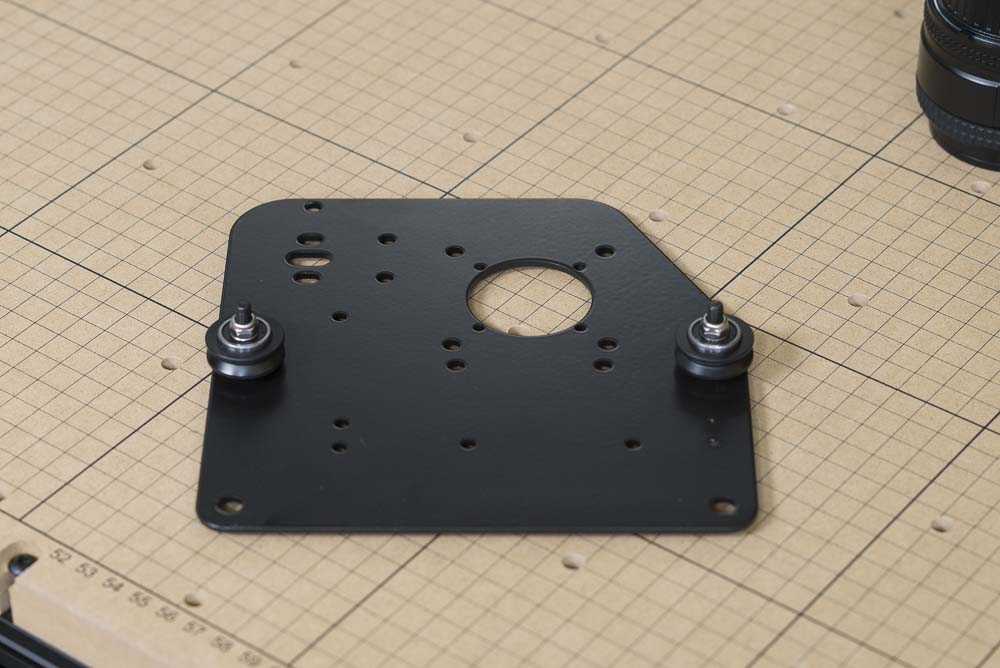
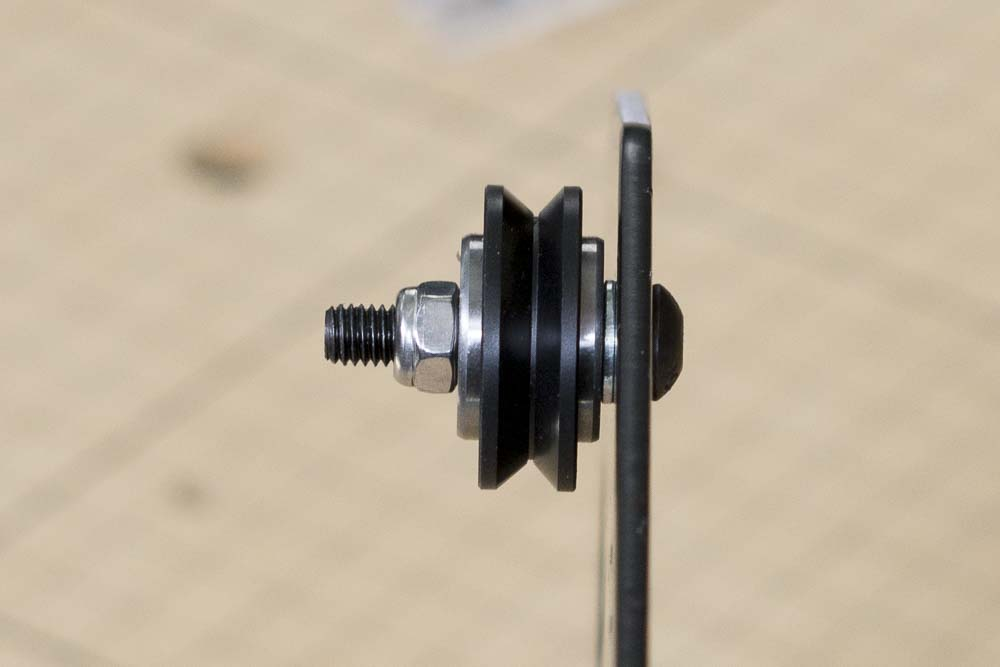

<h3>Attach Fixed V-Wheels</h3>

<table>
<tr><td style="color:#fff;background: #000;" colspan="3"><b>Components</b></td></tr>
<tr>
	<tr>
		<td><b>SKU</b></td>
		<td><b>Name</b></td>
		<td><b>Quantity</b></td>
	</tr>
<td>25286-21</td>
<td>M5 x 25mm Button Head Cap Screw</td>
<td>4</td>
</tr>
<tr>
<td>25287-08</td>
<td>M5 Washer</td>
<td>4</td>
</tr>
<tr>
<td>25203-01</td>
<td>V Wheel Assembly</td>
<td>4</td>
</tr>
<tr>
<td>30265-04</td>
<td>Hex Nut M5 Nylon Locking Steel/Zinc</td>
<td>4</td>
</tr>
</table>

First, we'll attach the fixed v-wheels to the carriage. Insert the M5x25 bolt into one of the smaller v-wheel holes, then put on an M5 flat washer followed by a v-wheel. Use an M5 nylon lock nut to secure the assembly. Tighten the nut until secure using a 3mm allen key on the bolt and an 8mm wrench on the nut.

Repeat this for the other side.

