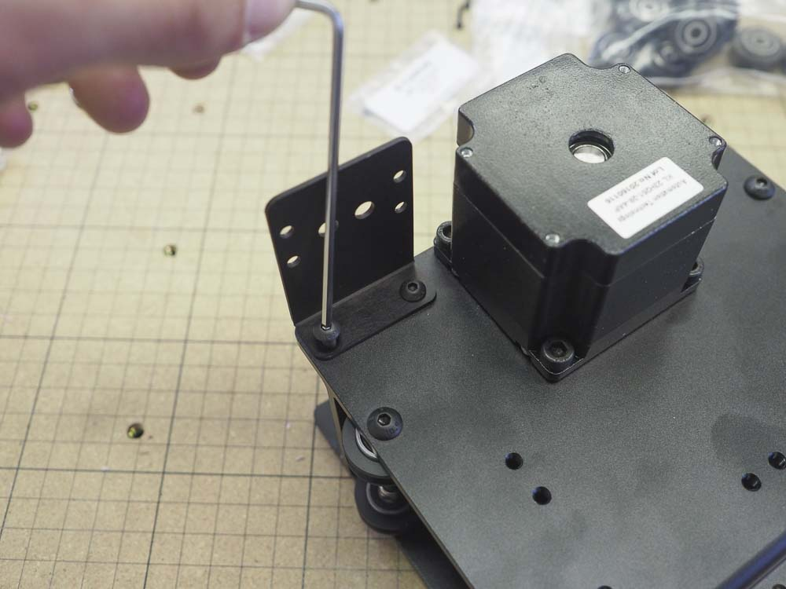

<table>
<tr><td style="color:#fff;background: #000;" colspan="3"><b>Components</b></td></tr>
	<tr>
		<td><b>SKU</b></td>
		<td><b>Name</b></td>
		<td><b>Quantity</b></td>
	</tr>
<tr>
<td>25286-24</td>
<td>Button Head Screw M4 x 10 Steel/Black</td>
<td>2</td>
</tr>
<tr>
<td>30527-05</td>
<td>Drag Chain Bracket</td>
<td>1</td>
</tr>

</table>

Use 2x M4x10mm button head cap screws to fasten the drag chain bracket to the X-Carriage. This requires a 2.5mm hex key. You will install the drag chain later on.

