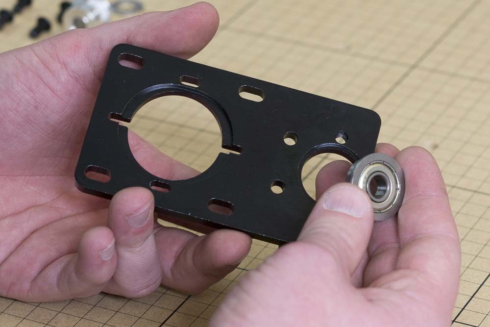
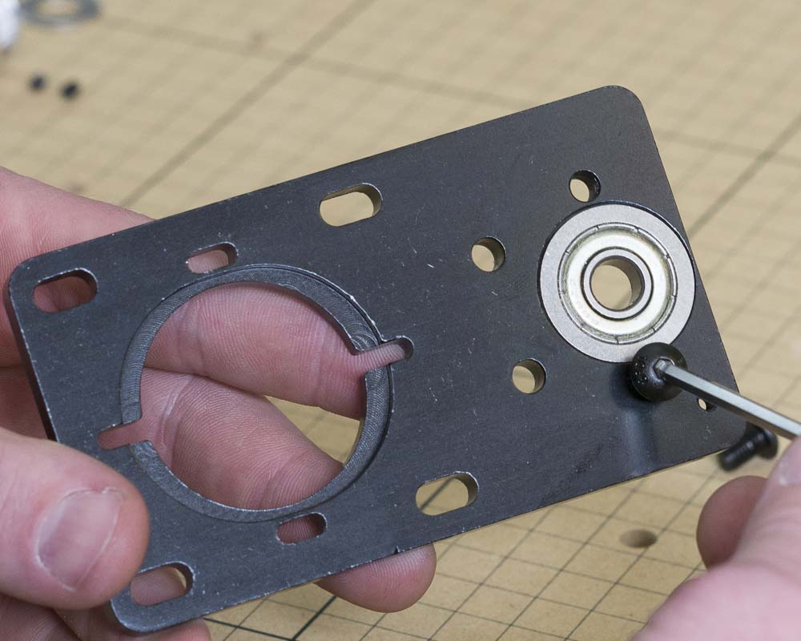

<table>
  <tr>
    <td style="color:#fff;background: #383838" colspan="3">
      <b>Core Components Kit</b>
    </td>
  </tr>
  <tr>
    <td>
      <b>SKU</b>
    </td>
    <td>
      <b>Name</b>
    </td>
    <td>
      <b>Quantity</b>
    </td>
  </tr>
  <tr>
    <td>
      30534-01
    </td>
    <td>
      Z Axis Motor Plate
    </td>
    <td>
      1
    </td>
  </tr>
  <tr>
    <td>
      30169-01
    </td>
    <td>
      Flanged Bearing, 8mm
    </td>
    <td>
      1
    </td>
  </tr>
  <tr>
    <td>
      25286-33
    </td>
    <td>
      Button Head Cap Screw M5 x 8
    </td>
    <td>
      2
    </td>
  </tr>
</table>

<h3>Attach Flanged Bearing to Z-Axis Plate</h3>

Place the flanged bearing into the Z axis motor plate so it rests in the recess for the flange. Secure the bearing with 2x M5x8mm button head cap screws.

