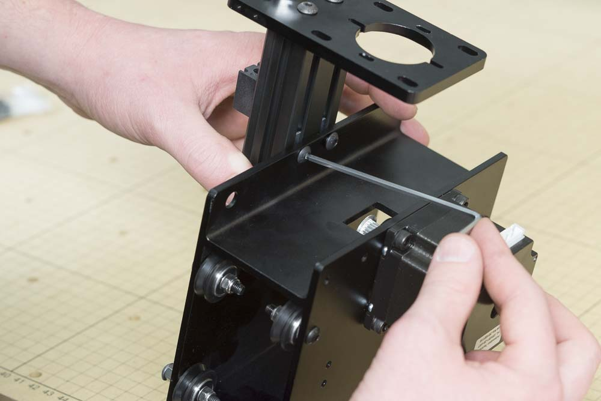
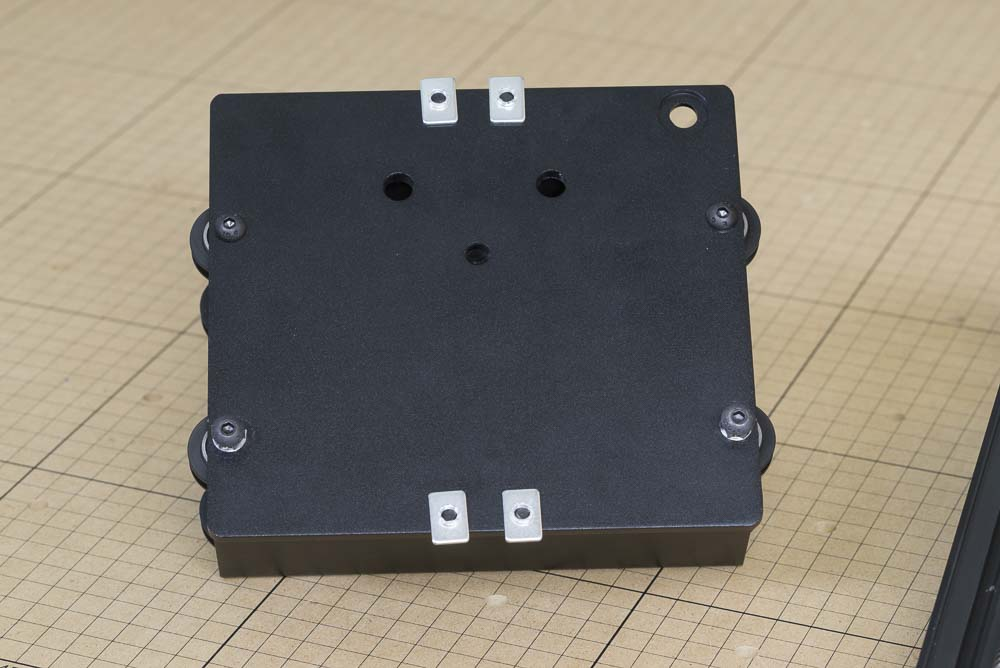
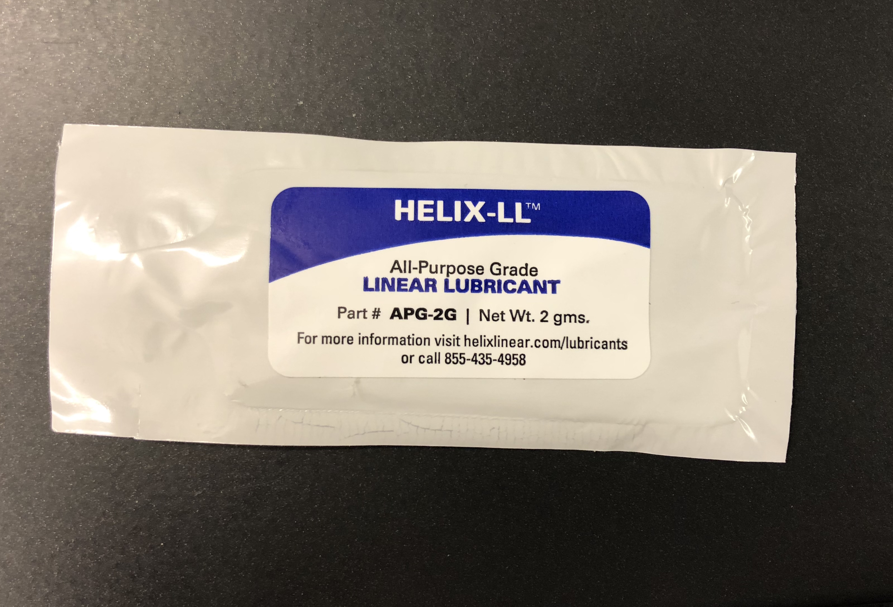

<table>
  <tr>
    <td style="color:#fff;background: #383838" colspan="3">
      <b>Core Components Kit</b>
    </td>
  </tr>
  <tr>
    <td>
      <b>SKU</b>
    </td>
    <td>
      <b>Name</b>
    </td>
    <td>
      <b>Quantity</b>
    </td>
  </tr>
  <tr>
    <td>
      25286-35
    </td>
    <td>
      Button Head Cap Screw M5 x 10
    </td>
    <td>
      4
    </td>
  </tr>
  <tr>
    <td>
      25281-12
    </td>
    <td>
      T-Slot Nut M5 Pre-Assembly
    </td>
    <td>
      4
    </td>
  </tr>
</table>

<h3>Attach Z-Axis Assembly to X-Carriage</h3>

Insert an M5x10mm button head cap screw into one of the four holes on the X-Carriage's front flanges. Loosely thread a pre-assembly insertion nut onto the screw. Repeat this for the remaining three holes in the X-Carriage.

Take the X-Carriage assembly and slide it onto the pre-assembly nuts, just until the makerslide covers the bottom pair.

Use a 3mm hex key to tighten the four bolts.

At this point you can lubricate the leascrew with the included packet of synthetic grease (SKU: 30711-01) by applying a sparing amount directly to the threads. While the delrin is self-lubricating to a certain extent, this grease will keep the Z axis from binding from static friction. 

