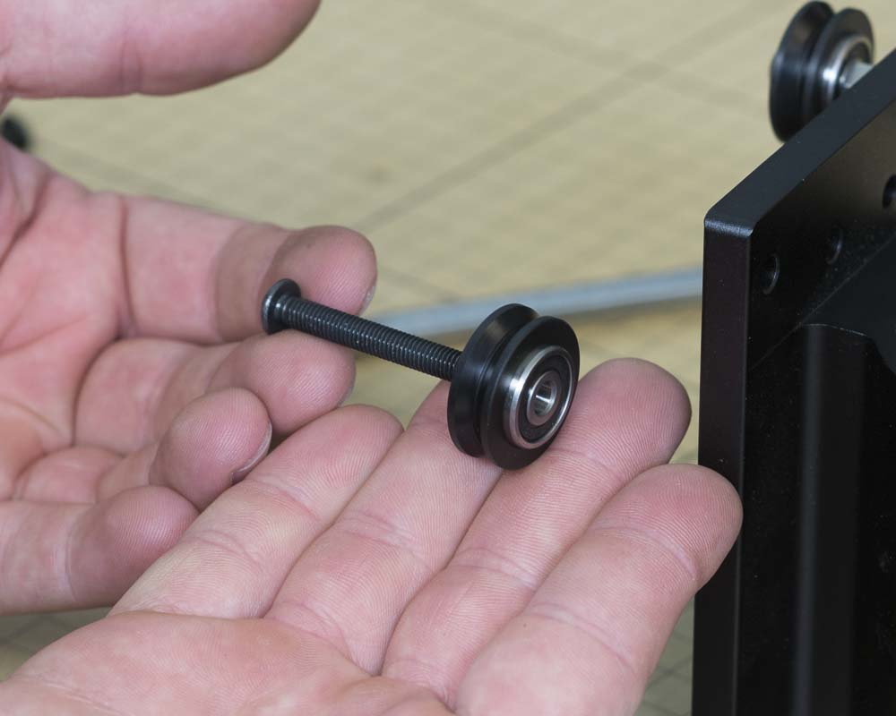

<table>
  <tr>
    <td style="color:#fff;background: #383838" colspan="3">
      <b>Core Components Kit</b>
    </td>
  </tr>
  <tr>
    <td>
      <b>SKU</b>
    </td>
    <td>
      <b>Name</b>
    </td>
    <td>
      <b>Quantity</b>
    </td>
  </tr>
  <tr>
    <td>
      25203-01
    </td>
    <td>
      V Wheel Assembly
    </td>
    <td>
      2
    </td>
  </tr>
  <tr>
    <td>
      25286-48
    </td>
    <td>
      Button Head Cap Screw M5 x 40
    </td>
    <td>
      2
    </td>
  </tr>
  <tr>
    <td>
      25312-23
    </td>
    <td>
      Aluminum Spacer 5.1mm ID 9.5mm OD 9.5mm LG
    </td>
    <td>
      2
    </td>
  </tr>
  <tr>
    <td>
      30265-09
    </td>
    <td>
      Nylon Insert Lock Nut M5
    </td>
    <td>
      2
    </td>
  </tr>
</table>

<h3>Attach Fixed V-Wheels</h3>

Take an M5x40 button head cap screw and put a v-wheel on followed by a plain aluminum spacer. Insert this assembly into one of the smaller holes on the makerslide and use an M5 nylock nut to secure. Repeat this procedure for the other wheel.

