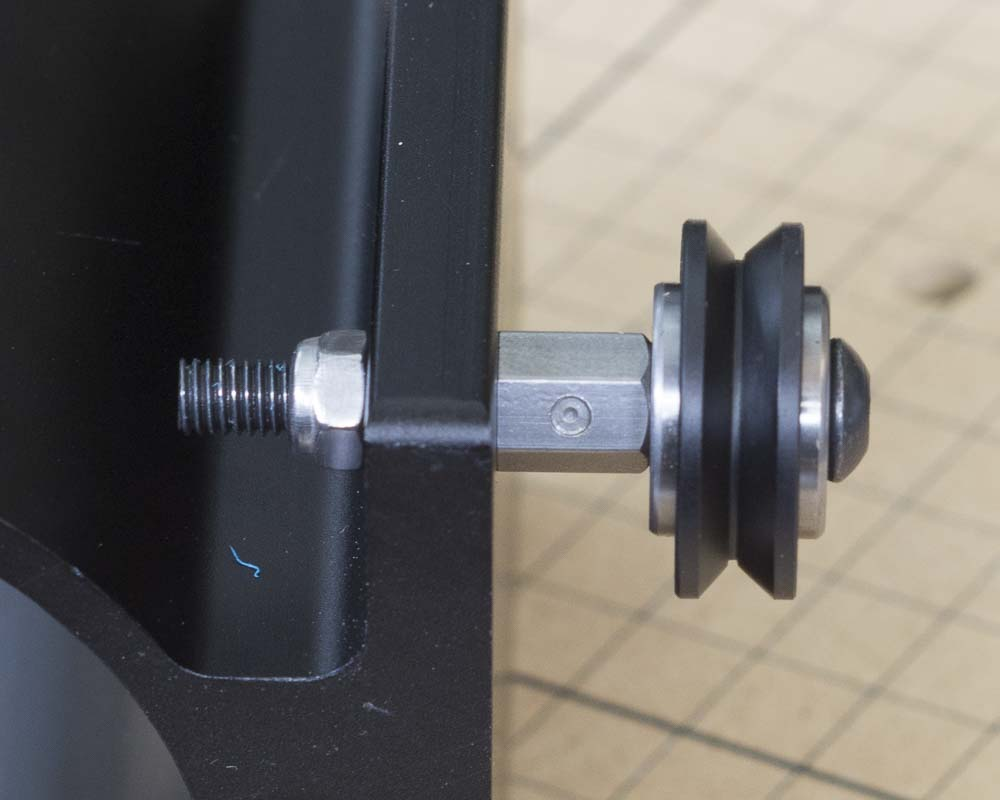

<table>
<tr><td style="color:#fff;background: #000;" colspan="3"><b>Components</b></td></tr>
	<tr>
		<td><b>SKU</b></td>
		<td><b>Name</b></td>
		<td><b>Quantity</b></td>
	</tr>
<tr>
<td>25286-30</td>
<td>Button Head Screw M5 x 40 Steel/Black</td>
<td>2</td>
</tr>
<tr>
<td>25195-08</td>
<td>Eccentric Spacer 0.375in Long</td>
<td>2</td>
</tr>
<tr>
<td>30265-04</td>
<td>Hex Nut M5 Nylon Locking Steel/Zinc</td>
<td>2</td>
</tr>

</table>

Take an M5x40mm button head cap screw and thread on a v-wheel and eccentric spacer. Insert this assembly into one of the large holes on the spindle mount. These are both on the right side of the mount when looking at it from the front. Secure the assembly with an M5 nylock nut. repeat this procedure for the other wheel.

