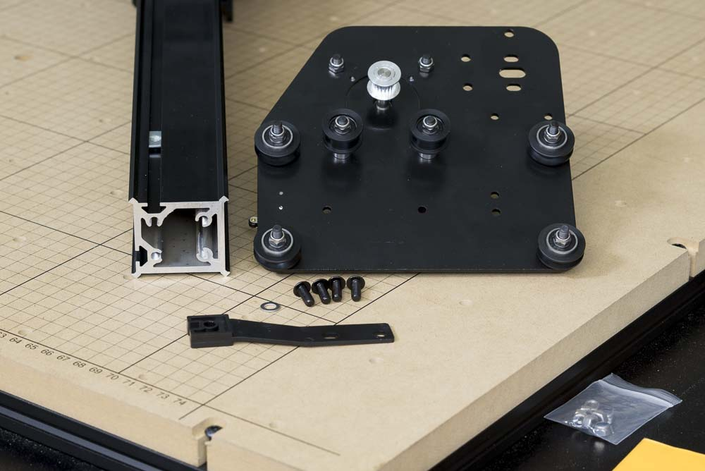

<table>
<tr><td style="color:#fff;background: #000;" colspan="3"><b>Components</b></td></tr>
	<tr>
		<td><b>SKU</b></td>
		<td><b>Name</b></td>
		<td><b>Quantity</b></td>
	</tr>
<tr>
<td>25286-19</td>
<td>Button Head Screw M5 x 12 Steel/Zinc</td>
<td>4</td>
</tr>
<tr>
<td>25286-19</td>
<td>M5 Washer</td>
<td>1</td>
</tr>
<tr>
<td>30681-01</td>
<td>Drag Chain Support Arm</td>
<td>1</td>
</tr>
<tr>
<td>25284-09</td>
<td>Hex Nut M2x0.4 Steel/Zinc</td>
<td>2</td>
</tr>
</table>

In this step you will attach one of the Y Plates to The X axis makerslide rail. You'll put one plate on, then slide the assembled X Carriage on before inserting some pre-assembly insertion nuts for the belting and attaching the other plate.

Make sure the beveled side of the plates and the X-Carve logo on the gantry rail are facing in the same direction

Secure the plate to the end of the makerslide rail with four M5x12mm button head cap screws. Position the plastic bracket for the drag chain support with the extrusion mount facing down. You will have to install one washer between the plate and the screw on the top slotted hole in the plate. The bottom slotted hole is covered by the plastic bracket and doesn't need a washer.

