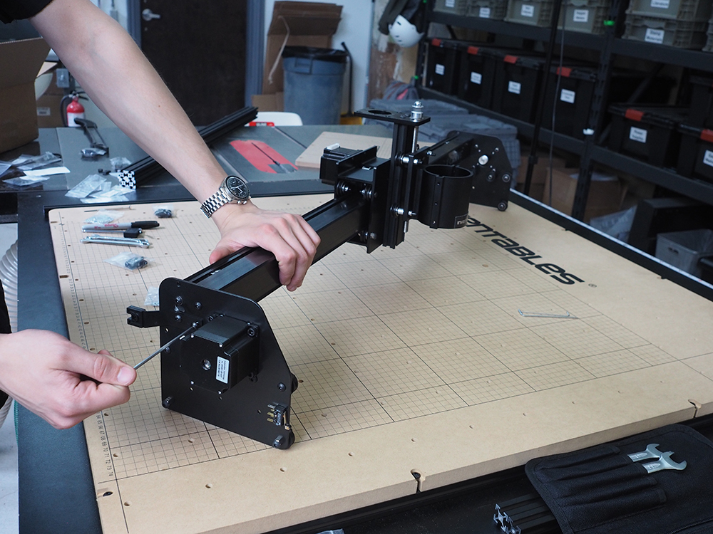

<table>
<tr><td style="color:#fff;background: #000;" colspan="3"><b>Components</b></td></tr>
	<tr>
		<td><b>SKU</b></td>
		<td><b>Name</b></td>
		<td><b>Quantity</b></td>
	</tr>
<tr>
<td>25286-19</td>
<td>Button Head Screw M5 x 12</td>
<td>4</td>
</tr>
<tr>
<td>25286-19</td>
<td>M5 Washer</td>
<td>1</td>
</tr>
<tr>
<td>30681-01</td>
<td>Drag Chain Support Arm</td>
<td>1</td>
</tr>
<tr>
<td>25284-09</td>
<td>Hex Nut M2x0.4</td>
<td>2</td>
</tr>
<tr>
<td>25281-05</td>
<td>T-Slot Nut M5 Pre-Assembly</td>
<td>3</td>
</tr>

</table>

Before attaching the other gantry side plate, insert two pre-assembly insertion nuts into the top rail of the main rail so that the belting can be attached later

**NOTE:** This photo **will be changed** it is for illustration of orientation only

**If you will are installing home switches:** Insert a single insertion nut from your home switch kit into the back slot on the gantry rail. You will install the actuator at a later point.

Attach the other Y plate with 4x M5x12mm , again paying attention to the placement of the plastic bracket and the single M5 washer on the exposed slotted hole in the plate.

Your Gantry is now complete and should look like this:

