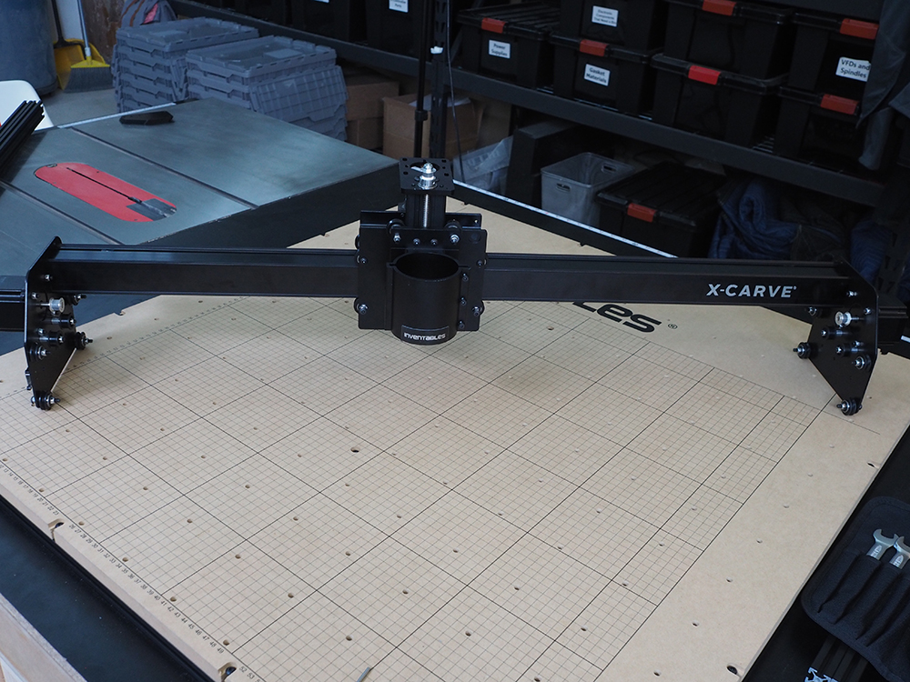

<table>
  <tr>
    <td style="color:#fff;background: #8A52A1" colspan="3">
      <b>750mm Drag Chain Kit</b>
    </td>
  </tr>
  <tr>
    <td>
      <b>SKU</b>
    </td>
    <td>
      <b>Name</b>
    </td>
    <td>
      <b>Quantity</b>
    </td>
  </tr>
  <tr>
    <td>
      26049-08
    </td>
    <td>
      Extrusion T-Slot 20x20 x 750mm Tapped
    </td>
    <td>
      1
    </td>
  </tr>
  <tr>
    <td>
      25286-46
    </td>
    <td>
      Button Head Cap Screw M5 x 14
    </td>
    <td>
      2
    </td>
  </tr>
</table>

Attach the piece of 750mm 20mmx20mm extrusion to the plastic brackets of the gantry. Secure the ends with 2x M5x14mm button head cap screws. We'll attach the drag chain hardware on this in a later step.

