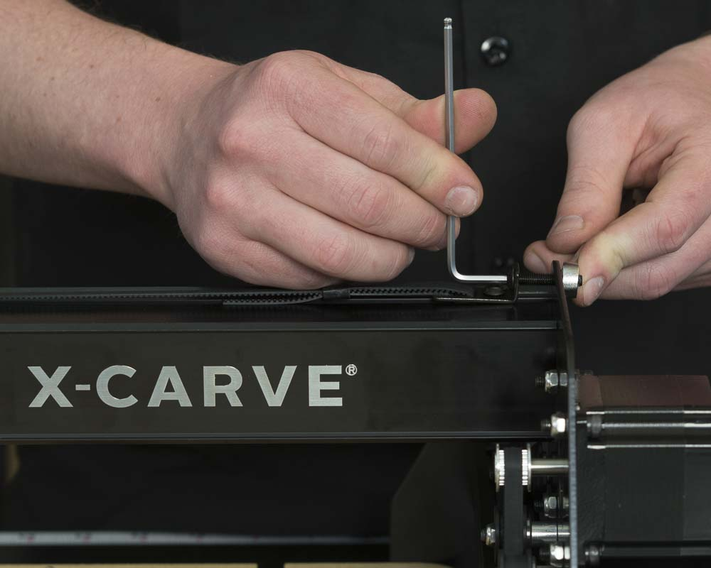

This section covers installing the belting.

<table>
  <tr>
    <td style="color:#fff;background: #383838" colspan="3">
      <b>Core Components Kit</b>
    </td>
  </tr>
  <tr>
    <td>
      <b>SKU</b>
    </td>
    <td>
      <b>Name</b>
    </td>
    <td>
      <b>Quantity</b>
    </td>
  </tr>
  <tr>
    <td>
      30526-01
    </td>
    <td>
      Belt Clip
    </td>
    <td>
      6
    </td>
  </tr>
  <tr>
    <td>
      30677-01
    </td>
    <td>
      Belt Sleeve Clip
    </td>
    <td>
      6
    </td>
  </tr>
  <tr>
    <td>
      25286-33
    </td>
    <td>
      Button Head Cap Screw M5 x 8
    </td>
    <td>
      16
    </td>
  </tr>
  <tr>
    <td>
      25286-43
    </td>
    <td>
      Button Head Cap Screw M5 x 25
    </td>
    <td>
      3
    </td>
  </tr>
  <tr>
    <td>
      30547-01
    </td>
    <td>
      GT2 Belt Closed Loop, 80T
    </td>
    <td>
      1
    </td>
  </tr>
  <tr>
    <td>
      25287-12
    </td>
    <td>
      M5 Flat Washer
    </td>
    <td>
      4
    </td>
  </tr>
  <tr>
    <td>
      30265-09
    </td>
    <td>
      Nylon Insert Lock Nut M5
    </td>
    <td>
      4
    </td>
  </tr>
  <tr>
    <td>
      25285-53
    </td>
    <td>
      Socket Head Screw M5 x 20
    </td>
    <td>
      4
    </td>
  </tr>
</table>
<table>
  <tr>
    <td style="color:#000;background: #FFFFFF" colspan="3">
      <b>750mm Rail Kit</b>
    </td>
  </tr>
  <tr>
    <td>
      <b>SKU</b>
    </td>
    <td>
      <b>Name</b>
    </td>
    <td>
      <b>Quantity</b>
    </td>
  </tr>
  <tr>
    <td>
      26053-01
    </td>
    <td>
      GT2 Belting - Open Ended (feet)
    </td>
    <td>
      9
    </td>
  </tr>
</table>
<table>
  <tr>
    <td style="color:#fff;background: #CC3440" colspan="3">
      <b>750mm Motor and Wiring Kit</b>
    </td>
  </tr>
  <tr>
    <td>
      <b>SKU</b>
    </td>
    <td>
      <b>Name</b>
    </td>
    <td>
      <b>Quantity</b>
    </td>
  </tr>
  <tr>
    <td>
      25311-06
    </td>
    <td>
      Stepper Motor - NEMA 23
    </td>
    <td>
      1
    </td>
  </tr>
</table>

Start by cutting the belt into 3 equal lengths.

Route the belt (teeth side down) under the smooth idler, over the pulley, and under the smooth idler across all three lengths of Makerslide.

The x-axis is by far the trickiest of the three.  You won't be able to route the belt over the pulley by going in from the side of the x-carriage, so you'll need to go through the hole in the top.  This works best if both ends are first curled before placing them through the top hole.  Feed one curled belt end between the pulley and smooth idler, and instead of forcing the belt through, slowly move the x-carriage in the opposite direction to help reveal the end of the belt.  Once revealed, grab the belt and pull it further through.  Repeat this process with the other end of the belt.

Each end of the belt is attached to a belt clip which secures the belt to the machine.  Take one end of the belt and add one of the belt sleeve clips, small end first.  Route the belt through the slot closest to the small bend, underneath the clip and through the remaining slot.  Push the end of the belt through the wide end of the belt sleeve clip to lock the teeth in place.

Tensioning screws (M5x25mm button head cap screw) are used at the end of each length of belt to help keep your belts tight.  Place the M5x25mm button head cap screw (tensioning screw) through the hole in the small bend of the belt clip.  Place the M5x8mm button head cap screw through the remaining hole and lightly tighten the clip down to the pre-assembly insertion nut, installed in the top slot of your Makerslide in a previous step.  Place the tensioning screw through the hole in the back end plate and hand tighten the M5 nylon locking nut.  On the opposite end, without the tensioning screw, place the M5x8mm button head cap screw through the hole on the belt clip and lightly tighten the clip down to the pre-assembly insertion nut.

So you don't waste any threads on your tensioning screw, you need to start with some tension in your belt. To do so, place your hex key in the head of the M5x8mm button head cap screw on the front (without the tensioning screw) and pull towards the front of the machine making the belt tight.  While pulling, tighten the button head cap screw in place.  Go back to your tensioning screws and start tightening down the M5 nylon locking nut until you hear an audible tone when plucking the belt.  Once you have that tone (similar to a bass string on a guitar), tighten down the M5x8mm button head cap screw to secure the belt clip in place.  This might seem like a very complicated step, but if you start with tension already in your belt, you won't have to deal with undoing the tensioning screw and feeding more belt through the belt clip; essentially redoing all of the work you just did.

Place the closed loop belt around the drive rod pulley.  Angle the stepper motor through the z-axis motor mount plate and grab the closed loop belt with the pulley on the stepper motor.

Use the M5x20mm socket head cap screws, M5 flat washers, and M5 nylon locking nuts to secure the motor onto the z-axis motor mount plate.

Pull the motor away from the drive rod to tension the closed loop belt and tighten down all of the M5 nylon locking nuts in place.

