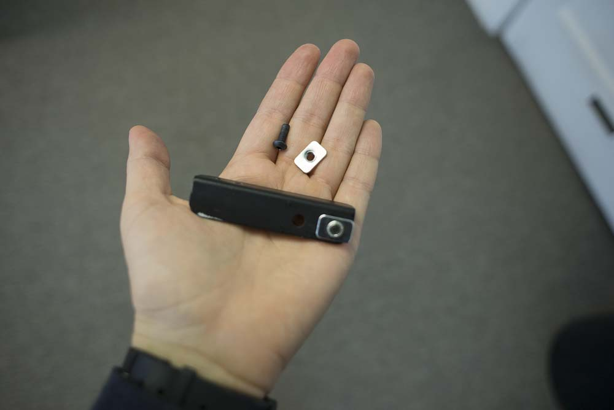
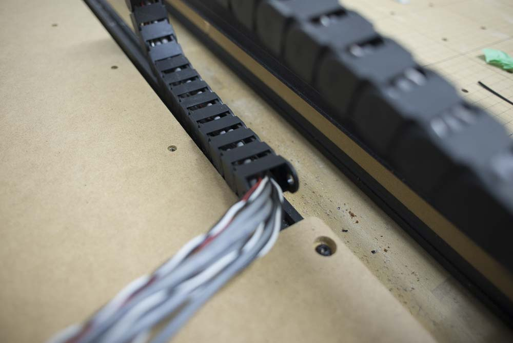
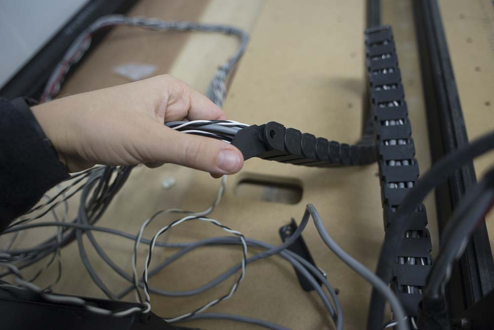
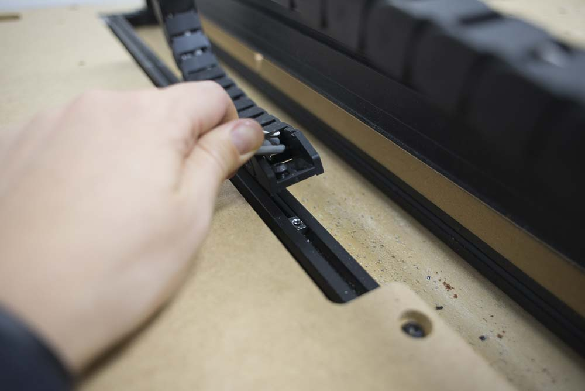
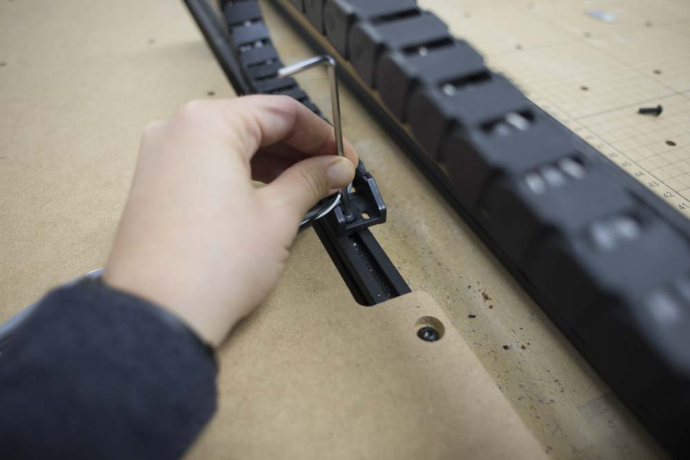
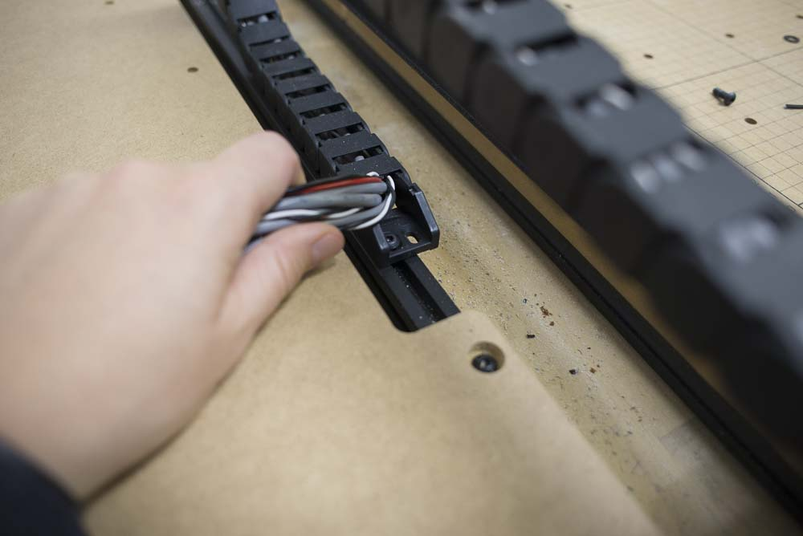

<a data-toggle="collapse" data-parent="#side-board-accordion" href="#side-board" aria-expanded="false" aria-controls="side-board" style="color:#fff;background:#9D9FA2" class="panel-heading" role="tab" id="side-board-header">
<h4 class="panel-title">
<strong>Bill of Materials</strong>
</h4>

<i class="fa fa-plus"></i>
<i class="fa fa-minus"></i>

</a>

<table>
  <tr>
    <td style="color:#fff;background: #9D9FA2" colspan="3">
      <b>1000mm Side Board Kit</b>
    </td>
  </tr>
  <tr>
    <td>
      <b>SKU</b>
    </td>
    <td>
      <b>Name</b>
    </td>
    <td>
      <b>Quantity</b>
    </td>
  </tr>
  <tr>
    <td>
      30684-01
    </td>
    <td>
      Extrusion Connection Bracket
    </td>
    <td>
      2
    </td>
  </tr>
  <tr>
    <td>
      25281-13
    </td>
    <td>
      T-Slot Nut M5 Pre-Assembly
    </td>
    <td>
      21
    </td>
  </tr>
  <tr>
    <td>
      26018-01
    </td>
    <td>
      Cast Corner Bracket, Clear
    </td>
    <td>
      4
    </td>
  </tr>
  <tr>
    <td>
      30517-11
    </td>
    <td>
      Threaded Insert M5
    </td>
    <td>
      12
    </td>
  </tr>
  <tr>
    <td>
      30685-03
    </td>
    <td>
      Side Board, X-Carve 1000mm
    </td>
    <td>
      1
    </td>
  </tr>
  <tr>
    <td>
      26049-10
    </td>
    <td>
      Extrusion T-Slot 20x20 x 250mm
    </td>
    <td>
      2
    </td>
  </tr>
  <tr>
    <td>
      26049-04
    </td>
    <td>
      Extrusion T-Slot 20x20 x 958mm
    </td>
    <td>
      2
    </td>
  </tr>
  <tr>
    <td>
      25286-34
    </td>
    <td>
      Button Head Cap Screw M5 x 8
    </td>
    <td>
      8
    </td>
  </tr>
  <tr>
    <td>
      25286-37
    </td>
    <td>
      Button Head Cap Screw M5 x 10
    </td>
    <td>
      8
    </td>
  </tr>
  <tr>
    <td>
      25286-41
    </td>
    <td>
      Button Head Cap Screw M5 x 12
    </td>
    <td>
      5
    </td>
  </tr>
  <tr>
    <td>
      25286-47
    </td>
    <td>
      Button Head Cap Screw M5 x 14
    </td>
    <td>
      12
    </td>
  </tr>
</table>
<table>
  <tr>
    <td style="color:#fff;background: #9D9FA2" colspan="3">
      <b>750mm Side Board Kit</b>
    </td>
  </tr>
  <tr>
    <td>
      <b>SKU</b>
    </td>
    <td>
      <b>Name</b>
    </td>
    <td>
      <b>Quantity</b>
    </td>
  </tr>
  <tr>
    <td>
      30684-01
    </td>
    <td>
      Extrusion Connection Bracket
    </td>
    <td>
      2
    </td>
  </tr>
  <tr>
    <td>
      25281-13
    </td>
    <td>
      T-Slot Nut M5 Pre-Assembly
    </td>
    <td>
      21
    </td>
  </tr>
  <tr>
    <td>
      26018-01
    </td>
    <td>
      Cast Corner Bracket, Clear
    </td>
    <td>
      4
    </td>
  </tr>
  <tr>
    <td>
      30517-11
    </td>
    <td>
      Threaded Insert M5
    </td>
    <td>
      12
    </td>
  </tr>
  <tr>
    <td>
      30685-02
    </td>
    <td>
      Side Board, X-Carve 750mm Size
    </td>
    <td>
      1
    </td>
  </tr>
  <tr>
    <td>
      26049-10
    </td>
    <td>
      Extrusion T-Slot 20x20 x 250mm
    </td>
    <td>
      2
    </td>
  </tr>
  <tr>
    <td>
      26049-05
    </td>
    <td>
      Extrusion T-Slot 20x20 x 708mm
    </td>
    <td>
      2
    </td>
  </tr>
  <tr>
    <td>
      25286-34
    </td>
    <td>
      Button Head Cap Screw M5 x 8
    </td>
    <td>
      8
    </td>
  </tr>
  <tr>
    <td>
      25286-37
    </td>
    <td>
      Button Head Cap Screw M5 x 10
    </td>
    <td>
      8
    </td>
  </tr>
  <tr>
    <td>
      25286-41
    </td>
    <td>
      Button Head Cap Screw M5 x 12
    </td>
    <td>
      5
    </td>
  </tr>
  <tr>
    <td>
      25286-47
    </td>
    <td>
      Button Head Cap Screw M5 x 14
    </td>
    <td>
      12
    </td>
  </tr>
</table>
<table>
  <tr>
    <td style="color:#fff;background: #9D9FA2" colspan="3">
      <b>500mm Side Board Kit</b>
    </td>
  </tr>
  <tr>
    <td>
      <b>SKU</b>
    </td>
    <td>
      <b>Name</b>
    </td>
    <td>
      <b>Quantity</b>
    </td>
  </tr>
  <tr>
    <td>
      30684-01
    </td>
    <td>
      Extrusion Connection Bracket
    </td>
    <td>
      2
    </td>
  </tr>
  <tr>
    <td>
      25281-13
    </td>
    <td>
      T-Slot Nut M5 Pre-Assembly
    </td>
    <td>
      21
    </td>
  </tr>
  <tr>
    <td>
      26018-01
    </td>
    <td>
      Cast Corner Bracket, Clear
    </td>
    <td>
      4
    </td>
  </tr>
  <tr>
    <td>
      30517-10
    </td>
    <td>
      Threaded Insert M5
    </td>
    <td>
      4
    </td>
  </tr>
  <tr>
    <td>
      30685-01
    </td>
    <td>
      Side Board, X-Carve 500mm Size
    </td>
    <td>
      1
    </td>
  </tr>
  <tr>
    <td>
      26049-10
    </td>
    <td>
      Extrusion T-Slot 20x20 x 250mm
    </td>
    <td>
      2
    </td>
  </tr>
  <tr>
    <td>
      26049-11
    </td>
    <td>
      Extrusion T-Slot 20x20 x 458mm
    </td>
    <td>
      2
    </td>
  </tr>
  <tr>
    <td>
      25286-34
    </td>
    <td>
      Button Head Cap Screw M5 x 8
    </td>
    <td>
      8
    </td>
  </tr>
  <tr>
    <td>
      25286-37
    </td>
    <td>
      Button Head Cap Screw M5 x 10
    </td>
    <td>
      8
    </td>
  </tr>
  <tr>
    <td>
      25286-41
    </td>
    <td>
      Button Head Cap Screw M5 x 12
    </td>
    <td>
      5
    </td>
  </tr>
  <tr>
    <td>
      25286-50
    </td>
    <td>
      Button Head Cap Screw M5 x 14
    </td>
    <td>
      4
    </td>
  </tr>
</table>

Before getting started, we will remove the drag chain and bracket from the left side of your machine. Start by removing the drag chain from the bracket, so the drag chain can be set to the side while you work.

Next, loosen the M5 x 8mm screws attaching the bracket to the front extrusion. You should be able to loosen the screws enough to slide the bracket out with the pre-assembly t-slot nuts still attached to the screws and bracket. When you’re finished, the bracket should be fully removed from your machine and the drag chain should be detached from the bracket.

Set aside one of the M5 x 8mm screws and one of the pre-assembly t-slot nuts from the drag chain bracket. We will reuse these parts later. 

Install all threaded inserts into side board. 

Assemble frame using the 20mm x 20mm aluminum extrusion, gusset brackets, pre-assembly insertion nuts and M5x10mm button head cap screws. 

You will want to install two pre-assembly insertion nuts—one from the side board kit and the one from the drag chain bracket—into the long piece of extrusion that will align flush with the edge of your machine (if you’re looking at the front of the machine, this is the length of extrusion on the right side of the side board). There should be one pre-assembly insertion nut on the long piece of extrusion on the left. 

Align the extrusions so the longer pieces are on the inside of the short extrusions. In other words, the outside edges of the long extrusions should align flush with the ends of the shorter extrusions. This photo demonstrates how to line up the extrusions:

Do not tighten the brackets down all the way. You’ll need to be able to move the extrusions when attaching the board later on in the instructions. 

Insert two pre-assembly insertion nuts into top track of the short pieces of extrusion at each end of the frame. Next, install the side board to the frame by screwing the M5x12mm button head cap screws into the threaded inserts on the short extrusions. Make sure the spare t-slot nut on the right extrusion is not hidden under the board; it needs to be visible on the track so we can mount the drag chain down when the side board is fully installed.

Install two more pre-assembly insertion nuts into the inside tracks of the short extrusions. These will be used to attach the side board to the rest of the machine using the side board plates.

Lift the machine onto the side board and tighten down remaining M5 x 8mm button head cap screws.

Now we’ll revisit our drag chain and get it mounted onto the side board correctly. 
Lay the drag chain on top of the long extrusion on the right edge of the side board. You should see your unused pre-assembly insertion nut on the track. Position the pre-assembly nut an inch away from the section of the side board which narrows, as illustrated below. 

Snap off the end of your drag chain at this point, so it will align with the pre-assembly insertion nut. 

Remove the female end of the drag chain (the end that was previously attached to the bracket at the bottom of the machine) and snap it into place on the drag chain at this shortened length. 

Use one of the M5 x 8mm button head cap screws we saved from disassembling the drag chain bracket to secure the drag chain to the pre-assembly insertion nut in the side board extrusion. We recommend using the hole on the left side of the drag chain end when tightening to the extrusion, so you do not get unnecessary friction. 

