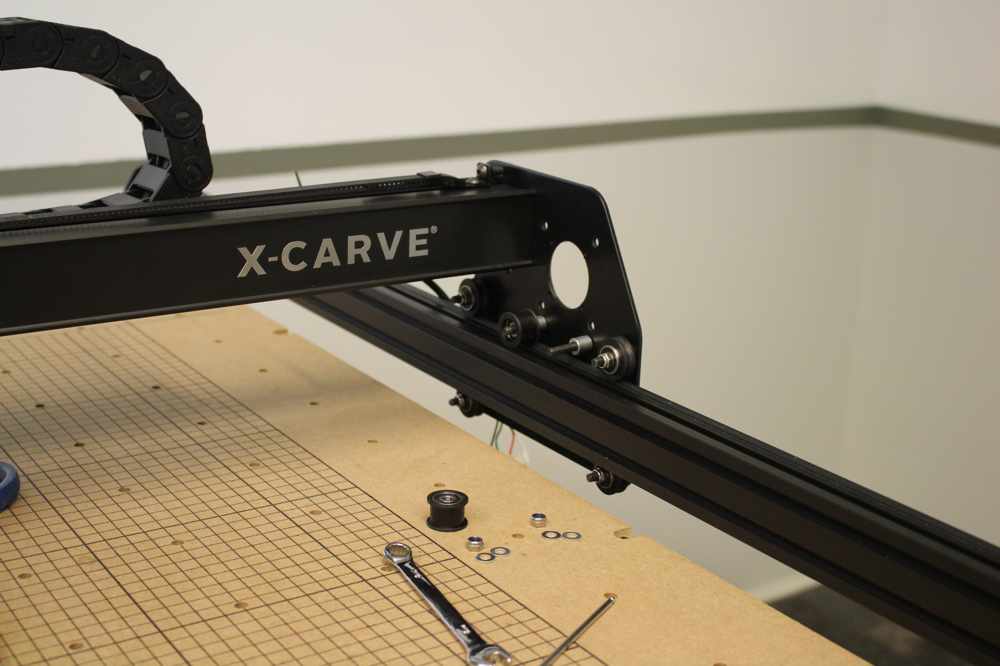
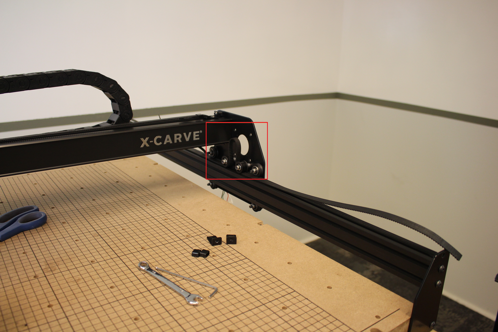
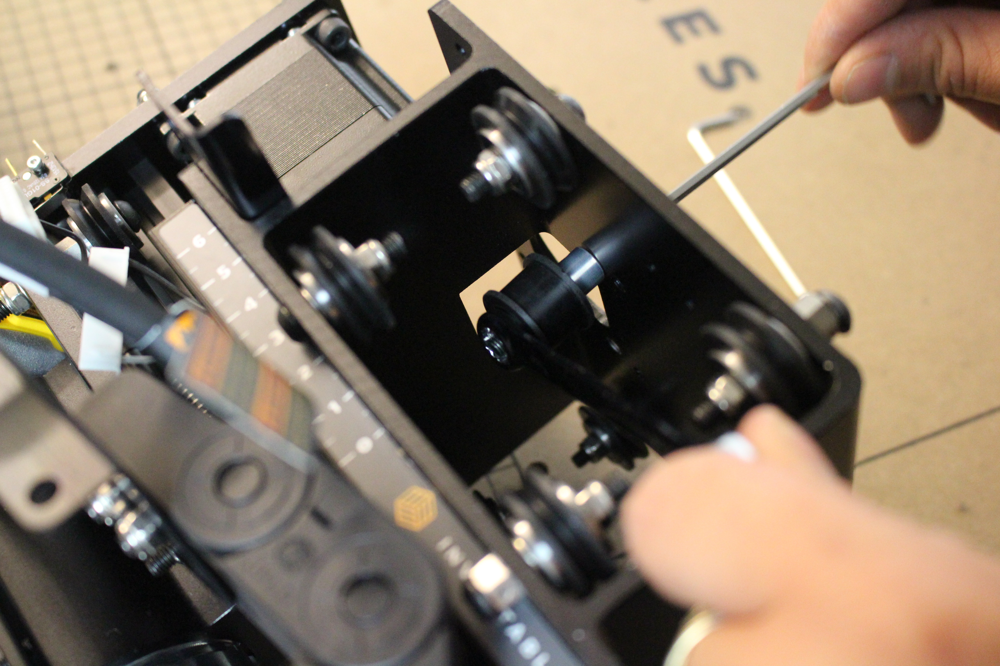
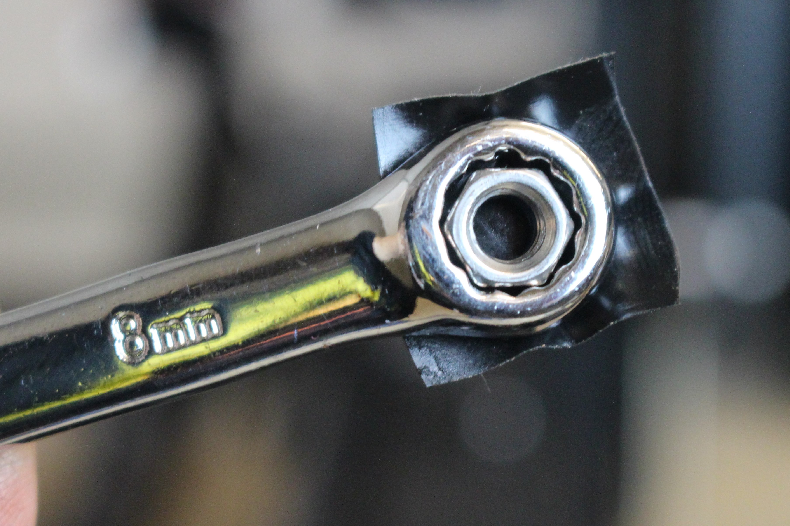

<table>
  <tr>
    <td style="color:#fff;background: #383838" colspan="3">
      <b>9mm Belt Upgrade Kit</b>
    </td>
  </tr>
  <tr>
    <td>
      <b>SKU</b>
    </td>
    <td>
      <b>Name</b>
    </td>
    <td>
      <b>Quantity</b>
    </td>
  </tr>
  <tr>
    <td>
      30858-01
    </td>
    <td>
      9mm Belt Clip
    </td>
    <td>
      6
    </td>
  </tr>
  <tr>
    <td>
      25197-10
    </td>
    <td>
      9mm Idler
    </td>
    <td>
      6
    </td>
  </tr>
  <tr>
    <td>
      25311-09
    </td>
    <td>
      212 oz/in Stepper Motor
    </td>
    <td>
      3
    </td>
  </tr>
  <tr>
    <td>
      26053-04
    </td>
    <td>
      3GT 9mm Belting (3.58 meters)
    </td>
    <td>
      1
    </td>
  </tr>
  <tr>
    <td>
      30677-04
    </td>
    <td>
      9mm Belt Sleeve
    </td>
    <td>
      6
    </td>
  </tr>
  <tr>
    <td>
      25287-13
    </td>
    <td>
      M5 Washers
    </td>
    <td>
      12
    </td>
  </tr>
</table>

  

    <i class="fa fa-hand-o-right"></i>
     
     <strong>Note: Make sure the X-Controller is completely powered off. Failure to disconnect stepper motors will damage the electronics. </strong>
     
  

Gather up the following tools to get started.

<table>
  <tr>
    <td style="color:#fff;background: #383838;" colspan="3"><b>Tools</b> </td>
  </tr>
  <tr>
    <td colspan="3">3mm Allen Wrench </td>
  </tr>
  <tr>
    <td colspan="3">4mm Allen Wrench </td>
  </tr>
  <tr>
    <td colspan="3">8mm Wrench or socket </td>
  </tr>
  <tr>
    <td colspan="3">Scissors or knife</td>
  </tr>
</table>  
<h3> Attach Y-axis stepper motors and belts </h3>

 Start by unplugging the Y1, Y2 and X-axis stepper motors. We will leave these unplugged until the upgrade is complete.

  

    
  

  
 
    
  

 
Using a 4mm allen wrench and an 8mm wrench, remove the X and Y axis stepper motors. We will be reusing the hardware, so take care to keep track of it.

 

(Image above shows Y1 stepper motor, repeat steps for Y2 stepper motor.) 

 

<strong> Remove existing belts</strong>
 
Using a 4mm allen wrench, remove the belt clips and belting from the X and Y axis. We will be reusing the belt clips, screws and lock nuts, so take care to keep track of it. <strong>Tip:</strong> With your thumb at the end, use an allen key to remove the shorter button head cap screw or the tensioning screw.

  

    
  

  

    
  

  

    
  

(Repeat for Y2 and X axis) 

 
You should now have the following hardware, one set for the Y1 and another for the Y2 axis. 

<strong> Replace y-axis belt idlers </strong>
 
Using a 4mm allen wrench and 8mm wrench, remove the Y1 and Y2 axis smooth idlers and replace them with the 9mm idlers (25197-10) from the kit. It is easiest to do these one at a time - remove the nut, remove the stock idler, slide on the new idler (25197-10), 2 M5 washers (25287-13) and reinstall the nut. 

For each idler, you’ll use the existing screw, spacer and locknut plus 2 M5 washers and the 9mm idler. 

The order of assembly is as follows: screw through plate, spacer, idler, two M5 washers and locknut. Make sure the idler is positioned correctly with the inset part facing out away from the screw head.

<strong>Install y-axis belting </strong> 
Cut the new belting into 3 equal pieces.  Measure twice, cut once! 
You will also need two belt clips (30858-01) and belt selves (30677-04). <strong>Tip:</strong> fold the roll of belt into 3 sections then cut.

Route belts (teeth side down) under the smooth idler, over the pulley, and under the smooth idler across all the Y axis Makerslides.  

Use two belt clips and two belt sleeves at each end of the rails. Take one end of the belt and add one of the belt sleeves, small end first. Route the belt through the slot closest to the small bend, underneath the clip and through the remaining slot. Push the end of the belt through the wide end of the belt sleeve to lock the teeth in place.

<strong> Install y-axis stepper motors </strong> 
Using the hardware set aside previously, install the new stepper motors on the Y1 and Y2 side plate.  

 (Repeat on the Y2 side plate.) 

 

    <i class="fa fa-hand-o-right"></i>
     
     <strong>Note: 9mm belts are stronger and stretch less. Make sure to avoid over tensioning as this can cause damage to the stepper motor. If you're using a tension scale, we recommend 3 lbs. at 1" displacement. If you have any questions about belt tensioning, reach out to our Customer Success team. </strong>
     
  

Using the hardware set aside earlier, attach the screws to the belt clips to the rails.

Tensioning screws (M5x25mm button head cap screw) are used at one end of each length of belt to help keep your belts tight. Place the M5x25mm button head cap screw (tensioning screw) through the hole in the small bend of the belt clip. Place the M5x8mm button head cap screw through the remaining hole and lightly tighten the clip down to the pre-assembly insertion nut. Place the tensioning screw through the hole in the back end plate and hand tighten the M5 nylon locking nut. 

On the opposite end, without the tensioning screw, place the M5x8mm button head cap screw through the hole on the belt clip and lightly tighten the clip down to the pre-assembly insertion nut.

 

    <i class="fa fa-hand-o-right"></i>
     
     <strong>Note: After installing, you may cut off excess belting at the end. You may want to leave about 1-2 inches behind for adjustments.</strong>
     
  

Your Y-axis stepper motor and belt update is now complete. 

<h3> Attach z-axis stepper motor and belt </h3>

The x-axis belt has a few extra steps. If you did not remove your x-axis belt previously, start by removing by loosening the belt clips at each end and removing the hardware. 

Next, loosen and remove the x-axis stepper motor. Lastly, you’ll remove the existing idlers.  
<strong>We will be reusing the hardware, so take care to keep track of it.</strong>

After the x-axis motor, idlers and belt are removed, disconnect the z-stepper motor, homing switch wires and the drag chain bracket. You'll also need to carefully disconnect the z-probe from the z-probe relocation bracket. 

Loosen the top 2 screws that hold the right side plate to the wide makerslide. Before removing the screws, use the upgrade kit box or prop to hold the makerslide and drag chain rail in place to keep it from falling and bending. Be careful as the drag chain arm brackets are fragile and can snap off.  

Once the wide makerslide and drag chain rail are propped up, completely remove the screws and slide the Y2 side plate forward/backward out of the way. 

Carefully slide the x-carriage off of the wide makerlide. You may need to <a href="http://x-carve-instructions.inventables.com/1000mm/step9/" target="_blank">adjust</a> the eccentric spacer to the open position to allow the x-carraige to move easily. 

Using the hardware set aside earlier, install the 9mmm belt idlers. The order is as follows: screw through chassis, spacer, belt idler, two M5 wasters and locknut. Make sure the inset part is facing out/away from the screw head.

This step requires precision and patience. You may try using a bit of tape at the end of the wrench to help re-attach the nut. 

Once the idlers are attached and secured, you can carefully push the x-carriage back onto the wide makerslide. If you're having trouble sliding the x-carriage back on, make sure your eccentric v-wheels are in the open position.  

You're more than halfway done! Now you can slide the Y2 plate in line with the wide makerslide and reattach to top two screws. 

Carefully re-align the drag chain bracket to the side plate and tighten. 

You'll want to reattach the drag chain to the x-carriage in this step. 

<strong>Attach x-axis belting and stepper motor</strong> 

 

    <i class="fa fa-hand-o-right"></i>
     
     <strong>Note: 9mm belts are stronger and stretch less. Make sure to avoid over tensioning as this can cause damage to the stepper motor. If you're using a tension scale, we recommend 3 lbs. at 1" displacement. If you have any questions about belt tensioning, reach out to our Customer Success team. </strong>
     
  

The steps are the same as the y-axis belt. Place the belt flat on the wide makerslide and roll the x-carriage over the belt, aligning it with the smooth idlers as you go. Then use a small allen wrench or similar to lift the belt between the idlers, making room for the X axis motor pulley.

Once the belt is in place, attach the new motor using the hardware previously saved. 

The belt should now be looped over the x-axis stepper motor pulley. Take one end of the belt and add one of the belt sleeves, small end first. Route the belt through the slot closest to the small bend, underneath the clip and through the remaining slot. Push the end of the belt through the wide end of the belt sleeve to lock the teeth in place.

Using the hardware set aside earlier, attach the screws to the belt clips to the rails as previously done with with the y-axis.

 

(Left side of belt is not show, attach using smaller button head capscrew) 

The x-axis stepper motor and belt are now installed. 

Carefully reconnect the z-probe to the relocation bracket. 

Lastly, you'll reconnect the homing switch cables and stepper motor cables to their respective positions. 

Y1 and Y2 stepper motors are the last to be connected.

<h3> Computer Setup </h3>

The upgraded belts and stepper motors require a change to the steps/mm setting in the GRBL firmware. We will be making these changes through the Machine Inspector. 

Once the X-Carve is connected, you can power on the X-Controller and connect to your computer. 

Open up an existing project or a new project in <a href="https://easel.inventables.com" target="_blank">Easel </a>. 

In Easel, click the "Carve" button and unlock without homing. Once the X-Carve is unlocked, click on Machine > Advanced > Machine Inspector. 

Scroll down to the console and type the following commands, one at a time: 

$100=26.66

Press enter. 

Then type:

$101=26.66

Press enter. 

You should now be configured. Exit the Machine Inspector. 

We recommend you run a test carve to make sure the X-Carve is moving accurately.

