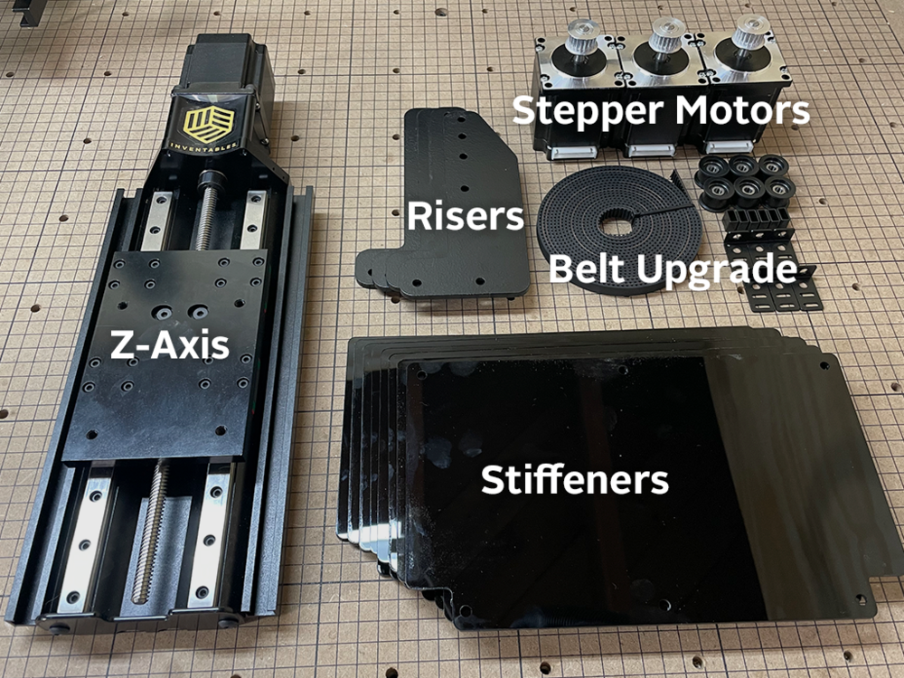
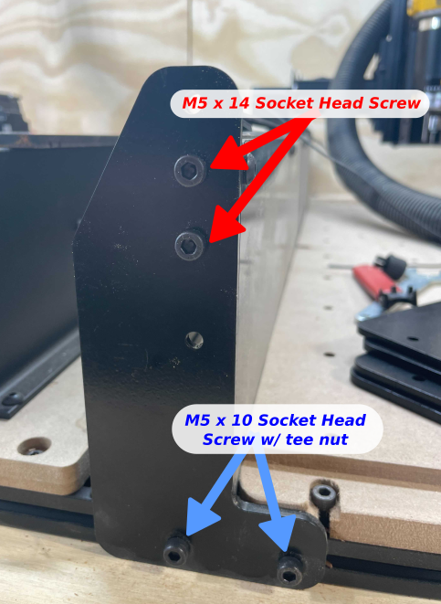
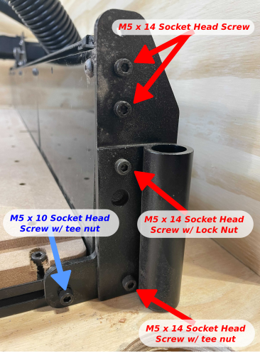
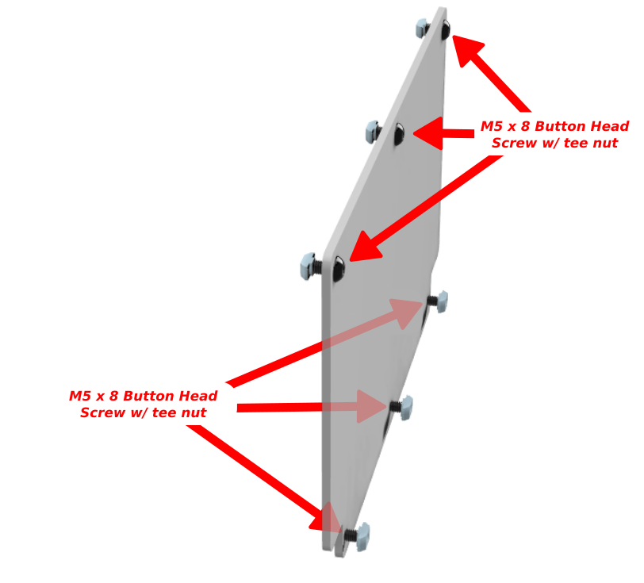
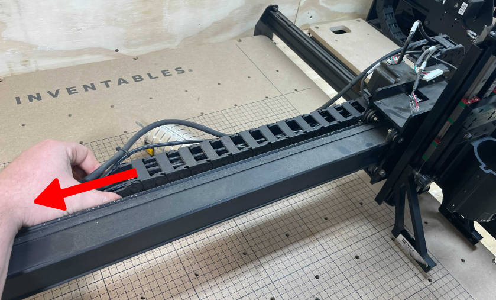
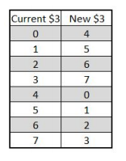

<table>
  <tr>
    <td style="color:#fff;background: #383838" colspan="3">
      <b>Z Axis Kit</b>
    </td>
  </tr>
  <tr>
    <td>
      <b>SKU</b>
    </td>
    <td>
      <b>Name</b>
    </td>
    <td>
      <b>Quantity</b>
    </td>
  </tr>
  <tr>
    <td>
      30870-01
    </td>
    <td>
      Stiffener Panel
    </td>
    <td>
     8
    </td>
  </tr>
  <tr>
    <td>
     30873-01
    </td>
    <td>
      Stiffener Hardware Subassembly
    </td>
    <td>
     1
    </td>
  </tr>
  <tr>
    <td>
      30844-01
    </td>
    <td>
     Upgrade Risers
    </td>
    <td>
      4
    </td>
  </tr>
  <tr>
    <td>
      30874-01
    </td>
    <td>
      Riser Upgrade Hardware Subassembly
    </td>
    <td>
      1
    </td>
  </tr>
  <tr>
    <td>
      30677-04
    </td>
    <td>
      Z Axis Assembly
    </td>
    <td>
      1
    </td>
  </tr>
 <tr>
    <td>
      30872-01
    </td>
    <td>
      Dust Shoe Knobs
    </td>
    <td>
      2
    </td>
  </tr>
  <tr>
    <td>
      30749-01
    </td>
    <td>
      Z-Probe Relocation Bracket
    </td>
    <td>
      1
    </td>
  </tr>
 <tr>
    <td>
      30756-01
    </td>
    <td>
      Z-Probe Relocation Bracket Kit
    </td>
    <td>
      1
    </td>
  </tr>
<tr>
    <td>
      30871-01
    </td>
    <td>
      Z-Upgrade Hardware Kit
    </td>
    <td>
      1
    </td>
  </tr>
  </table>

<!--

    <i class="fa fa-hand-o-right"></i>
     
     <strong>Note: Make sure the X-Controller is completely powered off. Failure to disconnect stepper motors will damage the electronics. </strong>
     
  

Gather up the following tools to get started.

<table>
  <tr>
    <td style="color:#fff;background: #383838;" colspan="3"><b>Tools</b> </td>
  </tr>
  <tr>
    <td colspan="3">3mm Allen Wrench </td>
  </tr>
  <tr>
    <td colspan="3">4mm Allen Wrench </td>
  </tr>
  <tr>
    <td colspan="3">8mm Wrench or socket </td>
  </tr>
  <tr>
    <td colspan="3">Scissors or knife</td>
  </tr>
</table>  -->
<h3> Riser Installation </h3>

1. If you are using the Inventables Dust Collection System, start by removing the dust hose boom and sitting aside.

 

2. Support the gantry using stacked books, materials, boxes, etc.  5 layers of ¾” thick material works well.

 

3. Remove the stock front and back plates. Be sure to put the belt clip lock nuts in a safe place - we will be reusing them.
   

 

4. Raise the gantry approximately 2” by adding additional support under the gantry.   A total of 8 layers of ¾” material works well.

 

5. Install the upgraded risers using the included hardware.  It is easiest to start the tee nuts on their screws, and then slide them into the extrusion.  Be sure to reinstall the belt clip tensioner lock nuts that you set aside earlier.

6. If you are using the Inventables Dust Collection system, install the pole support bracket as shown:
 

7. Now is a good time to ensure that your Y axis rails are properly aligned to your wasteboard. If you hold a square against the rails, there should be approximately ⅛” overhang on each side.To slide the rails left or right, loosen the bottom 2 screws on all 4 risers. Align and tighten.

  

<h3>Stiffener Installation:</h3>

1. Peel the protective film from both sides of the stiffener panels

  

2. Prefit the hardware on the panels as shown. The hardware should be loose at this point.
  

3. Fit the panels in place using the drop in tee nuts. Make sure that all 6 nuts are in place before tightening each panel. Install 4 panels on each side.

  

<h3>Z Axis installation:</h3>

1. Unplug the Z axis stepper motor and homing switch

  
 

2. Remove the router from the router mount - it can sit behind the gantry for now

  
 

3. Remove the stock Z axis assembly by loosening the 4 screws at the back of the Z.
 
  

4. Transfer the homing switch from the stock Z to the Upgraded Z.   You will reuse the homing switch mounting hardware.

  

5. Remove the 2 bolts that attach the stock delrin nut to the spindle mount on the stock Z axis. This will allow you to remove the router mount by sliding it downward.

  

6. Remove the Z wheels and hardware from the router mount

  

7. Bolt the router mount to the new Z Axis using (4) M5 x 16 socket head screws and (4) M5 flat washers from the Z axis hardware kit 

  

8. If you are using the Inventables Dust Collection system, remove the dust shoe arms from the stock Z axis. Remove the green screws and replace with the black knobs from the kit. Install the dust shoe arms on the new Z axis.

  

9. The upgrade kit includes a Z probe relocation kit. If you already have one installed or if you do not have a Z probe, you can skip this step. Otherwise, install the Z probe relocation kit using the included hardware. 

  

10. Install the Z axis on the gantry. You can reuse the (4) screws that mounted the stock Z, or use the replacements included in the kit.For short bits or thin work, mount the Z a little below the bottom of the X-Carriage. For longer bits or thick workpieces, mount the bottom of the Z flush with the bottom of the X-Carriage. Tighten the (4) screws from the back to secure the Z. 

  

11. Install the router in the router mount and tighten the 3 clamping screws.

  

12. For the Z axis stepper and homing switch wires, you will need all the extra wire to be on the Z axis end of the drag chains. Work carefully to work the slack through the drag chains to get as much wire as possible available. You may need to adjust the drag chains slightly to get enough slack.

<h4>Adjusting drag chain to get more wire slack:</h4>

1. Move the X-Carriage to its furthest right position 

2. Loosen the 2 screws that hold the lower end of the X axis drag chain to the 2020 drag chain support extrusion

3. Pull the end of the drag chain to the left, as shown:

13. Tighten the 2 screws on the drag chain end

 

14.Plug in the Z axis homing switch and stepper motor

 

15. Apply the included Inventables sticker to the top of the Z axis

<h3>Recalibrate</h3>

The upgraded belts and stepper motors require a change to the steps/mm setting in the GRBL firmware. We will be making these changes through the Machine Inspector. Once the X-Carve is connected, you can power on the X-Controller and connect to your computer. 
 

Open up an existing project or a new project in <a href="https://easel.inventables.com" target="_blank">Easel </a>. 
 

In Easel, click the "Carve" button and unlock without homing. Once the X-Carve is unlocked, click on Machine > Advanced > Machine Inspector. Scroll down to the console and type the following command: $102 = 49.909 
 

To change the z-axis travel direction update $3 based on <a href="https://github.com/gnea/grbl/wiki/Grbl-v1.1-Configuration#2--step-port-invert-mask" target="_blank">this chart: </a> 
  
 
For example: If your settings show $3=3. You will type in the following command: $3=7
 
 

If you're having trouble with the direction of the stepper motor, you can reach our Customer Success team through email help@inventables.com or by phone at 312 775 7009.

