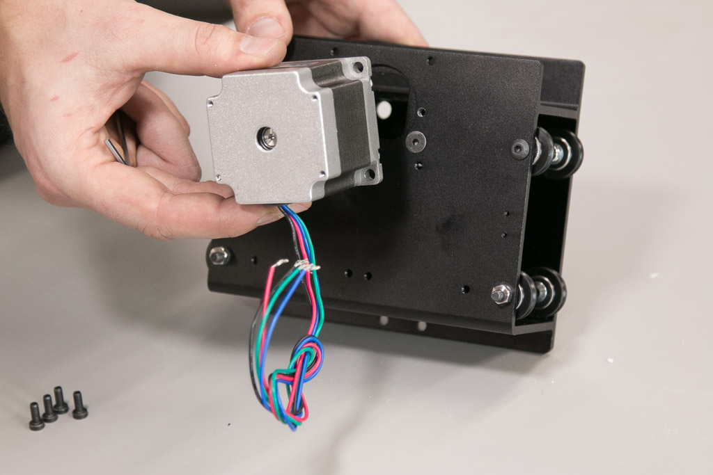
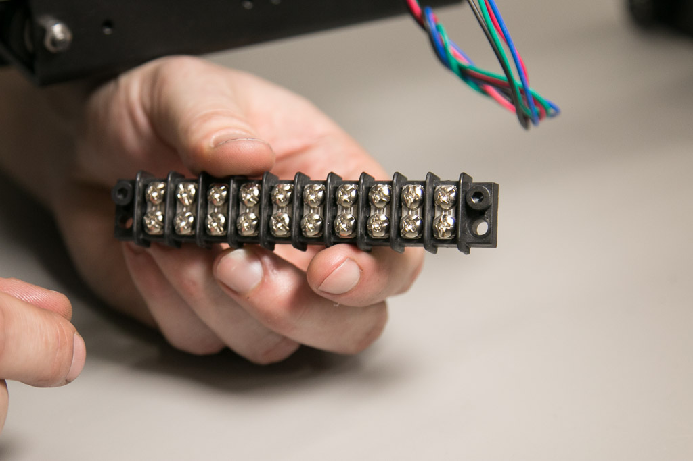

<iframe width="560" height="315" src="https://www.youtube.com/embed/Pts70Si3aTI" frameborder="0" allowfullscreen>
</iframe>
<table>
	<tr>
		<td style="color:#fff;background: #383838;" colspan="3"><b>Core Components Kit</b> </td>
	</tr>
	<tr>
		<td> <b>SKU</b> </td>
		<td> <b>Name</b> </td>
		<td> <b>Quantity</b> </td>
	</tr>
	<tr>
		<td> 30545-01 </td>
		<td> X Carriage Extrusion </td>
		<td> 1 </td>
	</tr>
	<tr>
		<td> 25197-01 </td>
		<td> Smooth Idler Wheel Kit </td>
		<td> 2 </td>
	</tr>
	<tr>
		<td> 25203-01 </td>
		<td> Dual Bearing V-Wheel Kit </td>
		<td> 8 </td>
	</tr>
	<tr>
		<td> 30552-01 </td>
		<td> Flat Head Socket Cap Screw M5 x 35mm </td>
		<td> 2 </td>
	</tr>
	<tr>
		<td> 25286-21 </td>
		<td> Button Head Cap Screw M5 x 25mm </td>
		<td> 8 </td>
	</tr>
	<tr>
		<td> 30265-04 </td>
		<td> Nylon Insert Lock Nut M5 </td>
		<td> 6 </td>
	</tr>
	<tr>
		<td> 30158-01 </td>
		<td> Eccentric Nut M5 </td>
		<td> 4 </td>
	</tr>
	<tr>
		<td> 25287-08 </td>
		<td> Flat Washer M5 </td>
		<td> 8 </td>
	</tr>
	<tr>
		<td> 25312-23 </td>
		<td> Aluminum Spacer 5.1mm ID 9.5mm OD 9.5mm LG </td>
		<td> 2</td>
	</tr>
</table>

<i class="fa fa-level-up"></i>
 
 <b>Note: Shapeoko 2 Upgraders,</b> use the included Flat Head Socket Cap Screw M5 × 35mm in this step. Also use the original aluminum spacers from your Shapeoko 2. The pulley can be positioned in a variety of places on the shaft of the stepper motor, so the spacing isn't critical. Just make sure to position the pulley in-line with the smooth idlers when going through the belting section.
 

<h3 id="smooth-idlers">
1. Smooth Idlers</h3>

The first thing you will do is attach the smooth idlers. Insert one of the flat head screws like this:

Next you’ll put a spacer onto the screw followed by the smooth idler and a nylock hex nut. Tighten the hex nut with moderate force.

   

<i class="fa fa-hand-o-right"></i>
 
 <b>Note:</b> make sure the side of the Smooth Idler with the protruding bearing is installed next to the aluminum spacer. If not, the plastic portion of the Smooth Idler may get in the way of the screws used to mount your stepper motor.
 

Repeat this process with the other smooth idler.

<h3 id="v-wheels">
2. V-Wheels</h3>

Next you’ll be attaching the V-Wheels. There will be eight V-Wheels on the X Carriage, four of them will be attached with nylock nuts and the other four will be attached with eccentric nuts. The holes for the eccentric nuts are larger.

Start by attaching one of the top four V-Wheels with nylock nuts. You’ll insert a 25mm button head cap screw into this hole on the X Carriage.

Next slide a washer over the screw, followed by a V-Wheel and a nylock hex nut. Tighten the nut with moderate force.

Repeat that three times and your X Carriage will look like this:

Next you’ll attach the bottom V-Wheels with eccentric nuts. These nuts have a "shoulder" on them which is designed to be seated in various holes on your X-Carve.

You'll need to adjust them later so put a V-Wheel and then a washer onto a screw and insert it into the X Carriage from the inside.

Thread the eccentric nut onto the screw making sure the “shoulder” is facing the X Carriage. Be sure to seat the shoulder in the hole on the X Carriage and tighten the screw with moderate force.

   

Repeat this process for the remaining three V-Wheels. When you're done your X Carriage should look like this:

<h3 id="eccentric-nuts">
3. Positioning of Eccentric Nuts</h3>

The eccentric nuts on your X-Carve are a slick little example of good engineering. By rotating the nut you can change the position of the screw it captures. You'll use these to adjust the position of V-Wheels all over the machine. Before going any further take a minute to position the eccentric nuts on the X Carriage to the “open” position. In this position the screw that is held by the nut is down and as far away from the top V-wheels as possible. When we refer to an eccentric nut being in the open position it will always be as far away from a static V-Wheel as possible. Here’s a photo that illustrates this concept:

This animation illustrates how the eccentric nuts change the position of the v-wheels.  Keep the eccentric nuts in the "open" position for the time being, so you can easily insert the Makerslide rail in next steps.  You will make the eccentric nut adjustments later on in the Calibrate section.

<iframe width="560" height="315" src="https://www.youtube.com/embed/nX0J317l0mY" frameborder="0" allowfullscreen></iframe>

<i class="fa fa-hand-o-right"></i>
 
 <strong>Note:</strong> The video shows an eccentric spacer instead of an eccentric nut, however it is the exact same concept.
 

<h3 id="motor-mounting">
4. Motor Mounting</h3>

If you purchased a stepper motor kit with your X-Carve, click on your chosen type below to mount your motors.

<a data-toggle="collapse" data-parent="#motor-accordion" href="#nema17" aria-expanded="false" aria-controls="nema17" class="panel-heading" role="tab" id="nema17-header">

<h4 class="panel-title">
NEMA 17

</h4>

<i class="fa fa-plus"></i>
 <i class="fa fa-minus"></i>

</a>

<table>
	<tr>
		<td style="color:#fff;background: #cc3440;" colspan="3"><b>NEMA 17 Stepper Motor Kit</b> </td>
	</tr>
	<tr>
		<td> <b>SKU</b> </td>
		<td> <b>Name</b> </td>
		<td> <b>Quantity</b> </td>
	</tr>
	<tr>
		<td> 25253-01 </td>
		<td> Stepper Motor NEMA 17 62 oz-in </td>
		<td> 1 </td>
	</tr>
	<tr>
		<td> 26054-01 </td>
		<td> Aluminum GT2 Pulley 20T 5mm </td>
		<td> 1 </td>
	</tr>
	<tr>
		<td> 25285-32 </td>
		<td> Socket Head Cap Screw M3 x 10mm </td>
		<td> 3 </td>
	</tr>
	<tr>
		<td> 25287-10 </td>
		<td> Flat Washer M3 </td>
		<td> 3 </td>
	</tr>
</table>

Start this step by putting a pulley on your NEMA 17 stepper motor. You will use two set screws to hold it in place. Slide it on so the edge is flush with the end of the motor shaft and tighten the screws just enough to hold it in place.

   

Your NEMA 17 motor has tapped holes to accept screws, take a moment to locate them. You'll use three of the four on the motor. Orient the motor as shown with the wires pointing up and to the right:

   

Put a washer on each screw and insert them from the opposite side of the X Carriage using the access holes. You may find it easier to start the screws by inserting them from the side of the carriage and then tightening them through the access holes. Tighten these screws with moderate force.

<iframe width="560" height="315" src="https://www.youtube.com/embed/SrW56e4f3Bk" frameborder="0" allowfullscreen>
</iframe>

<a data-toggle="collapse" data-parent="#motor-accordion" href="#nema23" aria-expanded="false" aria-controls="nema23" class="panel-heading" role="tab" id="nema23-header">

<h4 class="panel-title">
NEMA 23

</h4>

<i class="fa fa-plus"></i>
 <i class="fa fa-minus"></i>

</a>

<i class="fa fa-hand-o-right"></i>
 
 **Note:** There are two styles of motors; one style with wires attached and one with connectors. If you received the style with the connectors, the wires come separately and plug directly into the connector on the stepper motor body.
 

<table>
	<tr>
		<td style="color:#fff;background: #cc3440;" colspan="3"><b>NEMA 23 Stepper Motor Kit</b> </td>
	</tr>
	<tr>
		<td> <b>SKU</b> </td>
		<td> <b>Name</b> </td>
		<td> <b>Quantity</b> </td>
	</tr>
	<tr>
		<td> 25311-04 </td>
		<td> Stepper Motor NEMA 23 140oz-in </td>
		<td> 1 </td>
	</tr>
	<tr>
		<td> 26054-03 </td>
		<td> Aluminum GT2 Pulley 20T 1/4in </td>
		<td> 1 </td>
	</tr>
	<tr>
		<td> 25285-41 </td>
		<td> Socket Head Cap Screw M5 x 10mm </td>
		<td> 4 </td>
	</tr>
</table>

Start this step by putting a pulley on your NEMA 23 stepper motor. You will use two set screws to hold it in place. Slide it on so the edge is flush with the end of the motor shaft and tighten the screws just enough to hold it in place.

   

The NEMA 23 mounting holes on the X Carriage are tapped. Simply insert the screws through the motor housing and screw them into the X Carriage. Get all of the screws finger tight and then tighten them in an x-pattern with moderate force . Be sure to orient the wires of your stepper motor towards the bottom of the X Carriage.

   

You may have received stepper motors with white connectors on them. Plug the provided four wire connectors into the motors and follow the rest of the instructions.

<i class="fa fa-hand-o-right"></i>
 
 Note: the connectors only go together one way, be sure to line up the tabs on the wire side to the slots on the motor side.
 

<iframe width="560" height="315" src="https://www.youtube.com/embed/0w-rUEsHl78" frameborder="0" allowfullscreen>
</iframe>

<h3 id="drag-chain-end">
5. Mounting Drag Chain End</h3>

If you purchased a drag chain kit with your X-Carve, click below to mount your drag chain ends.

<a data-toggle="collapse" data-parent="#drag-chain-accordion" href="#1000mm-drag-chain" aria-expanded="false" aria-controls="1000mm-drag-chain" class="panel-heading" role="tab" id="1000mm-drag-chain-header">

<h4 class="panel-title">
Drag Chain

</h4>

<i class="fa fa-plus"></i>
 <i class="fa fa-minus"></i>

</a>

<table>
	<tr>
		<td style="color:#fff;background: #8a52a1;" colspan="3"><b>Drag Chain Kit</b> </td>
	</tr>
	<tr>
		<td> <b>SKU</b> </td>
		<td> <b>Name</b> </td>
		<td> <b>Quantity</b> </td>
	</tr>
	<tr>
		<td> 30331-09 </td>
		<td> Drag Chain Male End Link (attached) </td>
		<td> 1 </td>
	</tr>
	<tr>
		<td> 25286-24 </td>
		<td> Button Head Cap Screw M4 × 10mm </td>
		<td> 2 </td>
	</tr>
	<tr>
		<td> 30554-01 </td>
		<td> Flat Head Socket Cap Screw M4 x 10mm </td>
		<td> 2 </td>
	</tr>
	<tr>
		<td> 30265-03 </td>
		<td> Nylon Insert Lock Nut M4 </td>
		<td> 2 </td>
	</tr>
	<tr>
		<td> 30586-01 </td>
		<td> Drag Chain Angle Bracket </td>
		<td> 1 </td>
	</tr>
</table>
 Remove a male drag chain end from one of the longer drag chain lengths.  Attach it to the angle bracket and then the X-Carriage like this:

 
 
 

<h3 id="terminal-block">
6. Mounting Terminal Block</h3>

If you purchased a wiring kit with your X-Carve, click below to mount your terminal block.

<a data-toggle="collapse" data-parent="#wiring-accordion" href="#wiring" aria-expanded="false" aria-controls="wiring" class="panel-heading" role="tab" id="wiring-header">

<h4 class="panel-title">
Wiring

</h4>

<i class="fa fa-plus"></i>
 <i class="fa fa-minus"></i>

</a>

<table>
	<tr>
		<td style="background: #ffcd05;" colspan="3"><b>Wiring Kit</b> </td>
	</tr>
	<tr>
		<td> <b>SKU</b> </td>
		<td> <b>Name</b> </td>
		<td> <b>Quantity</b> </td>
	</tr>
	<tr>
		<td> 25306-06 </td>
		<td> Terminal Block 10C </td>
		<td> 1 </td>
	</tr>
	<tr>
		<td> 25285-35 </td>
		<td> Socket Head Cap Screw M4 x 14mm </td>
		<td> 2 </td>
	</tr>
</table>

Put the screws through the top holes of the terminal block and screw them into the tapped holes.

<h3 id="x-axis-limit-switch">
7. Mounting X-Axis Limit Switch</h3>

If you purchased a limit switch kit with your X-Carve, click below to mount your x-axis limit switch.

<a data-toggle="collapse" data-parent="#limit-switch-accordion" href="#limit-switch" aria-expanded="false" aria-controls="limit-switch" class="panel-heading" role="tab" id="limit-switch-header">

<h4 class="panel-title">
Limit Switch

</h4>

<i class="fa fa-plus"></i>
 <i class="fa fa-minus"></i>

</a>

<table>
	<tr>
		<td style="color:#fff;background: #9d9fa2;" colspan="3"><b>Limit Switch Kit</b> </td>
	</tr>
	<tr>
		<td> <b>SKU</b> </td>
		<td> <b>Name</b> </td>
		<td> <b>Quantity</b> </td>
	</tr>
	<tr>
		<td> 30557-01 </td>
		<td> Microswitch &#8211; Roller Actuator </td>
		<td> 1 </td>
	</tr>
	<tr>
		<td> 30544-02 </td>
		<td> Pan Head Screw M2 x 14mm </td>
		<td> 2 </td>
	</tr>
	<tr>
		<td> 25284-09 </td>
		<td> Hex Nuts M2 </td>
		<td> 2 </td>
	</tr>
	<tr>
		<td> 30555-02 </td>
		<td> Split Lock Washer M2 </td>
		<td> 2 </td>
	</tr>
</table>

Put the lock washers onto the screws and insert them through the switch and into the holes on the X Carriage (they're on the right side if you're looking at the motor). Use a pair of pliers and a screwdriver to snug these down just past finger tight.

   

