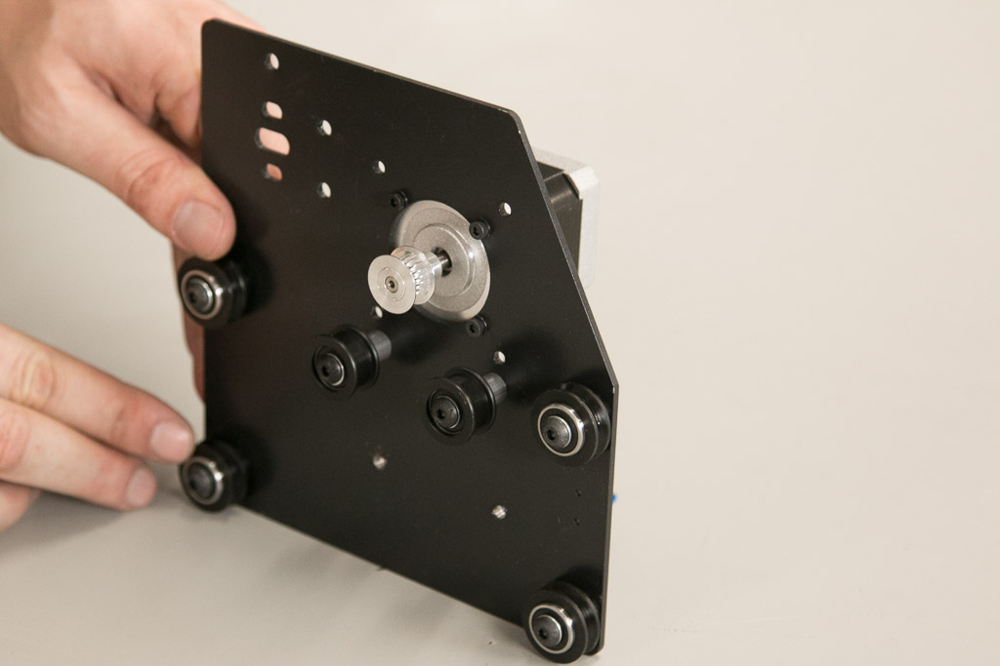
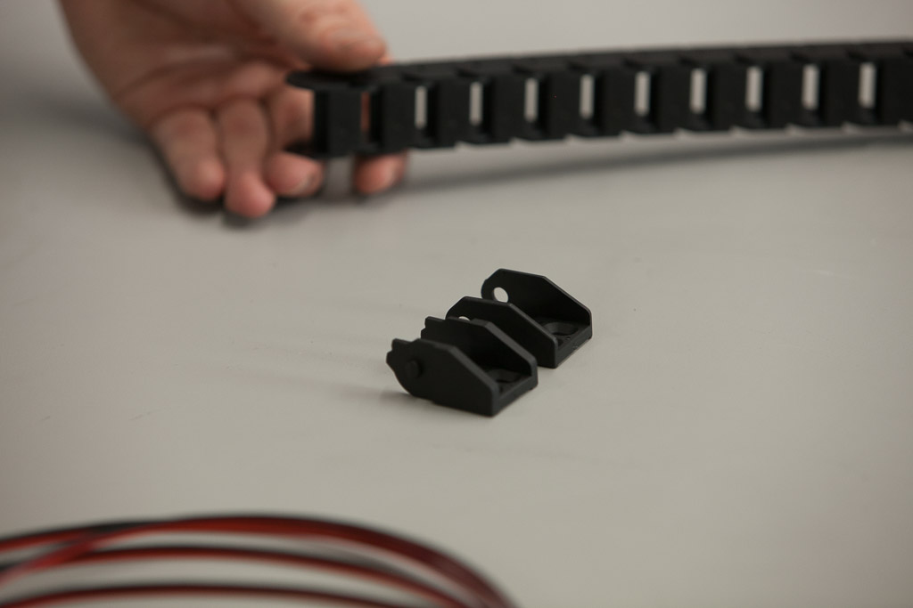
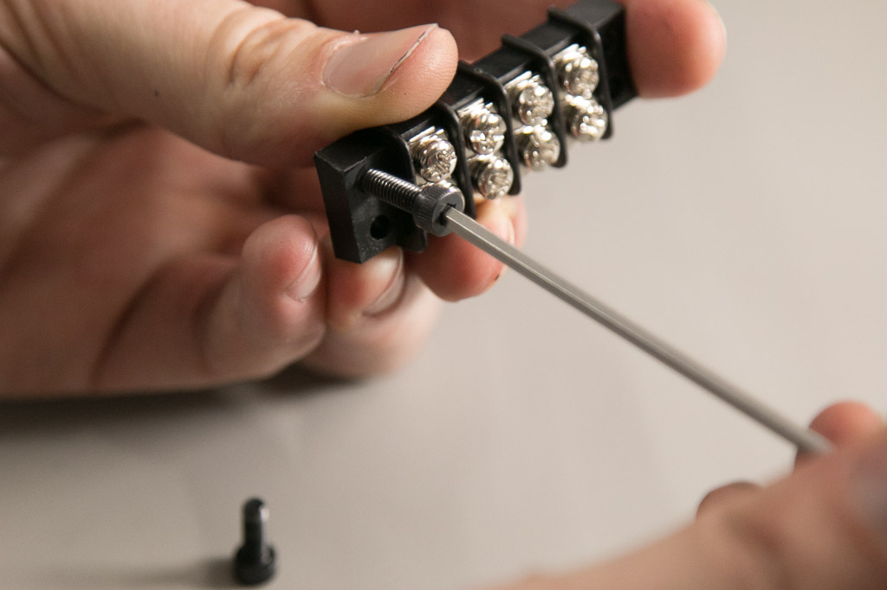
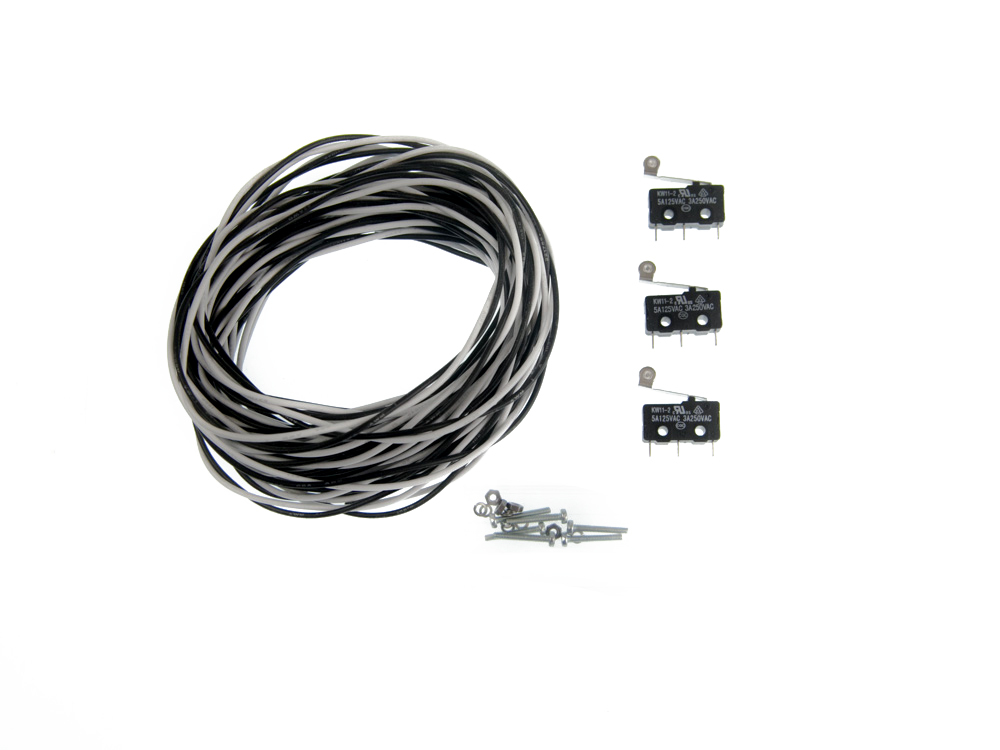

<iframe width="560" height="315" src="https://www.youtube.com/embed/mmIVaf1D2kU" frameborder="0" allowfullscreen>
</iframe>
You'll need these parts to assemble your Y-Plates:

<table>
	<tr>
		<td style="color:#fff;background: #383838;" colspan="3"><b>Core Components Kit</b> </td>
	</tr>
	<tr>
		<td> <b>SKU</b> </td>
		<td> <b>Name</b> </td>
		<td> <b>Quantity</b> </td>
	</tr>
	<tr>
		<td> 30525-01 </td>
		<td> Gantry Side Plate (Y-Plate) </td>
		<td> 2 </td>
	</tr>
	<tr>
		<td> 25197-01 </td>
		<td> Smooth Idler Wheel Kit </td>
		<td> 4 </td>
	</tr>
	<tr>
		<td> 25203-01 </td>
		<td> Dual Bearing V-Wheel Kit </td>
		<td> 8 </td>
	</tr>
	<tr>
		<td> 25286-22 </td>
		<td> Button Head Cap Screw M5 x 35mm </td>
		<td> 4 </td>
	</tr>
	<tr>
		<td> 25286-21 </td>
		<td> Button Head Cap Screw M5 x 25mm </td>
		<td> 8 </td>
	</tr>
	<tr>
		<td> 30265-04 </td>
		<td> Nylon Insert Lock Nut M5 </td>
		<td> 8 </td>
	</tr>
	<tr>
		<td> 30158-01 </td>
		<td> Eccentric Nut M5 </td>
		<td> 4 </td>
	</tr>
	<tr>
		<td> 25287-08 </td>
		<td> Flat Washer M5 </td>
		<td> 8 </td>
	</tr>
	<tr>
		<td> 25312-23 </td>
		<td> Aluminum Spacer 5.1mm ID 9.5mm OD 9.5mm LG </td>
		<td> 4 </td>
	</tr>
</table>

<i class="fa fa-level-up"></i>
 
 <strong>Note: Shapeoko 2 Upgraders,</strong> use the original aluminum spacers from your Shapeoko 2. The pulley can be positioned in a variety of places on the shaft of the stepper motor, so the spacing isn't critical. Just make sure to position the pulley in-line with the smooth idlers when going through the belting section.
 

<h3 id="smooth-idlers">
1. Smooth Idlers</h3>

You'll mount two smooth idlers to each Y-Plate. These are the mounting holes:

To mount a smooth idler to your Y-Plate slide it onto a 35mm screw followed by an aluminum spacer. Remember that the smooth idler is an asymmetrical part.

<i class="fa fa-hand-o-right"></i>
 
 Just as in the X-Carriage assembly, make sure the side of the Smooth Idler with the protruding bearing is installed next to the aluminum spacer.
 

Insert the screw through the Y-Plate and fasten it with a hex nut on the other side. Tighten the nut with moderate force.

   

Repeat this process for the other smooth idler:

<h3 id="v-wheels">
2. V-Wheels</h3>

Each Y-Plate has four holes for V-Wheels. Just like the X Carriage there are two sizes of holes that accept V-Wheels; the smaller holes are for V-Wheels with nylock nuts and the larger holes are designed to accept V-Wheels with eccentric nuts.

Start by installing the top two V-Wheels. Put a V-Wheel on a 25mm button head cap screw followed by a washer. Tighten a nylock nut on the other side of the plate:

   

Repeat with another 25mm screw, V-Wheel, washer and nylock nut.

Repeat the process for the bottom V-Wheels using eccentric nuts this time. Be sure to seat the shoulder of the eccentric nut flush in the hole.

   

Repeat with another 25mm screw, V-Wheel, washer and eccentric nut.

Before proceeding adjust the eccentric nuts to the open position.

Repeat everything you did with the other Y-Plate, but **mirror** the orientation of your parts. You should have two Y-Plates that look like this:

<h3 id="motor-mounting">
3. Y-Axis Motor Mounting</h3>

If you purchased a stepper motor kit with your X-Carve, click on your chosen type below to mount your motors.

<a data-toggle="collapse" data-parent="#motor-accordion" href="#nema17" aria-expanded="false" aria-controls="nema17" class="panel-heading" role="tab" id="nema17-header">

<h4 class="panel-title">
Nema 17</h4>

<i class="fa fa-plus"></i>
 <i class="fa fa-minus"></i>

</a>

<table>
	<tr>
		<td style="color:#fff;background: #cc3440;" colspan="3"><b>NEMA 17 Stepper Motor Kit</b> </td>
	</tr>
	<tr>
		<td> <b>SKU</b> </td>
		<td> <b>Name</b> </td>
		<td> <b>Quantity</b> </td>
	</tr>
	<tr>
		<td> 25253-01 </td>
		<td> Stepper Motor NEMA 17 62 oz-in </td>
		<td> 2 </td>
	</tr>
	<tr>
		<td> 26054-01 </td>
		<td> Aluminum GT2 Pulley 20T 5mm </td>
		<td> 2 </td>
	</tr>
	<tr>
		<td> 25285-31 </td>
		<td> Socket Head Cap Screw M3 x 8mm </td>
		<td> 8 </td>
	</tr>
	<tr>
		<td> 25287-10 </td>
		<td> Flat Washer M3 </td>
		<td> 8 </td>
	</tr>
</table>

To mount a NEMA 17 motor on your Y-Plate slide the washers onto the screws, insert the screws through the plate and thread them into the motor. Insert them in an x pattern and get them all finger tight, then tighten them with moderate force. Be sure to orient the motor as shown in the photos with the wires facing the bottom of the plate.

   

Repeat with the second Y-Plate.

<iframe width="560" height="315" src="https://www.youtube.com/embed/vpJgw8YUEoA" frameborder="0" allowfullscreen>
</iframe>

<a data-toggle="collapse" data-parent="#motor-accordion" href="#nema23" aria-expanded="false" aria-controls="nema23" class="panel-heading" role="tab" id="nema23-header">

<h4 class="panel-title">
Nema 23</h4>

<i class="fa fa-plus"></i>
 <i class="fa fa-minus"></i>

</a>

<i class="fa fa-hand-o-right"></i>
 
 <strong>Note:</strong> There are two styles of motors; one style with wires attached and one with connectors. If you received the style with the connectors, the wires come separately and plug directly into the connector on the stepper motor body.
 

<table>
	<tr>
		<td style="color:#fff;background: #cc3440;" colspan="3"><b>NEMA 23 Stepper Motor Kit</b> </td>
	</tr>
	<tr>
		<td> <b>SKU</b> </td>
		<td> <b>Name</b> </td>
		<td> <b>Quantity</b> </td>
	</tr>
	<tr>
		<td> 25311-04 </td>
		<td> Stepper Motor NEMA 23 140oz-in </td>
		<td> 2 </td>
	</tr>
	<tr>
		<td> 26054-03 </td>
		<td> Aluminum GT2 Pulley 20T 1/4in </td>
		<td> 2 </td>
	</tr>
	<tr>
		<td> 25285-36 </td>
		<td> Socket Head Cap Screw M5 x 16mm </td>
		<td> 8 </td>
	</tr>
	<tr>
		<td> 25287-08 </td>
		<td> Flat Washer M5 </td>
		<td> 8 </td>
	</tr>
	<tr>
		<td> 30265-04 </td>
		<td> Nylon Insert Lock Nut M5 </td>
		<td> 8 </td>
	</tr>
</table>

To mount a NEMA 23 motor on your Y-Plate insert a screw through a mounting hole on the motor and then the plate. Slide a washer onto the screw and use and finger tighten a nylock nut. Orient the motor as shown in the photos with the wires facing the bottom of the plate.

   

Repeat with the remaining three screws and then tighten all screws firmly.

Repeat with the second Y-Plate.

<iframe width="560" height="315" src="https://www.youtube.com/embed/N65WMdgOUUE" frameborder="0" allowfullscreen>
</iframe>

<h3 id="drag-chain-end">
4. Mounting Drag Chain End (Left Plate)</h3>

If you purchased a drag chain kit with your X-Carve, click below to mount your drag chain ends.

<a data-toggle="collapse" data-parent="#drag-chain-accordion" href="#1000mm-drag-chain" aria-expanded="false" aria-controls="1000mm-drag-chain" class="panel-heading" role="tab" id="1000mm-drag-chain-header">

<h4 class="panel-title">
Drag Chain</h4>

<i class="fa fa-plus"></i>
 <i class="fa fa-minus"></i>

</a>

<table>
	<tr>
		<td style="color:#fff;background: #8a52a1;" colspan="3"><b>Drag Chain Kit</b> </td>
	</tr>
	<tr>
		<td> <b>SKU</b> </td>
		<td> <b>Name</b> </td>
		<td> <b>Quantity</b> </td>
	</tr>
	<tr>
		<td> 30331-09 </td>
		<td> Drag Chain Male End Link (attached) </td>
		<td> 1 </td>
	</tr>
	<tr>
		<td> 30554-01 </td>
		<td> Flat Head Socket Cap Screw M4 x 10mm </td>
		<td> 2 </td>
	</tr>
	<tr>
		<td> 30265-03 </td>
		<td> Nylon Insert Lock Nut M4 </td>
		<td> 4 </td>
	</tr>
	<tr>
		<td> 25286-24 </td>
		<td> Button Head Cap Screw M4 x 10mm </td>
		<td> 2 </td>
	</tr>
	<tr>
		<td> 30586-01 </td>
		<td> Drag Chain Angle Bracket </td>
		<td> 1 </td>
	</tr>
</table>

If you purchased drag chain with your X-Carve, now is the time to attach a male drag chain end to the left Y-Plate. Check the photo to see which Y-Plate is the left one. It's not so easy to tell yet. Remove the male end link from the other length of drag chain. Attach it to the angle bracket and then the Y-Plate like this:

<h3 id="terminal-block">
5. Mounting Terminal Block (Both Plates)</h3>

If you purchased a wiring kit with your X-Carve, click below to mount your terminal block.

<a data-toggle="collapse" data-parent="#wiring-accordion" href="#wiring" aria-expanded="false" aria-controls="wiring" class="panel-heading" role="tab" id="wiring-header">

<h4 class="panel-title">
Wiring</h4>

<i class="fa fa-plus"></i>
 <i class="fa fa-minus"></i>

</a>

<table>
	<tr>
		<td style="background: #ffcd05;" colspan="3"><b>Wiring Kit</b> </td>
	</tr>
	<tr>
		<td> <b>SKU</b> </td>
		<td> <b>Name</b> </td>
		<td> <b>Quantity</b> </td>
	</tr>
	<tr>
		<td> 25306-01 </td>
		<td> Terminal Block 4C </td>
		<td> 2 </td>
	</tr>
	<tr>
		<td> 25285-35 </td>
		<td> Socket Head Cap Screw M4 x 14mm </td>
		<td> 4 </td>
	</tr>
	<tr>
		<td> 30265-03 </td>
		<td> Nylon Insert Lock Nut M4 </td>
		<td> 4 </td>
	</tr>
</table>
Attach terminal blocks to the Y-Plates of your X-Carve with two screws and nuts like this:

<h3 id="mount-limit-switch">
6. Mounting Y-Axis Limit Switch</h3>

If you purchased a limit switch kit with your X-Carve, click below to mount your x-axis limit switch.

<a data-toggle="collapse" data-parent="#limit-switch-accordion" href="#limit-switch" aria-expanded="false" aria-controls="limit-switch" class="panel-heading" role="tab" id="limit-switch-header">

<h4 class="panel-title">
Limit Switch</h4>

<i class="fa fa-plus"></i>
 <i class="fa fa-minus"></i>

</a>

<table>
	<tr>
		<td style="color:#fff;background: #9d9fa2;" colspan="3"><b>Limit Switch Kit</b> </td>
	</tr>
	<tr>
		<td> <b>SKU</b> </td>
		<td> <b>Name</b> </td>
		<td> <b>Quantity</b> </td>
	</tr>
	<tr>
		<td> 30557-01 </td>
		<td> Microswitch &#8211; Roller Actuator </td>
		<td> 1 </td>
	</tr>
	<tr>
		<td> 30544-02 </td>
		<td> Pan Head Screw M2 x 14mm </td>
		<td> 2 </td>
	</tr>
	<tr>
		<td> 25284-09 </td>
		<td> Hex Nuts M2 </td>
		<td> 2 </td>
	</tr>
	<tr>
		<td> 30555-02 </td>
		<td> Split Lock Washer M2 </td>
		<td> 2 </td>
	</tr>
</table>

Put the lock washers onto the screws and insert them through the switch and into the holes on the left Y-Plate. Use a pair of pliers and a screwdriver to snug these down just past finger tight.

