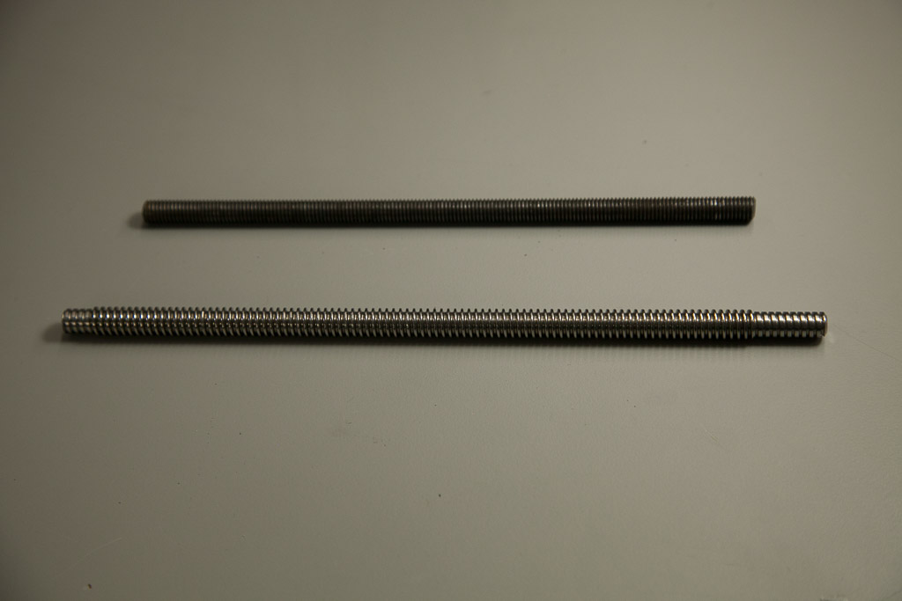

Now you'll add the drive rod to your X-Carve. This is the piece that will allow the spindle carriage to move up and down the Z-Axis.

Click below to select your chosen type of drive rod.

<a data-toggle="collapse" data-parent="#drive-rod-accordion" href="#m8" aria-expanded="false" aria-controls="m8" class="panel-heading" role="tab" id="m8-header">

<h4 class="panel-title">
M8 Threaded Rod</h4>

<i class="fa fa-plus"></i>
 <i class="fa fa-minus"></i>

</a>

<iframe width="560" height="315" src="https://www.youtube.com/embed/k4MhzC2_odU" frameborder="0" allowfullscreen>
</iframe>
<table>
	<tr>
		<td style="color:#fff;background: #6b4e40;" colspan="3"><b>M8 Threaded Rod Lead Screw Kit</b> </td>
	</tr>
	<tr>
		<td> <b>SKU</b> </td>
		<td> <b>Name</b> </td>
		<td> <b>Quantity</b> </td>
	</tr>
	<tr>
		<td> 30530-01 </td>
		<td> Lead Screw M8 </td>
		<td> 1 </td>
	</tr>
	<tr>
		<td> 25280-01 </td>
		<td> Delrin Nut M8 </td>
		<td> 1 </td>
	</tr>
	<tr>
		<td> 25284-08 </td>
		<td> Hex Nut M8 </td>
		<td> 2 </td>
	</tr>
</table>
<table>
	<tr>
		<td style="color:#fff;background: #383838;" colspan="3"><b>Core Components Kit</b> </td>
	</tr>
	<tr>
		<td> <b>SKU</b> </td>
		<td> <b>Name</b> </td>
		<td> <b>Quantity</b> </td>
	</tr>
	<tr>
		<td> 26054-04 </td>
		<td> Aluminum GT2 Pulley 20T 8mm </td>
		<td> 1 </td>
	</tr>
</table>

Your M8 Threaded Rod came with a Delrin Nut that is designed to travel along it. The fit between the rod and the nut will be tight at first. It is a good idea to use a handheld drill and traverse the nut up and down the rod a few dozen times:

   

Leave the Delrin Nut in the middle of the rod and thread one of the M8 hex nuts onto one of its end. You&#8217;ll want to thread the nut about an inch and a half onto the rod.

Insert the threaded rod through the flanged bearing:

Screw on the second M8 hex nut. You want to leave just enough of the threaded rod above it to fit the pulley on.

When you have the top M8 hex nut in place tighten the bottom M8 hex nut until it is flush with the flanged bearing. Be sure to hold the top M8 hex nut captive while you do this so that its position along the threaded rod does not change.

Slide the pulley onto the threaded rod and tighten it with two set screws. Be sure to orient the pulley as shown:

When you&#8217;re done your Z-Axis should look like this:

<a data-toggle="collapse" data-parent="#drive rod-accordion" href="#acme" aria-expanded="false" aria-controls="acme" class="panel-heading" role="tab" id="acme-header">

<h4 class="panel-title">
Acme Threaded Rod</h4>

<i class="fa fa-plus"></i>
 <i class="fa fa-minus"></i>

</a>

 

<table>
	<tr>
		<td style="color:#fff;background: #6b4e40;" colspan="3"><b>ACME Lead Screw Kit</b> </td>
	</tr>
	<tr>
		<td> <b>SKU</b> </td>
		<td> <b>Name</b> </td>
		<td> <b>Quantity</b> </td>
	</tr>
	<tr>
		<td> 30396-02 </td>
		<td> Lead Screw ACME </td>
		<td> 1 </td>
	</tr>
	<tr>
		<td> 25280-02 </td>
		<td> Delrin Nut ACME </td>
		<td> 1 </td>
	</tr>
	<tr>
		<td> 25284-10 </td>
		<td> Nylon Insert Lock Nut M6 </td>
		<td> 1 </td>
	</tr>
</table>
<table>
	<tr>
		<td style="color:#fff;background: #383838;" colspan="3"><b>Core Components Kit</b> </td>
	</tr>
	<tr>
		<td> <b>SKU</b> </td>
		<td> <b>Name</b> </td>
		<td> <b>Quantity</b> </td>
	</tr>
	<tr>
		<td> 26054-04 </td>
		<td> Aluminum GT2 Pulley 20T 8mm </td>
		<td> 1 </td>
	</tr>
</table>

Insert the ACME Lead Screw through the the bottom of the flanged bearing, with the Delrin Nut attached just below the Z Axis Motor Plate (as pictured).

Slide the pulley onto the ACME Lead Screw and tighten the two set screws.

With the allen wrench still in place to prevent the pulley from moving, tighten down the M6 Nylon Lock Nut to secure the assembly in place.

