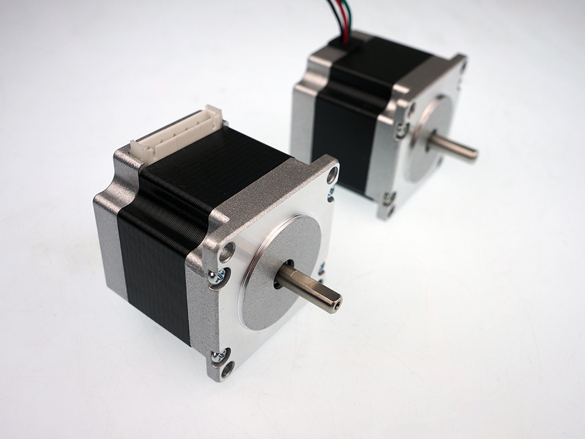

Now you'll mount a stepper motor to the Z-Axis Plate of your X-Carve. This motor will control the up and down movement of your spindle.

Click below to select your chosen motor type.

<a data-toggle="collapse" data-parent="#motor-accordion" href="#nema17" aria-expanded="false" aria-controls="nema17" class="panel-heading" role="tab" id="nema17-header">

<h4 class="panel-title">
NEMA 17</h4>

<i class="fa fa-plus"></i>
 <i class="fa fa-minus"></i>

</a>

<iframe width="560" height="315" src="https://www.youtube.com/embed/cEJDROc9ZEs" frameborder="0" allowfullscreen>
</iframe>
<table>
	<tr>
		<td style="color:#fff;background: #cc3440;" colspan="3"><b>NEMA 17 Stepper Motor Kit</b> </td>
	</tr>
	<tr>
		<td> <b>SKU</b> </td>
		<td> <b>Name</b> </td>
		<td> <b>Quantity</b> </td>
	</tr>
	<tr>
		<td> 25253-01 </td>
		<td> Stepper Motor NEMA 17 62 oz-in </td>
		<td> 1 </td>
	</tr>
	<tr>
		<td> 26054-01 </td>
		<td> Aluminum GT2 Pulley 20T 5mm </td>
		<td> 1 </td>
	</tr>
	<tr>
		<td> 25285-32 </td>
		<td> Socket Head Cap Screw M3 x 10mm </td>
		<td> 4 </td>
	</tr>
	<tr>
		<td> 25287-10 </td>
		<td> Flat Washer M3 </td>
		<td> 4 </td>
	</tr>
</table>
<table>
	<tr>
		<td style="color:#fff;background: #383838;" colspan="3"><b>Core Components Kit</b> </td>
	</tr>
	<tr>
		<td> <b>SKU</b> </td>
		<td> <b>Name</b> </td>
		<td> <b>Quantity</b> </td>
	</tr>
	<tr>
		<td> 30547-01 </td>
		<td> GT2 Belt Closed Loop, 80T </td>
		<td> 1 </td>
	</tr>
</table>

Begin this step by sliding the pulley onto the shaft of the motor. Hold it in place using two set screws. Be sure to orient the pulley as shown:

Put the shaft and pulley of the motor through the largest hole on the Z-Plate and orient the wires of the motor towards the back of the machine:

Secure the motor to the Z-Plate with four screws and four washers. Leave these screws a little looser than finger tight for now so the motor can slide in its slots.

Slide the small fixed length belt around both the pulley on the drive rod and the pulley on the Z-Axis motor. Adjust the placement of the pulley on the shaft of the motor until it lines up with the pulley on the drive rod:

Apply pressure on the motor toward the back of the machine while you tighten the screws in an x pattern.

<a data-toggle="collapse" data-parent="#motor-accordion" href="#nema23" aria-expanded="false" aria-controls="nema23" class="panel-heading" role="tab" id="nema23-header">

<h4 class="panel-title">
NEMA 23</h4>

<i class="fa fa-plus"></i>
 <i class="fa fa-minus"></i>

</a>

<i class="fa fa-hand-o-right"></i>
 
 <strong>Note:</strong> There are two styles of motors; one style with wires attached and one with connectors. If you received the style with the connectors, the wires come separately and plug directly into the connector on the stepper motor body.
 

<table>
	<tr>
		<td style="color:#fff;background: #cc3440;" colspan="3"><b>NEMA 23 Stepper Motor Kit</b> </td>
	</tr>
	<tr>
		<td> <b>SKU</b> </td>
		<td> <b>Name</b> </td>
		<td> <b>Quantity</b> </td>
	</tr>
	<tr>
		<td> 25311-04 </td>
		<td> Stepper Motor NEMA 23 140oz-in </td>
		<td> 1 </td>
	</tr>
	<tr>
		<td> 26054-03 </td>
		<td> Aluminum GT2 Pulley 20T 1/4in </td>
		<td> 1 </td>
	</tr>
	<tr>
		<td> 25285-37 </td>
		<td> Socket Head Cap Screw M5 x 20mm </td>
		<td> 4 </td>
	</tr>
	<tr>
		<td> 30265-04 </td>
		<td> Nylon Insert Lock Nut M5 </td>
		<td> 4 </td>
	</tr>
	<tr>
		<td> 25287-08 </td>
		<td> Flat Washer M5 </td>
		<td> 4 </td>
	</tr>
</table>
<table>
	<tr>
		<td style="color:#fff;background: #383838;" colspan="3"><b>Core Components Kit</b> </td>
	</tr>
	<tr>
		<td> <b>SKU</b> </td>
		<td> <b>Name</b> </td>
		<td> <b>Quantity</b> </td>
	</tr>
	<tr>
		<td> 30547-01 </td>
		<td> GT2 Belt Closed Loop, 80T </td>
		<td> 1 </td>
	</tr>
</table>

Begin this step by sliding the pulley onto the shaft of the motor. Hold it in place using two set screws. Be sure to orient the pulley as shown:

Put the shaft and pulley of the motor through the largest hole on the Z-Plate and orient the wires of the motor towards the back of the machine. Secure the back of the motor to the Z-Plate by inserting two screws through the motor housing and z-plate. Use washers and finger tightened nylock hex nuts. The motor should feel loose at this point.

Hold the motor flush with the Z-Plate and adjust the placement of the pulley on the motor shaft until it is even with the pulley on the drive rod:

Tighten the set screws to keep the pulley in place. Slide the small fixed length belt around the pulley on the drive rod and tilt the motor forward to loop the belt around its pulley.

Apply pressure on the motor towards the back of the machine to tension the belt. Tighten the screws to keep the motor in place. Insert the other two screws add washers and nylock hex nuts to them and tighten them as well.

When you&#8217;re done your Z-Axis should look like this:

