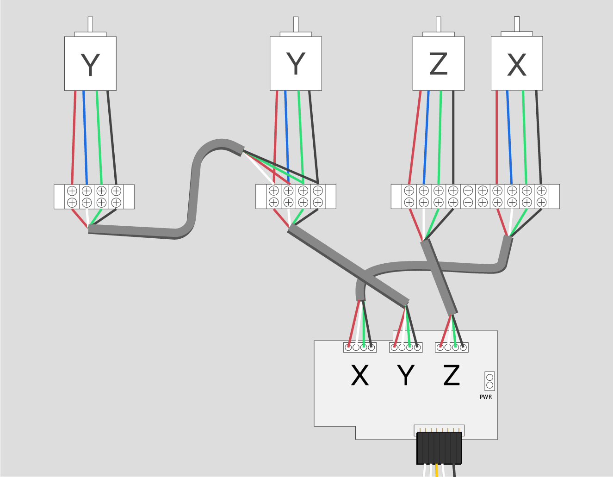

<iframe width="560" height="315" src="https://www.youtube.com/embed/_vCIVagKgzA" frameborder="0" allowfullscreen>
</iframe>
<h3 id="prepare-stepper-motor-wires">
1. Prepare Stepper Motor Wires</h3>

First you'll trim the excess wire from each stepper motor and strip each wire of each stepper motor (16 in total). You'll want about 1/4" of bare wire showing.

 

<h3 id="secure-wires">
2. Secure Wires in Terminal Blocks</h3>

Next insert the stepper motor wires for the X and Z motors into the corresponding terminal blocks. To keep wiring consistent work from left to right and keep the order of **red**, **blue**, **green** and **black**.

#### X-Motor

 

#### Z-Motor

 

#### Right Y-Motor

Next insert the stepper motor wires for the **right Y-Motor** into the corresponding terminal block. To keep wiring consistent work from left to right and keep the order of **red**, **blue**, **green** and **black**.

 

<h3 id="prepare-stepper-cable">
3. Prepare Stepper Cable</h3>

Next cut the stepper cable to length.

<table>
	<tr>
		<td colspan="2"><strong>500mm Machine</strong> </td>
	</tr>
	<tr>
		<td> <strong>Length</strong> </td>
		<td> <strong>Quantity</strong> </td>
	</tr>
	<tr>
		<td> 6 feet </td>
		<td> 2 </td>
	</tr>
	<tr>
		<td> 4 feet </td>
		<td>1 </td>
	</tr>
	<tr>
		<td> 3 feet </td>
		<td> 1 </td>
	</tr>
</table>
<table>
	<tr>
		<td colspan="2"><strong>1000mm Machine</strong> </td>
	</tr>
	<tr>
		<td> <strong>Length</strong> </td>
		<td> <strong>Quantity</strong> </td>
	</tr>
	<tr>
		<td> 12 feet </td>
		<td> 2 </td>
	</tr>
	<tr>
		<td> 7 feet </td>
		<td> 1 </td>
	</tr>
	<tr>
		<td> 5 feet </td>
		<td> 1 </td>
	</tr>
</table>
Strip one end of each piece of stepper cable. There is grey insulation around all four wires inside. Remove it as well as the foil, string and thin silver wire. You should be left with four wires; one **black**, one **green**, one **white** and one **red**.

   

Strip about 1/4" of each of these colored wires.

 

<h3 id="secure-stepper-cable">
4. Secure Stepper Cable in Terminal Blocks</h3>

Take the shortest length of stepper cable and wire it to the terminal block on the right Y-Plate. Match **red** to **red**, **white** to **blue**, **green** to **green** and **black** to **black**.

 

Put the other end of this piece of stepper cable in to this hole and thread it through the X-Axis of the machine:

 

When you get the end through the same hole on the left Y-Plate strip it as before. Now you'll twist these wires with the left Y-Motor wires. Twist them as follows: **red** to **white**, **blue** to **red**, **green** to **green**, and **black** to **black**. Insert them into the terminal block one pair at a time. When you're done your left Y-Plate should look like this:

 

Ok, that was the hardest part of the wiring. Now you'll wire the x-axis motor. Use one of the longest pieces of stepper cable and wire into the terminal block under the x-axis motor. Match **red** to **red**, **blue** to **white**, **green** to **green** and **black** to **black**. Repeat the process with the other long piece of stepper cable for the z-motor. When you're done you should have something like this:

 

If you purchased a 24V or 48V spindle with your X-Carve kit now is a good time to attach the zip wire that will eventually power it. Pull the **black** and **red** wires away from each other and strip the ends leaving about 1/4" bare. Wire them into the bottom of the terminal block in the two spaces you left open. Use the left terminal for **red** and the right terminal for **black**.

 

Now you'll wire the left y-axis motor. Use your last piece of stepper cable and wire into the bottom of the terminal block on the left Y-Plate in the order of **red**, **white**, **green**, and **black**.

 

This diagram should help clarify this step, and will be referenced again when you wire your stepper cable to the gShield in the Electronics section.

<h3 id="solder-limit-switches">
5. Soldering Limit Switches</h3>

If you purchased a limit switch kit with your X-Carve, click below to solder your limit switches.

<a data-toggle="collapse" data-parent="#limit-switch-accordion" href="#limit-switch" aria-expanded="false" aria-controls="limit-switch" class="panel-heading" role="tab" id="limit-switch-header">

<h4 class="panel-title">
Limit Switch

</h4>

<i class="fa fa-plus"></i>
 <i class="fa fa-minus"></i>

</a>

Cut the black and white stranded wiring into the following lengths:

<table>
	<tr>
		<td colspan="2"><strong>500mm Machine</strong> </td>
	</tr>
	<tr>
		<td> X-Axis </td>
		<td> 6 feet </td>
	</tr>
	<tr>
		<td> Y-Axis </td>
		<td> 4 feet </td>
	</tr>
	<tr>
		<td> Z-Axis </td>
		<td> 6 feet </td>
	</tr>
</table>
<table>
	<tr>
		<td colspan="2"><strong>1000mm Machine</strong> </td>
	</tr>
	<tr>
		<td> X-Axis </td>
		<td> 12 feet </td>
	</tr>
	<tr>
		<td> Y-Axis </td>
		<td> 6 feet </td>
	</tr>
	<tr>
		<td> Z-Axis </td>
		<td> 12 feet </td>
	</tr>
</table>
Strip one end of each pair of wires. Solder the white wire to the middle tab on each switch (marked NO) and the black wire to the tab closest to the lever (marked C).

 

<i class="fa fa-hand-o-right"></i>
 
 <strong>Note:</strong> Heating the switch for too long may damage it, try to work as quickly as possible when soldering the wires to the tabs.
 

<iframe width="560" height="315" src="https://www.youtube.com/embed/mBiC6D7dsxs" frameborder="0" allowfullscreen>
</iframe>

